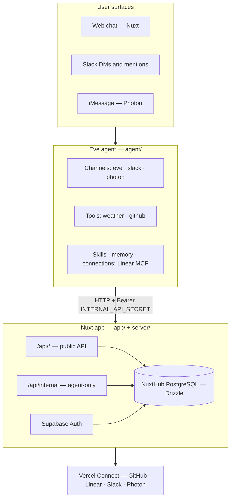

# Personal Agent Template — Architecture

> Back to [README](../README.md) | See also: [Environment](./ENVIRONMENT.md), [Customization](./CUSTOMIZATION.md)

This document describes the technical architecture of Personal Agent Template — a durable personal AI assistant built with Eve, Nuxt 4, and Supabase Auth.

## System overview

The app runs as two cooperating services on Vercel:



| Vercel service | Entry | Role |
|----------------|-------|------|
| `web` | `/` | Nuxt UI + Nitro API |
| `eve` | `/eve/v1/*` | Eve agent runtime (service generated by `eve/nuxt`) |

The `eve/nuxt` module generates the Vercel service and its `/eve/v1/*` route at build time — `vercel.json` does not declare them.

## Project structure

```
personal-agent-template/
├── agent/                    # Eve agent
│   ├── agent.ts              # Model and agent config
│   ├── channels/             # eve (web), slack, photon (iMessage)
│   ├── tools/                # weather
│   ├── extensions/           # mounted eve extensions (github)
│   ├── memory/               # memory slots (profile)
│   ├── skills/               # e.g. daily-summary.md
│   ├── connections/          # Linear MCP
│   ├── lib/                  # profile-internal, slack-internal, phone-internal, internal-api
│   └── instructions.ts       # system instructions
├── app/                      # Nuxt frontend
│   ├── pages/                # chat, settings, login
│   ├── components/           # chat UI, profile, integrations
│   └── composables/          # useProfile, useConnectors, chat providers
├── server/                   # Nitro API
│   ├── api/                  # Public + internal routes
│   ├── db/                   # Drizzle schema + migrations
│   └── utils/                # profile, auth, connectors, threads
├── shared/                   # Cross-layer types and helpers
│   ├── agent.ts              # Branding metadata
│   └── types/                # profile, thread, connector
└── docs/                     # Documentation
```

## Request flows

### Web chat

1. User opens `/chat/[id]` — Nuxt loads thread via `/api/threads`
2. Chat streams through Eve's Nuxt module (`eve/nuxt`)
3. Tool calls render in [`MessageContentEve.vue`](../app/components/chat/message/MessageContentEve.vue)
4. Approvals and questions render through [`AgentInputRequest.vue`](../app/components/AgentInputRequest.vue)

Each chat page owns one Eve subscription; switching chats disconnects the local
stream without cancelling the backend turn. Outgoing messages carry an
`x-pat-message-id` receipt ID. The authenticated history hook persists this ID
on `message.received` immediately, and the history endpoint returns accepted IDs
alongside the current runtime binding. Reopening a chat, focus, online events,
and polling reconcile saved sends against those receipts and resume the stream
without resubmitting work. A late runtime binding remounts only the chat page.
Composer drafts are stored separately. Legacy text-only send copies are retired
only when their exact text is already in that chat's durable history.

### Memory recall

1. Eve resolves the `profile` slot's scope to the authenticated principal ([`agent/memory/profile.ts`](../agent/memory/profile.ts))
2. `fileMemory()` reads that principal's document from private Vercel Blob storage
3. The indexed entries are recalled on `turn.started` and again after compaction

Records arrive as untrusted user-role messages, never as system instructions.
The agent maintains them with `profile__save_memory` and `profile__remove_memory`.

### Slack

1. Slack events hit Eve's slack channel ([`agent/channels/slack.ts`](../agent/channels/slack.ts))
2. Linked users map Slack ID → app user via `slack_links` table
3. Unlinked users get instructions to generate a link code in the web app
4. Link flow: web generates code → user DMs `link <code>` → agent consumes via internal API

### Integrations (Linear)

1. User connects Linear in **Settings → Integrations**
2. Vercel Connect provisions MCP credentials
3. Eve connection ([`agent/connections/linear.ts`](../agent/connections/linear.ts)) exposes Linear tools to the agent

## Internal API

Routes under `/api/internal/*` require:

```
Authorization: Bearer <INTERNAL_API_SECRET>
```

Validated in [`server/utils/internal-api.ts`](../server/utils/internal-api.ts).

| Route | Purpose |
|-------|---------|
| `GET /api/internal/profile` | Caller identity for the session instructions |
| `GET /api/internal/phone/link` | Resolve phone number → app user |
| `GET /api/internal/slack/link/member` | Resolve Slack user → app user |
| `POST /api/internal/slack/link/consume` | Consume link code |

Agent-side clients live in `agent/lib/*-internal.ts`.

## Database

PostgreSQL via [NuxtHub](https://hub.nuxt.com), `postgres-js` driver. Schema in [`server/db/schema/`](../server/db/schema/).

Key tables:

| Table | Purpose |
|-------|---------|
| `user` / `session` / `account` | Supabase Auth |
| `threads` | Chat threads |
| `user_profile` | Name, timezone, phone |
| `phone_links` | Phone ↔ app user mapping, used by the iMessage channel |
| `slack_links` | Slack ↔ app user mapping |
| `slack_link_codes` | Temporary link codes |

Migrations: `pnpm db:generate` → `pnpm db:migrate`.

`server/db/schema/auth.ts` retains the local pat_user profile mirror and legacy auth tables. Authentication now lives in Supabase Auth; legacy session/account tables are not used and are retained to avoid deleting data. Do not regenerate this schema with the old auth CLI.

## Memory model

- **Provider** — Eve's `fileMemory()`, one bounded document per scope
- **Scope** — `byPrincipal`: one document per authenticated caller
- **Storage** — private Vercel Blob, `eve/memory/file/<scope>/MEMORY.md`
- **Tools** — `profile__save_memory`, `profile__remove_memory`
- **Bounds** — 4,000 recalled characters, 2 KB per entry, 64 KB per document

## Auth

Supabase Auth handles email/password authentication. Browser cookies use @supabase/ssr; Nitro and Eve verify them with auth.getUser(). Nitro mirrors the verified Supabase UUID into pat_user, preserving the existing profile/thread relationships. No automatic account linking by email is performed.

Global middleware: [`app/middleware/auth.global.ts`](../app/middleware/auth.global.ts).

## Build performance

The login page uses SSR with private/no-store responses. Prerendering this one
page requires an extra Nitro server compilation, so do not add it back to the
prerender routes without measuring the cost. Login redirects and confirmation
messages are still evaluated from the current request.

On Vercel (`VERCEL=1`), asset precompression is disabled because the
[CDN compresses responses](https://vercel.com/docs/how-vercel-cdn-works/compression).
Self-hosted builds retain precompressed assets. Database migrations still run
before every production build.

Nitro inlines `eve/client` and resolves its package-private `#shared` imports
within Eve. Externalizing it can produce a bundle missing those dependencies;
check that the built server starts, not only that compilation succeeds.

## Eve docs

### Workspace quality and test readiness

`pat_workspace_quality` stores a versioned target, scoped prerequisite checks and
regression selection. Authenticated `/api/workspaces/:id/quality` GET/PUT and the
internal `quality` agent tool use the same ownership-checked service. Writes use
optimistic revisions plus a workspace advisory lock. Changing the target clears
prerequisite assertions. Checks are reported observations, not a background health
monitor, and do not automatically prevent independent test executions.

Test runs optionally record an explicit `target` (environment, URL, revision).
The caller must verify that target; it is never copied automatically from a
desired release. Legacy runs remain readable without inventing missing metadata.
`shared/quality.ts` derives counts from current cases and compatible latest runs.
Definition changes or another target require retesting. A started retry has no
successful result. Comparisons retain old runs and require matching definitions,
environment/URL and documented revisions; manual reviews remain distinguishable.

Run `node --experimental-strip-types --test tests/quality.test.mjs` for projection
tests. `RUN_QUALITY_TESTS=1 node --env-file=.env tests/quality.integration.mjs`
uses a disposable account to verify scope, conflicts, reset behavior and run
history. Never use synthetic fixture outcomes as product test evidence.

### Autonomous missions (controller version 1)

The autonomous path is implemented behind `AUTONOMOUS_MISSIONS_ENABLED`.
Implementation is not deployment certification: the dated verification and open
acceptance gates are maintained in [the development plan](AUTONOMOUS_MISSIONS_PLAN.md)
and [the rollout guide](AUTONOMY_ROLLOUT.md).

V admits a bounded assignment through `qa_mission`. The persisted mission owns
the original request, owner/workspace/runtime, target, mandate and plan revisions,
budgets, deadlines, tasks, physical attempts and resource claims. Closing the
chat disconnects its subscription; it does not own or stop this work.

`agent/schedules/autonomy.ts` calls the authenticated controller every minute.
`server/utils/mission-controller.ts` reconciles saved executor receipts and
dispatches eligible tasks under a fenced database lease. Discovery, planning,
Iris execution, Klara review and final reporting use that same mission. Repository
inspection/testing and Otto's prepare/apply/preview path also join this controller;
they are not a second continuation engine. Read-only activity, mission and
assessment endpoints do not drive the queues.

Each attempt has a stable dispatch identity and an explicit scope. An uncertain
external acknowledgement is reconciled rather than treated as permission for a
second start. Losing a lease is not evidence that a physical process stopped.
Cancellation, expiry and disabled admission still need compatible callbacks and
resource cleanup. Human-owned browser sessions retain their separate ownership.

Observations, agent conclusions and independent evidence remain different data.
Trusted capture paths bind saved bytes to run/attempt, target and content hash;
uploading or rewriting an agent note cannot grant that provenance. Klara's review
is stored separately from the original test result. Typed evidence gaps may
create at most two scoped complement rounds within the original mandate and
budget. A supported defect finishes an investigation; it does not trigger retries
until the result becomes green. A report-only assignment cannot start tests.

Final reports read a versioned mission snapshot. A deterministic bounded selector
reads evidence before the report writer runs (at most 24 sources, including six
images). Unread or unavailable evidence stays explicit. The writer receives the
actual text/image bytes; validation checks citations, applicability and source
freshness again before saving. Report delivery, review verdict and product outcome
are separate states. Shared public/PIN reports use an allowlisted projection,
not the internal workspace snapshot.

Vault configuration and permission to apply it are separate. Otto must provide a
verified repository/commit/start plan. Application requires a matching saved
consent and current vault revision; a key merely existing does not authorize
another repository or process. Runtime policy, deadlines and revision fencing
apply again at physical execution. Default work duration is 60 minutes, user
wait 15 minutes and final report delivery 10 minutes, within the saved mandate.
Independent permitted work can continue while one branch waits. A late answer
does not revive an expired assignment.

### Legacy browser delegation: Iris

Outside a version-1 autonomous mission, V can delegate browser tests with `browser_job`. Iris
uses a separate durable Eve session through `agent/channels/iris.ts`; the model
loop runs in Eve and browser actions run on the existing VPS browser service.
This is an asynchronous worker session, not a synchronous subagent tool call.
The existing repository specialist is named Axel.

- `pat_browser_jobs` stores workspace/thread ownership, runtime scope, session
  receipt, status and the final report. Apply database migrations before deploy.
- Internal channel routes live under `/eve/v1/workers/iris` so both the Nuxt
  development proxy and Vercel's Eve service routing reach them. They require
  the internal bearer secret; user-facing reads and cancellation verify ownership.
- One active Iris job per workspace/runtime. Stable job IDs, a workspace lock
  and a per-job dispatch lock prevent duplicate starts on retries. An uncertain
  dispatch remains visible and blocks another job until resolved or cancelled.
- Iris gets its own browser assignment, the caller's workspace context, and a
  reduced model tool set. Worker messages do not replace the main chat history.
- Starting work ends the main agent's tool loop. Users can immediately chat
  with V while Iris runs. The activity panel polls job receipts every four
  seconds and subscribes to the worker's Eve stream for tool activity.
- Completion saves a report and attempts one queued notification to the main
  chat, with tools disabled for that notification. The saved report remains
  available if delivery fails; notification retry is not implemented.
- Stop cancels the Eve turn; it does not close the live browser. Human takeover
  causes Iris to report the pause; continuing requires a new scoped task.
  Job completion is distinct from individual test-case success.

Run `RUN_IRIS_TESTS=1 node --env-file=.env tests/browser-jobs.integration.mjs`
to verify live delegation, concurrent chat, report persistence, idempotency,
ownership and cancellation. This opt-in test uses the configured pilot account,
model provider and VPS browser and removes its disposable workspace afterwards.

For channels, tools, connections, and deployment details, read Eve guides in `node_modules/eve/dist/docs/public/`.
## Legacy repository setup feedback and configuration

Codex starts register a durable `pat_setup_jobs` record with workspace, thread,
runtime, parent Eve session and sandbox identity. A startup task calls the worker's
`report_environment` tool. The worker checks checkout identity, commit, observed
start command/process and localhost HTTP. HTTP 500 with required configuration
becomes `needs_configuration`, not a ready app or passing test. Optional variables
for unrelated features do not gate the current task.

Terminal events are retried from a disk-backed VPS outbox. The app authenticates
the callback, verifies scope, ignores older results and persists before notifying.
One terminal version can claim one Eve send attempt. A network-ambiguous send is
shown as unconfirmed rather than automatically replaying a potentially accepted
test continuation. Session changes prevent sending to an unrelated/new chat.
Worker restart preserves terminal event timestamps; unfinished work is interrupted,
not silently restarted. Historical jobs without a registered structured plan remain
readable but cannot safely acquire configuration through this flow.

The configuration form is scoped to workspace + canonical repository URL + test.
Optimistic vault revisions prevent overwrites. Save-and-continue derives a stable
attempt ID, verifies the same repo/commit again, reuses the installation, restarts
the observed service, and probes HTTP. Retry of the same attempt never starts a
second process. HTTP readiness is only a setup observation; V must still delegate
and record the originally requested tests, checking for cancellation or changed
instructions in the latest conversation. Blocked notifications have tools disabled
and report the actionable missing configuration briefly.
