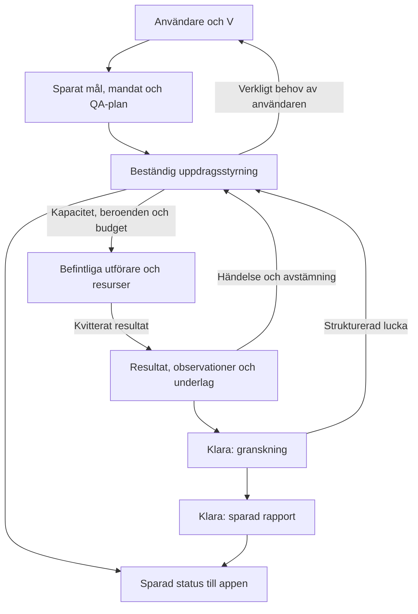

# Syna — utvecklingsplan för autonoma uppdrag

Datum: 2026-10-07 UTC. Revision 4: aktuell implementationsstatus och återstående acceptans; senaste kontrollpunkt 2026-10-07 01:28 UTC (00d7-fönstret). Revision 3:s arbetsorder utgick från `dd3db24c0ed004008355197dfdcfe3a1a4a52061` samt `AGENTS.md`. Revision 2:s fördjupade kodgranskning med tre utvecklingssubagenter gjordes på bascommit `e434bd9d631bf747d17e0650f6d692698b1b4db3`. Dessa granskningar och daterade körloggar bevaras som historiskt underlag. Dokumentet är en plan och implementationslogg, inte ett godkännande av hela autonomin.

Dokumentgranskningen i revision 3 omfattade endast dokumentation. Inga tester, modeller, databaser,
workers eller driftmiljöer kördes eller ändrades för den granskningen. Kodläst
beteende nedan är inte ett nytt acceptansprov. Tidigare daterade verifieringar
gäller endast sitt ursprungliga scope.

**Implementationsmandat 2026-10-05:** användaren har därefter beställt hela P1a–P5.
Arbetet pågår från `dd3db24`. Efter integrerad implementation, oberoende granskning
och relevanta körprov fortsätter nästa paket automatiskt. Den tidigare stoppunkten
efter P1a är ersatt. Produktkod, tester, dokumentation och isolerad lokal
testkonfiguration får ändras; produktion, deploy och externa meddelanden ingår inte.
Aktuella körbevis och kvarvarande acceptansluckor redovisas separat i arbetsloggen.

**Förenkling 2026-10-05:** användaren accepterar att gamla projekt, workspaces och
chattar rensas inför en nystart. Nya autonoma uppdrag behöver därför inte ta över
äldre aktiva jobb. Bygg ingen migreringsmotor för gammal styrning. Befintliga
obundna/okända data får inte automatiskt starta arbete eller räknas som bevis.
Versions- och återförsöksskydd behövs fortfarande inom den nya implementationen.
Utvecklingsproven använder en tom isolerad databas; ingen faktisk rensning av
delade tjänster har gjorts. En eventuell driftrensning ligger utanför dessa prov.

Otto ändrades separat i `22dee70`: implementationen stöder uttryckligt
`CODEX_ACCESS_MODE=shared` för autentiserade appkonton. Det innebär fortsatt
ägarisolering, ett aktivt jobb globalt och credential-spärr; ingen kö eller generell
uppdragsfortsättning infördes. Aktivt driftläge har inte kontrollerats i denna
granskning. Se tidsavgränsningen nedan och [Otto worker](./CODEX_WORKER.md).

## Aktuell status efter integrationsgenomgången

**Kontrollpunkt 2026-10-07 01:28 UTC, källa `00d7c6ed`:** WEB02 W1 `252d1def` har en mekaniskt och oberoende semantiskt godkänd repetition; detta är inte 3/3. AUTH09 W1 `cadf8f76` förblir FAIL: återlämning och ny profilobservation fungerar, men login-inspektionens granskning misslyckas och slutrapporten är korrekt partial/blocked. REP05 `b727503d` gjorde inget intag: V avslutade utan verktyg eller nytt uppdrag, och endast observationsdrivern avbröts kontrollerat. Ingen full observationsfrist eller acceptans påstås. Writer16k har därmed körts för WEB/AUTH, men inte för historiska REP05. **13/35 kvarstår; inga originalutfall omklassas.**

Multiplicitetsregeln för sparade resultat är granskad och integrerad i en instruktionsfil. Reviewer19 är därefter granskad och integrerad i sju filer. Fem riktade rena/SDK-prov, sju faktiska isolerade PG-fingerprintkontroller med syntetisk modell samt full app-/agenttypkontroll passerar. Båda privata byggen har exit 0 på källa `d16d1eac4aa0fedc99a541341fe9fe89fbb5664753257c938520dcec17a08eaf`; faktisk modellverifiering av rättningarna återstår. Se arbetsloggen för exakta kvitton. Äldre daterade statusrader nedan beskriver sina dåvarande lägen.

**Kontrollpunkt 2026-10-07, REP05/16k:** REP05 historical-review-gap på `bdd1df34`, omgång `ea4d1bd2`, avslutades failed 00:40 UTC efter första repetitionen; repetition 2 och 3 startades inte. Tre sparade writer-fel visar `finishReason=length`; ett senare unexpected-fel saknar fastställd orsak. Writer16k är därefter integrerad med versionsbundet outputtak: 3 riktade SDK-prov och 27 isolerade PG-fingerprintkontroller passerar, men något faktiskt modellprov med det nya taket är ännu inte redovisat. **13/35 kvarstår.** Originalutfall och äldre daterade kontrollpunkter bevaras.

**Intag v2 integrerat 2026-10-07:** originalmeddelandet binds nu av kod från det autentiserade chattarkivet; modellen kan välja verifierade tidigare referenser men kan inte skriva om goal. 17 filer har integrerats efter oberoende granskning (`mission-request-root-integration.json`, SHA `23ae362786b927fc05acda45997f9f5fc07db18171eb97d9305dfbc565c1a9cd`). Rootens 22 riktade rena prov, 6 + 25 + 11 faktiska isolerade PG/API-kontroller och full app-/agenttypkontroll passerar. Modell/inkommande kvitton är syntetiska i PG-proven; ingen faktisk modellacceptans tillskrivs dem. Testhjälparens aliasupplösning behövde en separat granskad rättning för installerad Eve; det första importfelet bevaras i loggen. Loggar: `mission-request-root-focus.log`, `mission-request-context-pg-resolved.log`, `mission-request-control-pg.log`, `mission-request-selection-pg.log` och `intake-report16k-typecheck.log` under `.data/autonomy-isolation/`. Nya isolerade Nuxt-/Evebyggen har exit 0 på fryst källa `00d7c6edf4bb1369ad605fd180b65f13feaeebd5d1ccab72d6b0427556737d39` (639 filer; `intake-report16k-build-{web,eve}.log`). Aktuella modellprov återstår; deras audit är en förkontroll. **13/35 är oförändrat.**

**Kontrollpunkt 2026-10-07 00:32 UTC:** planner21 är integrerad i 11 filer; 5 riktade rena prov, 14 isolerade PG-kontroller med syntetiska modellutkast och full app-/agenttypkontroll passerar. W1-harnessens avgränsade rättning för aktiv återlämning är integrerad och passerar 45 rena prov. Ny fryst källa är `bdd1df34` (638 filer); Nuxt- och Evebygget har exit 0. Detta är riktad verifiering, inget nytt modellacceptanspass.

På `efd6bfab` förblir AUTH09 `1e5f155e` och WEB02 W1 `4936f97f` underkända efter första repetitionen; senare repetitioner startades inte. AUTH-rapporten bevarar styrkt kontovy och en ärlig partial för planens extra, read-only-blockerade formulärfall. WEB-historiken är bevarad, men en för snäv tidskontroll stoppade oraklet; efter rättad filbaserad kontroll saknas fortfarande det låsta `article_return`-kravet och en rapportmening har en separat delnumreringsreservation. En avsmalning av målet vid intag har dessutom hittats genom kodläsning, utan ny produktfix eller körverifiering. **13/35 är oförändrat.** Det äldre W1-delpassets villkorade återbruk ger ingen färdig triplet när de nya proven inte passerar. REP05:s nya tre-originalomgång är under förberedelse/körning; audit räknas inte som acceptanspass. Exakta kvitton och tidigare utfall finns i arbetsloggen.

Den daterade körhistoriken finns i [Arbetslogg för autonoma uppdrag](AUTONOMY_WORK_LOG.md). Plan, kontrakt, paketgrindar och arbetsorder finns kvar nedan.

**Återtestprincip:** efter en ändring körs berörda kontraktsprov och det
faktiska flöde som ändrats eller fallerat. Tidigare källbundna pass behålls
med sina begränsningar. Hela katalogen körs inte om efter varje ändring.
Oprövade felvarianter är fortfarande återstående acceptans, inte regression.

## Syfte och två olika sorters agenter

Detta dokument styr hur **vi utvecklar Syna med Codex och dess utvecklingssubagenter**. Dessa är tillfälliga medarbetare för analys, implementation och granskning. De är inte Syna-agenterna V, Iris, Axel, Otto och Klara.

Produktmålet är att ett godkänt uppdrag fortsätter även när användaren lämnar chatten. V orkestrerar, utförarna samlar resultat och Klara granskar underlaget och skriver rapporten. Uppdrag avslutas med verifierbar måluppfyllelse eller ett konkret hinder. Ett korrekt rapporterat underkänt test kan vara ett framgångsrikt slutfört undersökningsuppdrag.

Meaning Model, frameworkbyte, Rust-omskrivning och nya agentpersonligheter ingår inte. Vi använder befintliga Eve-, Nuxt- och PostgreSQL-komponenter där de passar. Detta dokument ger ingen generell behörighet att ändra produktion eller användardata.

## Produktlöftet: ett QA-team som driver uppdraget

En behörig användare utan teknisk förkunskap ska kunna skriva **”Testa den här webbplatsen och ge mig en rapport”**. Användaren ska inte behöva känna till agentnamn, verktyg, uppdrags-ID:n, testplaner eller startkommandon. V ska förstå avsikten, avgränsa arbetet, ordna förutsättningar, fördela uppgifter, följa upp utförandet och leverera Klaras rapport. Uppdragsstyrningen ska fungera även med stängd chatt och efter återstart.

”Vem som helst” betyder en behörig användare i sitt workspace. Det innebär inte att alla exekveringsmiljöer eller testmetoder redan är tillgängliga. Ett fullständigt QA-arbetsflöde kräver upptäckt, planering, utförande, granskning och rapportering; en lyckad verktygskörning räcker inte. Utfästelser om API-, native mobil-, last- eller säkerhetstestning kräver egen verifierad exekveringsförmåga.

### Från vanlig fråga till avslutat uppdrag

1. **Ta emot och kvittera.** Klassificera avsikten: undersöka/testa, verifiera givna krav, köra regression eller sammanställa sparade resultat. Spara uppdraget innan självständigt arbete startas. Bekräfta kort mål, omfattning och att arbetet fortsätter i bakgrunden.
2. **Upptäck förutsättningarna.** Läs relevanta krav, befintliga testplaner, tidigare giltiga resultat, tillgängliga utförare och målmiljön. Publik URL testas direkt när det räcker; repo-setup är inte ett obligatoriskt mellansteg.
3. **Skapa ett avgränsat QA-upplägg.** Saknas testplan väljer V ett versionssatt standardupplägg för undersökande smoke-test: sidans tillgänglighet, viktiga navigationsvägar, upptäckta huvudflöden och relevanta fel-/tomlägen. Välj efter observerad produkt och risk. Skilj uttryckliga krav från hypoteser; hitta inte på domänregler. Spara urval, vad som lämnas utanför och vilket underlag varje kontroll behöver.
4. **Utför och följ upp.** Fördela uppgifter efter faktisk kapacitet, följ beroenden och kontrollera att förväntade testkörningar/underlag verkligen sparats. Utförarens ”klart” avslutar inte automatiskt uppgiften. Kör oberoende grenar parallellt när resurserna tillåter det.
5. **Återhämta.** Klassificera avbrott som infrastruktur, automation, behörighet, oklart krav eller produktutfall. Återanslut och kontrollera osäkra utfall; använd endast begränsade återförsök eller alternativa metoder inom uppdraget. Ett direkt URL-besök ersätter inte kravet att en länk går att klicka.
6. **Granska och komplettera.** Klara läser sparade bevis. Styrningen kan beställa en avgränsad komplettering för en identifierad evidenslucka. En verifierad produktdefekt rapporteras; agenterna försöker inte tills testet blir grönt och ändrar inte produktkod utan ett separat sådant uppdrag.
7. **Rapportera och avsluta.** Spara omfattning, miljö/version, testutfall, verifierade fynd, otestade delar och konkreta hinder. Avslutsorsak skiljs från produktens kvalitet. Rapportleverans är en egen beständig del: rapportfel får inte orsaka omkörning av testerna.

Starta redan beställt arbete utan ytterligare godkännande av rutinplanen. Fråga samlat när rätt mål inte kan fastställas, ett avgörande krav saknas, ny inloggning/nyckel/MFA behövs eller mandatet måste utökas. Fortsätt oberoende arbete under tiden. När ett svar eller en giltig konfigurationshändelse kommer under giltig väntan ska berörd gren återupptas utan ”ska jag fortsätta?” igen, efter kontroll av aktuellt mandat. Sena svar hanteras enligt avsnittet om uteblivet svar. Oklara produktkrav behöver inte blockera ofarlig undersökning, men begränsar vilka slutsatser som kan dras.

Användaren ser kort: **Vad görs nu? Vad har hittats? Behövs något från mig? Var finns rapporten?** Status kommer från sparat uppdragstillstånd och sammanfattas vid meningsfulla förändringar. Långa agentresonemang ska inte vara enda sättet att förstå arbetet. Att stoppa chattens svar och att avbryta QA-uppdraget är olika åtgärder och ska visas tydligt.

## Arbetsprinciper för utvecklingen av Syna

Utvecklingsarbetet följer dessa principer:

- En huvudagent ansvarar för helhet, kontrakt, integration och slutkontroll.
- Varje delegering har ett mål, tillåtna filer, beroenden och verifierbar leverans.
- Exklusivt filägande eller separata worktrees förebygger konflikter.
- Granskare söker konkreta fel och motexempel, inte bara bekräftelse.
- Ett komplett, avgränsat flöde ska bevisa arkitekturen före bred utbyggnad.
- Observationer, förslag och faktiskt verifierade resultat märks separat.

Antalet utvecklingssubagenter styrs av tillgängliga platser och oberoende uppgifter. Vid planeringen finns fyra samtidiga platser inklusive huvudagenten; kontrollera aktuell kapacitet vid start. Antalet agenter är inget kvalitetsmått. Modell/reasoning följer användarens inställning om inget annat uttryckligen begärs.

## Kodbas vid planeringen och återanvändning

Följande inventering och agentkarta beskriver planeringens bascommit, inte dagens
implementationsstatus. Aktuell status står ovan och i arbetsloggens pakettabell.
Kodreferenser är startpunkter från genomgången och ska kontrolleras mot aktuell
commit före implementation. Äldre testresultat verifierar inte senare ändringar.

| Del | Befintlig grund | Riktning |
|---|---|---|
| Uppdrag, uppgifter, resultat | `shared/mission.ts`, `server/utils/missions.ts` | Utöka befintliga kontrakt och statusövergångar; skapa ingen parallell uppdragsdatabas |
| Källnormalisering | `server/utils/mission-sources.ts` | Gemensamma observationer, slutsatser och versionsbundna underlag via befintliga adaptrar |
| Klara och rapportkö | `server/utils/mission-reports.ts`, `agent/lib/mission-reporter.ts` | Bevara läskvitton, källkontroller och rapporthistorik; kompletteringsbehov blir strukturerade förslag |
| Granskning | `agent/lib/result-reviewer.ts` | Bevara originalresultat och separata granskningsbedömningar |
| Utförarnas återkoppling | `agent/channels/iris.ts`, `agent/channels/setup.ts` | Flytta beslut om fortsatt arbete till en gemensam uppdragsstyrning |
| Chattens avslut efter delegering | `shared/codex-handoff.mjs` | Behåll responsiv chatt; skilj chattkvittens från uppdragets fortsättning |
| Befintliga verifieringar | `docs/KLARA_REPORTING.md`, `tests/mission-orchestration.integration.mjs` | Återanvänd fixtures och komplettera med livscykel- och feltester |

### Faktiska agentkopplingar

Kodgranskat på revision 2:s bascommit och centrala vägar återlästa på revisionscommiten ovan. Diagrammet visar befintliga kopplingar, inte ett verifierat autonomt flöde eller önskad framtida funktion.

```text
Användare -> V (Eve-chatt)
  |-> browser_job -> appens browserJobs -> Iris (egen Eve-session)
  |       |-> browser / test_run / Material -> sparade bevis
  |       `-> färdighändelse -> begränsad rapportnotis till V
  |-> repo-subagent -> Axel (deklarerad Eve-subagent)
  |       |-> repository -> avgränsat repojobb -> resultat till appens DB
  |       |-> delad VPS-sandbox -> kommandon / preview
  |       `-> codex -> Otto (extern VPS-worker)
  `-> codex -> Otto -> setupJobs -> specialfall: föräldrachatten fortsätter

test_run finish -> testgranskningskö -> Klara-bedömning
Sparade källor + befintliga Klara-bedömningar
  -> reconcileMission -> uppdragsläge/snapshot
  -> rapportkö -> Klara-rapport -> begränsad rapportnotis till V
```

Rollnamnen motsvarar alltså olika tekniska körvägar. Iris är inte en deklarerad Eve-subagent; Otto är inte samma slags process som Axel; Klaras granskning och rapport använder separata modellvägar. Det behöver inte göras identiskt, men de behöver samma uppdrags-, ägar- och resultatkontrakt. Axel delar uttryckligen förälderns sandbox via `agent/subagents/repo/sandbox.ts`; sådan delning är inte Eve-standard för deklarerade subagenter.

### Konkreta fynd och följder för byggordningen

| Fynd | Kodankare | Åtgärd i planen |
|---|---|---|
| Beroenden är lagrade metadata. Avstämningen uppdaterar resultat men startar inte redo uppgifter | `shared/mission.ts:16–28`, `server/utils/missions.ts:115–133` | Gemensam uppdragsstyrning med validerade övergångar och dispatch |
| Iris/Klara-notiser saknar exekveringsverktyg; setup fortsätter genom ursprunglig chatt och kan avstå när sessionen bytts | `agent/agent.ts:15`, `agent/channels/iris.ts:14`, `agent/channels/setup.ts:15`, `server/utils/setup-jobs.ts:52–64` | Fortsättning via sparat uppdrag, notiser separat; behåll tool-free-notisernas skydd |
| Schemat som modellen ser för repoverktyget saknar `mission`, trots stöd i gemensamt schema och backend. Axel återanvänder samma verktyg | `agent/tools/repository.ts:11–20`, `shared/repository.ts:13`, `server/utils/repositories.ts:59,78` | Reparera kontraktskedjan och testa faktisk verktygsinput före bred autonomi |
| Alla Material-objekt utom kända missionReports klassas som `source`; rapportvalideringen använder `origin != agent` som oberoende bevis | `server/utils/mission-sources.ts:20–23`, `shared/mission-report.ts:20–22` | Explicit proveniens och `unknown` för äldre oklar källa. Kodinspekterad risk: en agents egen anteckning kan annars räknas som oberoende |
| `closed` kräver terminala registrerade uppgifter, inte full kriterietäckning. `supported` kan styrka ett korrekt rapporterat misslyckande | `server/utils/missions.ts:77`, `shared/mission-report.ts:30`, `agent/lib/result-reviewer.ts:6` | Separera körstatus, produktutfall, bevisstöd och uppdragets avslutsorsak |
| Klaras nästa steg är fritext; detaljerade kontrollpunktsluckor reduceras i uppdragsprojektionen | `shared/result-assessment.ts:29`, `shared/mission-report.ts:6`, `server/utils/mission-sources.ts:40` | Typade, stabilt identifierade luckor som förs vidare utan omtolkning |
| Osäker Iris-dispatch kan låsa arbetsytans aktiva jobb; statusläsning är ingen full återhämtning | `server/utils/browser-jobs.ts:20–43` | Avstäm befintligt försök/session, skilj avbrytning begärd från bekräftad, inför watchdog |
| Repokvittot sparar resultat men driver inte nästa deluppgift | `server/api/internal/repository-result.post.ts:18` | Samma resultathändelse ska kunna väcka uppdragsstyrningen |
| Historiskt: Otto var kontoavgränsat på bascommit `e434bd9`. Aktuell kod stöder `shared`, `pilot` och `disabled`; ett aktivt jobb globalt och credential-spärr finns kvar | `infra/codex-worker/access.mjs`, `infra/codex-worker/worker.mjs:55–88`, ändring `22dee70` | Kontrollera faktiskt läge/kapacitet före start. Fleranvändaradmission är implementerad; autonom köning och hela QA-kedjan är separata leveranser |
| Nuvarande integrationstest instruerar V om verktyg/ID:n och driver rapportkön från testskriptet | `tests/mission-orchestration.integration.mjs:18,34` | Lägg till naturliga användaruppdrag och verifiera verklig bakgrundsdrift utan testskript som driver nästa steg |

**Otto: håll isär tid och bevis.** Bascommitens pilotspärr är ett historiskt
kodfynd, inte en kvarvarande generell enanvändarbegränsning. På `dd3db24` läser
workern åtkomstläget och kontrollerar användare, sandbox-ägare och workspace;
appens interna endpoint kontrollerar trådägaren (`server/api/internal/codex.post.ts`).
`tests/codex-access.test.mjs` beskriver prov av åtkomstlägena, men har inte körts
i denna dokumentgranskning. Användaren har tidigare rapporterat att testkontot
kunde trigga agenterna; det är inte ett dokumenterat prov av samtidig isolering,
kö/rättvisa eller obevakat QA-avslut. Dessa återstår i respektive acceptansprov.

### Kapaciteter och ansvar

Agentguiden i `shared/agent-capabilities.ts` beskriver produkten; den är inte en aktuell behörighets- eller driftkontroll. Inför ett litet typat kapacitetskontrakt ovanpå befintliga adaptrar, inte ett generellt pluginramverk. Servern avgör tillgänglighet för aktuell användare/workspace/runtime och validerar igen vid dispatch.

| Arbete | Befintlig väg / begränsning | Planeringsregel |
|---|---|---|
| Publik webbinspektion | Research, tillfällig läsande Chromium | Samla källor; påstå inte att interaktiva flöden testats |
| Interaktiva webbtester | Iris/browser, övertagande; ett aktivt Iris-jobb per workspace | Kör observerade flöden; isolera eller serialisera browser-state |
| Repoanalys/testkommandon | Axel vid analysbehov; repository stöder publika GitHub-repon | Direkt typat kommando när strategi är känd; ingen onödig agentkedja |
| Appstart/testmiljö | Sandbox/preview; Otto stöder `shared`/`pilot`/`disabled`, ett aktivt Otto-jobb globalt utan kö | Välj tillåten setup-adapter efter faktisk admission/kapacitet. Kringgå inte pilot/disabled, ägargräns eller credential-spärr genom en annan executor |
| Inloggning och hemligheter | Övertagande för login; Vault har krav på sparande/fortsättning | Beskriv ett konkret behov. Bevara skydd och återuppta från giltig händelse |
| API/manuell/native mobil | Typer i testplan är inte bevis på motsvarande executor | Markera faktisk tillgänglighet; mobil viewport räknas som webbtest |
| Linear/GitHub | Behörighetsberoende kopplingar och separat extern skrivning | Läsa inom åtkomst. Publicera/uppdatera endast inom sparat användarmandat; rapporten kan färdigställas även om publicering blockeras |

V äger mål och kommunikation; Axel kodundersökning och val av repostrategi; setup-adaptern/Otto miljöförberedelse; Iris webbinteraktion; Klara granskning och rapport. Samma logiska uppgift har en exekveringsägare och en resursreservation. Direktverktyg och specialister går genom samma kontroller.

## Arkitekturbeslut: återanvänd Eve och befintlig exekvering

Installerad version är Eve `0.47.3`. Bundlade guider som granskats: `subagents/index.mdx`, `concepts/sessions-runs-and-streaming.md`, `concepts/execution-model-and-durability.mdx`, `concepts/built-in-tools.md`, `schedules.mdx` och `guides/deployment/self-hosting.md` under `node_modules/eve/docs/`.

- **Eve äger modellsessioner och deras hållbara steg.** Behåll sessioner, strukturerade verktyg, kanaler och autentisering. Ett barns kontext måste överföras uttryckligen; gemensam historik uppstår inte automatiskt.
- **Syna äger uppdragets domäntillstånd i befintlig PostgreSQL.** Utöka mission/task-modellen med tillåtna beslut, beroendekrav och försök. En separat mission-worker kan anropa en avgränsad planeringssession när bedömning behövs; vanlig kvittens, status, deduplicering och köning behöver inte ett modellanrop.
- **Utförarna äger körning och resurser.** Återanvänd `infra/execution/outbox.mjs`, `store.mjs`, `budget.mjs` och befintliga runner/browser-kontroller. Appens beständiga fortsättningsavsikt och workerns resultatleverans har olika ansvar; bygg inte en andra VPS-resurskö.
- **Experimentella Workflow-verktyget är inte en genväg till produktmandat.** Den installerade guiden beskriver modellgenererad JavaScript-samordning som ett modellverktyg, inte ett API för appkod. Utvärdera befintliga session-/schedule-primitiver för mission-workern; aktivera inte fritt genererad orkestreringskod som första implementation.
- **Återspelning kräver logiska identiteter.** Eve `meta.id` deduplicerar samma streamhändelse, men ett återförsökt steg kan skapa nya event-ID:n. Använd även stabil operation/task/attempt-identitet, inte textlikhet eller enbart event-ID. Chattens `queue`-policy ersätter inte en domänkö.
- **Driftförutsättningarna måste bevisas.** `eve dev` kör inte cron automatiskt. Anpassad hosting måste starta schemaläggaren. Self-host kräver beständig workflowlagring och fungerande workflow-callbackrutter. `nuxt dev`/`nuxt preview` i package scripts bevisar inte dessa egenskaper. Dokumentera faktiskt deployläge, watchdog, senaste lyckade körning och återstartstest innan autonomi utlovas i produktion.

`docs/VPS_EXECUTION_PLAN.md` äger säker exekvering, miljöprofiler, browserkontroll, nätverk och fysisk resurskapacitet. Detta dokument äger när och varför nästa QA-steg ska köras, med användarmandat, kriterier, budget och avslut. Gränsen är ett gemensamt typat körningskvitto/resultat. `docs/KLARA_REPORTING.md` förblir dokumentation av befintlig rapportering; uppdatera den när implementationen ändrar beteendet.



## Föreslaget produktkontrakt

Detta är designkrav, inte färdiga schemas. P1a låser sin begränsade kontraktsändring enligt arbetsordern nedan; P1b låser styrningens återstående kontrakt. Hela målbilden är inte ett startvillkor för P1a.

1. **Uppdrag:** avsikt, mål, kriterier, avgränsning, ägare/workspace/runtime, konfigurationsrevision och uttryckligt arbetsmandat. Mandatet omfattar tillåtna åtgärder, målmiljöer, budget, deadline och stoppvillkor. Separera användarens ändrade mål/mandat från händelse- och snapshotrevision; en ny observation ska inte automatiskt ogiltigförklara alla pågående uppgifter.
2. **Uppgift/försök:** typad exekveringsspecifikation, beroenden med nödvändigt utfall, kriterier/kontrollpunkter, kapacitet, stabil operations-/dispatchidentitet, försök, status och resursanspråk. Specificera förväntade leveranser, exempelvis två bundna testkörningar med vissa captures. En ny transportleverans får inte skapa ett nytt logiskt försök.
3. **Observation:** vad som faktiskt observerats, tid, insamlare/metod, miljö/version och hänvisning till källa. Agentens berättelse ska kunna skiljas från verktygsdata. Observation och utförd åtgärd är olika saker.
4. **Slutsats:** vilket kriterium som bedöms, produktutfallet och vilka observationer som stödjer eller motsäger slutsatsen. Saknad observation är inte ett godkännande. Okänt krav blir en synlig kunskapslucka, inte ett påhittat fel eller en evig testloop.
5. **Underlag:** stabil identitet, version/hash, ursprung/derivationskedja, åtkomstgräns och tillgänglighet. Okänt ursprung ska vara `unknown`, inte oberoende bevis. Agentinsamlade verktygsbevis är möjliga bevis; agentförfattad text blir inte oberoende av att sparas i Material. Referenser förmedlas av kod; hemligheter ska inte ingå.
6. **Granskning:** bedömning per kriterium/kontrollpunkt, bevisstöd, källrevision/hash och strukturerade luckor. Originalresultatet skrivs inte över. Bevara fulla findings till uppdragsstyrningen. Gemensamma regelprimitiver kontrollerar mål/version/tid, läskvitto och relevans både vid testgranskning och rapportskrivning.
7. **Kompletteringsförslag:** stabilt gap-ID, kriterium/kontrollpunkt, lucktyp, underlag/försök, önskat bevis, föreslagen kapacitet, förutsättningar och freshness. Deduplicera strukturellt även om Klara formulerar samma lucka annorlunda. Fritext är aldrig ett exekverbart kommando.
8. **Fortsättningsbeslut:** gap eller beroende, planrevision, logisk åtgärd, faktaunderlag, beviljat mandat, reservation, rundnummer och beslut/avslagsorsak. Persistas före dispatch. Klara föreslår; servern kontrollerar och beslutar om nästa steg.
9. **Avslut:** orsak, kvarvarande kriterier och rapportrevision. Exempel på orsaker: genomförd undersökning, kriterier uppfyllda, blockerad, budget förbrukad eller avbruten. Orsaken är inte ett testutfall.

Användaren har 2026-10-05 tillåtit att äldre projekt-, workspace- och chattdata rensas om det förenklar övergången. Därför krävs ingen generell migrering av gamla uppdrag till den nya styrningen. En eventuell rensning ska avgränsas till Syna-data; detta medgivande är inte ett krav att rensa eller ändra produktion under implementationsuppdraget. Bevarade äldre resultat ska läsas med versionssatta adaptrar och explicita okända värden. Härled inte uppdragsmedlemskap från chattnamn eller tidsmässig närhet. Befintliga historiska uppdrag får inte börja utföra nya åtgärder bara för att funktionen aktiveras.

Inom ett nytt accepterat autonomt uppdrag är mission/task/attempt-bindning obligatorisk och serverhärledd. Ad hoc-verktyg kan fortsätta stödja äldre användning utanför detta läge. Testa bindningen genom hela kedjan: modellens faktiska verktygsschema → adapter → API → körning → underlag → granskning. Iris har redan serverhärledd testbindning i `server/api/internal/test-run.post.ts`; bevara den och inventera övriga gränser. Saknade utlovade testresultat efter ett avslutat Iris-jobb blir en konkret leveranslucka.

### Tillstånd är flera separata dimensioner

Föreslagna begrepp för P1, mappas versionssatt mot befintliga typer:

| Dimension | Vad den besvarar |
|---|---|
| Livscykel | Är uppdraget accepterat, aktivt, väntande, avbrytning begärd eller avslutat? |
| Arbetsfas | Upptäcker, planerar, förbereder, testar, granskar, kompletterar eller skriver rapport? |
| Produktutfall | Vad fungerade, vad misslyckades, vad är oklart/otestat/blockerat? |
| Bevisstöd | Är slutsatsen underbyggd, motsagd, otillräcklig eller inaktuell? |
| Avslutsorsak | Är det beställda QA-arbetet gjort eller stoppades det av hinder/budget/användaren? |

`completed` för en worker öppnar inte automatiskt nästa beroende. Miljöförberedelse måste till exempel uppfylla den observerade readiness som just nästa test behöver; HTTP 500 är ett terminalt setup-resultat men inget starttillstånd för en lyckad smoke-kontroll. Ett underbyggt funktionsfel kan däremot fullborda kriteriet ”undersök funktionen och rapportera utfallet”. Rapport-only-uppdrag omfattar bara befintligt underlag.

### Återanvändning av Vault och åtkomst

Nuvarande `agent/instructions/project-environment.md:26–29` kräver uttryckligt Spara och fortsätt. För obevakad återstart behöver P1b definiera ett sparat återanvändningsmedgivande för bestämt workspace/repo/testmiljö, variabelnamn och tillåtna verifierade startoperationer. Det ska kunna återkallas och omprövas vid relevant ändring av kod/startplan eller åtkomst. Att en nyckel finns lagrad ger inte generell shellåtkomst till den. Behåll isolerad injicering och nuvarande skydd för miljöer med hemligheter. Vid giltigt medgivande används sparad konfiguration utan upprepad fråga; annars samlas det nödvändiga beslutet i en tydlig begäran. P1a ändrar varken medgivande eller injicering. P2a använder inga nycklar; P2b får inte återanvända dem autonomt innan medgivandets implementation är verifierad.

### Kontext och kostnad

Bygg modellinput från aktuellt mål/mandat, godkänd plan, relevanta nya händelser, öppna luckor och ett litet index till underlag. Hämta detaljer vid behov. Delad sanning betyder gemensamma referenser, inte all chatt och alla rapporter i varje prompt. Lägg inte in hela köhistoriken eller hemligheter. Modell/verktygsval konfigureras per uppgift med tillåten eskalering; högre reasoning i utvecklingschatten ändrar inte Syna-agenternas modeller.

Behåll separata roller för testgranskning och rapportskrivning, men återanvänd läsning/proveniens/freshness-regler. Samma modell med olika namn räknas inte som oberoende bevis. Optimera efter mätning: färre onödiga agentövergångar, mindre kontext, händelsestyrd köning och begränsad parallellism med rättvis resursfördelning. Nuvarande rapport-/granskningsköer är serialiserade per runtime; detta är en möjlig flaskhals, inte en uppmätt sådan.

Telemetri sparas per anrop/försök även vid fel/avbrott: modell, token, kötid, exekverings-/granskningstid, reservation och känd/okänd förbrukning. Dagens rapportfält kan skrivas över vid nytt försök och fångar inte automatiskt hela kostnaden (`server/utils/mission-reports.ts`, `agent/lib/result-reviewer.ts`). Aggregera sedan till uppdraget med daterad prislista. Sanerad telemetri ska räcka för felsökning utan att lagra hemligheter eller privata resonemang.

## Livscykel och invariants

Beständiga händelser väcker uppdragsstyrningen. En periodisk avstämning återhämtar missade väckningar. UI-notifieringar får inte vara den enda mekanismen som driver uppdraget framåt.

- Resultat och nästa händelse måste kunna sparas atomärt eller återställas deterministiskt. Återanvänd lämplig befintlig kö/journal; inför inte ännu en kö utan dokumenterat behov.
- Dubbletter och omkastade händelser accepteras säkert. Konsumenter deduplicerar med stabila ID:n.
- Lease/fencing och mandat-/konfigurationsrevision valideras vid commit och dispatch. En gammal worker får inte återuppliva ett stoppat uppdrag. Sena observationer kan sparas som historik utan att ge rätt att fortsätta enligt en gammal plan.
- Osäkert utfall av en extern skrivning ska avstämmas före återförsök. Vi utlovar inte generell exactly-once-exekvering.
- Beroenden och resursägande kontrolleras före start. Två utförare får inte samtidigt styra samma muterbara webbläsarsession eller repo-checkout.
- Budget reserveras inför parallella starter och stäms av mot utfall. Okänd förbrukning måste hanteras uttryckligen; den räknas inte som noll.
- Ändrat mandat/konfiguration, paus, avbrytning och saknade behörigheter stoppar otillåtna fortsättningar. Vanliga nya observationer uppdaterar händelse-/snapshotrevisionen. Pågående externa åtgärder kan behöva avslutas kontrollerat och deras resultat bevaras.
- Kompletteringsrundor är begränsade och identifieras per lucka/kriterium. Föreslaget första tak: två rundor, fastställs i P1b och verkställs/testas i P3. Rapport-only-uppdrag startar aldrig tester.
- Alla läsningar, händelser, resultat och återupptagningar behåller användar-, workspace- och runtimeisolering.
- Mänskligt browserövertagande parkerar berörd uppgift och bevarar kontrollägarskapet. Ingen annan utförare får kringgå det. Återlämning väcker uppgiften och börjar med färsk inspektion.
- Blockering gäller minsta beroende gren. Nyckelbrist för lokalt repo stoppar inte redan tillåten, oberoende undersökning av en publik URL.
- En tyst/stannad worker upptäcks via senaste livstecken och förväntad deadline. Skilj långsam operation från övergiven lease; en watchdog ska inte skapa konkurrerande körningar.

### När användaren inte svarar

Designkrav för P1b:s livscykel, inte befintligt beteende. Dagens `missionConfigSchema`
och `taskSchema` i `shared/mission.ts` saknar ett kontrakt för väntande användarsvar.

- Spara frågans identitet, berörda grenar, mandat-/planrevision, väntorsak och sista svarstid. Håll svarstid skild från worker-lease och operationstimeout. P1b fastställer en ändlig standardfrist och hur den förhåller sig till uppdragets deadline; inga tider aktiveras genom denna plan.
- Parkera endast beroende grenar. Redan tillåtet oberoende arbete och rapportering fortsätter inom budget. Släpp onödiga resursreservationer; respektera befintligt mänskligt browserövertagande och resursens TTL.
- Uteblivet svar ger aldrig nytt mandat eller ett antaget krav. Skapa en delrapport när det oberoende arbetet är klart men svar fortfarande väntas. Återanvänd samma fråga; skapa inte en ny varje schemaläggartick.
- Vid svarstidens slut blir grenen blockerad med orsaken uteblivet svar. När inget aktivt eller tillåtet körbart arbete och ingen giltig väntan återstår avslutas uppdraget med en rapport över utfört arbete och luckor. Det är ett avslut på QA-arbetet med hinder, inte ett godkänt test. Uppdragets deadline stoppar nya starter; rapportleverans återförsöks separat inom sin begränsade policy och redovisar ett eventuellt leveransfel.
- Ett svar före avslut återupptar endast den berörda grenen efter kontroll av ägare, revision, mandat och aktuella förutsättningar. Ett sent svar får inte tyst återuppliva ett avslutat/avbrutet uppdrag: P1b ska definiera hur en uttrycklig återupptagning skapar en ny giltig revision. Historiska resultat bevaras.

## Arbetsordning och utvecklingssubagenter

Huvudagenten håller planen uppdaterad, fastställer kontrakt och integrerar. Använd högst tillgänglig samtidighet. Delegera avgränsade paket; ingen rekursiv agentuppdelning utan behov. Subagenter delar inte automatiskt filägande.

| Paket | Leverans | Beroende | Lämplig arbetsfördelning |
|---|---|---|---|
| P0 | Flödeskarta, schema-/behörighetsinventering, driftförutsättningar och reproducerbar baslinje | Inget | Tre läsande granskare: livscykel, kontrakt/evidens, användarintag; huvudagent verifierar och sammanställer |
| P1a | Täta befintliga kontraktsluckor enligt arbetsordern nedan | P0:s kodinventering och beslut A1–A4; inte hela drift-/kostnadsbaslinjen | Huvudagent låser gränssnitt; separata adapter-/evidenspaket och oberoende regressioner |
| P1b | Intake, tillståndsövergångar, typade uppgifter, mandat/budget, svarstider, Vault-medgivande och styrningens versionskompatibilitet | P0:s relevanta inventering och P1a-kontrakt; inget krav på färdig bred benchmark | Huvudagent äger kontrakt; oberoende granskare söker race conditions |
| P2a | Publik URL → upptäckt/testplan → Iris → Klara → rapport utan öppen chatt | P1a–P1b | En implementerar livscykel; en skriver feltester mot låst kontrakt i separata filer |
| P2b | Repo → tillåten miljöförberedelse → preview → browser med samma styrning; verifiera vanliga konton | P2a | Setup-adapter och behörighets-/resursprov. Ingen parallell specialorkestrering |
| P3 | Strukturerade Klaraluckor och begränsade kompletteringar | P2a; repoacceptans efter P2b | En äger Klara-adaptern; huvudagent integrerar med styrningen |
| P4 | Enkel uppdragsstatus i appen, sanerad telemetri och jämförelse | Börjar med P1b; slutförs efter P2–P3 | Separata UI- och mätpaket om deras kontrakt är låsta; mätning byggs in från första exekveringen |
| P5 | Ta bort ersatt styrning, migration/rollback, full verifiering | P3–P4 | Huvudagent integrerar; annan agent granskar slutdiff och felprov |

P0:s kodinventering får utföras parallellt som läsande arbete. Dess körprov är separata, uttryckligen avgränsade aktiviteter. Varje paket låser bara kontrakt som dess implementation behöver. En liten naturlig baslinje ska tas före ändrat intake-/fortsättningsbeteende i P1b/P2a; den breda 10–15-uppdragsmätningen får växa successivt och blockerar inte P1a. P3:s kompletteringsloop kan först verifieras mot P2a; repoanpassningen kräver även P2b. Den som granskar ett paket bör inte vara dess enda författare. Huvudagenten kontrollerar själv kritiska fynd och integrationsresultat.

**Aktuell beroendetolkning:** P2b och P3 har implementerats och delprovats mot
de låsta kontrakten medan P2a:s verkliga prov har hittat fel. Det flyttar inte
deras acceptansgrindar: P2a:s webb-/återstartsmatris ska fortfarande passera,
P2b behöver sin verkliga repo-/miljökedja och P3 sin verkliga begränsade
komplettering. P4 kan fortsätta med UI, testdata och mätning oberoende; P5 kan
slutföras först när de föreskrivna uppdrags- och felproven är redovisade.

### Första arbetsorder: P1a — befintliga kontrakt, ingen ny orkestrering

**Mål:** repoverktyget bevarar uppdragskopplingen och Klara kan skilja sparade
påståenden från aktuellt underlag och saknade leveranser. Återanvänd nuvarande
adaptrar, testurval och rapport-/granskningsköer. Arbetsordern aktiverades av
implementationsmandatet ovan; revision 3:s tidigare dokumentgranskning är historik.

**Beslut som måste låsas vid P1a-start före beroende kodändring:**

| ID | Minsta kontraktsbeslut | Avgränsning / kvarvarande konkretisering |
|---|---|---|
| A1 Bindning | Behåll `missionBindingSchema` inklusive validerad JSON-objektinput. Modellen får ange referenser; servern verifierar ägare/workspace/runtime och aktiv uppgift före exekvering. Samma startidentitet får inte tyst byta exekveringsuppdrag | Lås idempotensens bindningsfingeravtryck och konfliktbeteende. Skilj ny exekveringsbindning från uttrycklig återanvändning av historiska källor i rapport-only. Bevara legitim ad hoc-användning utan mission; obligatorisk autonom bindning införs med P1b/P2 |
| A2 Proveniens | Ursprung fastställs av betrodd insamlings-/skrivväg per version. Agenttext, verktygsobservation och okänd äldre källa skiljs åt; en URL, chattkoppling eller agentangiven `source`-etikett är inte bevis på ursprung | Lås lagring/versionering och vilka producenter som kan intyga ursprung. `unknown` får inte klara en negativ kontroll som `origin != agent`; använd explicit tillåten proveniens. Bevara giltiga research-/capturebevis |
| A3 Leveranstäckning och stöd | Koppla befintliga kriterier, `caseKeys`, uppgifter, testkörningar och kontrollpunkter. Utförarens terminalstatus fyller inte saknade leveranser. Underbyggt negativt produktutfall är en giltig slutsats | Lås en liten gemensam bedömningsprojektion med luckors källreferenser; definiera minsta uttryckliga förväntan där dagens urval inte räcker. Ingen full exekveringsspecifikation, dependency-dispatch eller kompletteringsloop i P1a |
| A4 Kompatibilitet | Äldre resultat/snapshots/rapporter förblir läsbara och originalbedömningar bevaras. Saknad proveniens/täckning blir explicit okänd i en ny bedömning, aldrig automatiskt godkänd | Lås schema-/granskarversion, cache-/snapshotinvalidering och eventuell additiv migrering för just P1a. Förhindra att en gammal fryst `source`-klassning återanvänds som ny betrodd verifiering. Bevara delningens begränsade projektion |

Full mandatmodell, budgetreservation, deadlines, kapacitetskö, Vault-medgivande,
worker/fencing och fortsättningspolicy hör till **P1b/P2**, inte A1–A4. Befintliga
åtkomst- och credential-skydd gäller oförändrat tills deras ersättare är verifierad.
Gemensamma regelprimitiver ska gälla de relevanta kontrollerna i båda Klara-vägarna;
de behöver inte samma inputformat, modellprompt eller kö.

**Intern genomförandeordning och verifiering:**

P1a genomförs i tre sekventiella steg inom samma paketgräns. Lås berörda
A1–A4-beslut före respektive ändring. Nästa steg börjar först när det föregående
stegets relevanta prov har passerat och underlaget har sparats i arbetsloggen.

| Steg | Leverans | Verifiering före nästa steg |
|---|---|---|
| 1. Schema/bindning | A1: schema-paritet genom V/Axel → API → sparad körning, med korrekt ägarskap och idempotens | Acceptanskriterium 1: giltig bindning och ad hoc fungerar; felaktig JSON, fel scope och ombindning av samma startidentitet avvisas utan ny exekvering |
| 2. Proveniens/kompatibilitet | A2 och A4: betrodda producenter, versionsbundet ursprung och hantering av äldre underlag/snapshots | Acceptanskriterium 2 och versionsdelen av 4: agenttext/okänd källa kan inte ensam styrka en slutsats; giltigt verktygsunderlag fungerar; gamla resultat är läsbara och oförändrade |
| 3. Leveranstäckning/gemensamma regler | A3: synliga leveransluckor och gemensamma relevanta regler i båda Klara-vägarna | Acceptanskriterier 3–5 samt en integrerad regression av hela P1a, inklusive berörda kontrakt från steg 1–2 |

Nödvändiga kontroller hos proveniensens konsumenter införs redan i steg 2;
de skjuts inte till steg 3 så att `unknown` tillfälligt kan räknas som oberoende
bevis. Steg 3 slutför samordningen och leveranstäckningen. Vid varje steg loggas
commit/diff, faktiskt körda kommandon, utfall och kvarvarande luckor. Kör relevanta
enhets-/isolerade integrationsprov, typkontroll för app och agent samt lint innan
nästa steg. Uteblivet eller misslyckat prov innebär att steget inte är verifierat;
lös hindret innan beroende arbete fortsätter. Ändras ett tidigare kontrakt återkörs
berörda tidigare prov. Efter steg 3 gäller integrationsgrinden nedan.

**Leveranser och acceptanskriterier:**

1. **Schema-paritet och bindning genom kedjan.** `agent/tools/repository.ts` och Axels återexport accepterar samma mission-binding som `shared/repository.ts`. Prov går genom modellens faktiska verktygsschema, intern-API och sparat resultat. Fel task/workspace/runtime avvisas före runner-anrop; identiskt återförsök återanvänder bindning/körning och ändrad bindning under samma startidentitet avvisas. Ogiltig JSON ska inte degraderas till obundet arbete. Ad hoc-flödet har en positiv regression.
2. **Proveniens genom skrivning, läsning och granskning.** Följ producenterna (Material, research, browser/test-capture) till `mission-sources`, evidensläsare och båda Klara-valideringarna. En agentanteckning med källa/länk, en kopierad rapport eller ett äldre objekt utan pålitligt ursprung kan inte ensam ge `supported`. Färska, korrekt bundna verktygsbevis kan fortfarande användas. Saknad/fel version, fel körning, oläst underlag och hemligheter har negativa regressioner. Historiska resultat skrivs inte över.
3. **Synliga leveransluckor.** Ett avslutat Iris-jobb med två av tre uttryckligen valda testkörningar, eller ett kriterium utan relevant leverans, ger en kvarvarande lucka och får inte presenteras som fullt genomfört. Återanvänd `missionMetrics` och befintlig kontrollpunktstäckning. Ett underbyggt misslyckat test räknas som utfört QA-arbete. Ingen automatisk omtestning eller ny avslutstillståndsmaskin ingår.
4. **Gemensamma regler utan dubbel styrning.** Testgranskning och uppdragsrapport använder samma relevanta proveniens-/läs-/versionsregler. Ta bort de ersatta kontrollerna och dokumentera skillnader som medvetet behålls. En snapshot med äldre regelversion får inte bli aktuell verifiering utan föreskriven kompatibilitetskontroll/ny bedömning.
5. **Granskningsbar leverans.** Redovisa låsta A1–A4, ändrade kontrakt/call sites, relevanta enhets- och isolerade integrationsprov, `pnpm typecheck` (app och agent), lint, berörda byggen och kvarstående risker. Om prov inte kan köras är paketet inte acceptansverifierat; ange exakt vad som endast kodgranskats.

Startpunkter för filfördelning: `agent/tools/repository.ts`, `shared/repository.ts`,
`shared/mission-binding.ts`, `shared/mission.ts`, `shared/mission-report.ts`,
`shared/result-assessment.ts`, `shared/mission-metrics.ts`, motsvarande
`server/utils/{repositories,missions,mission-sources,mission-evidence,mission-reports,result-assessments}.ts`
samt berörda insamlare och tester. Lås faktisk filfördelning efter A1–A4; ändra
inte alla dessa filer bara för att de listas. Följ `AGENTS.md`: läs relevant Eve-guide
före agentkod, behåll intern-API:s autentisering och båda typkontrollerna.

**Verifieringsmiljö:** `package.json` kör `db:migrate` före både `dev` och `build`;
kommandona är inte enbart läsande kontroller. Fastställ isolerad testdatabas/runtime
före sådana körningar. `AGENTS.md`:s äldre `auth:schema`/Better Auth-kommandon
saknas i aktuell `package.json`; `docs/ARCHITECTURE.md` anger Supabase Auth och
att gamla auth-CLI:n inte ska regenerera schemat. Ingen auth-omläggning ingår.

**Integrationsgrind (ersätter tidigare stoppunkt):** granska P1a:s diff, testbevis,
kompatibilitetsbeslut och återstående luckor. Fortsätt automatiskt till P1b när
paketets beroende kontrakt är verifierade. Lägg ny styrning i P1b/P2 enligt
byggordningen. Produktionsmigrering, driftändring och deploy ingår inte.

### Mall för varje delegering

```text
ID / mål:
Bascommit och relevant dokumentation:
Förutsättningar och godkänt kontrakt:
Tillåtna filer / exklusivt ägarskap:
Filer och beteenden som inte får ändras:
Leverans och acceptanskriterier:
Befintlig kod som återanvänds eller ersätts:
Tester / kommandon / förväntade resultat:
Rapportera blockerande kontraktsändringar före implementation.
Slutrapport: ändrade filer, tester faktiskt körda, resultat, risker,
kvarvarande arbete och förslag till borttagning av gammal kod.
Ingen deploy, datamigrering i produktion eller externa meddelanden
ingår utan separat gällande auktorisering.
```

Varje paket får en konkret filfördelning vid start. I delad checkout får en agent aldrig återställa någon annans ändringar. Separata worktrees används när det behövs; slutlig verifiering sker på integrerat resultat. Kontraktsändringar meddelas till beroende paket innan de fortsätter.

## Refaktorering och borttagning

För varje ersättning dokumenteras: nuvarande beteende, nya ägaren, call sites, kompatibilitet, tester, borttagningsvillkor och rollback.

| Kandidat | Avsedd ersättning | Villkor för borttagning |
|---|---|---|
| Setup-specifik fortsättning i återkopplingen | Generell uppdragsstyrning | Samma mandat/readinesskontroller verifierade; gamla pågående jobb kan avslutas |
| Chattåterkoppling som beslutsväg | Sparad resultathändelse + separat UI-notifiering | Uppdrag slutförs med stängd chatt och missad notifiering |
| Dubblerad resultatnormalisering där den hittas | Versionssatt gemensamt kontrakt med källadaptrar | Befintliga källor, äldre resultat och Klara fungerar genom samma gräns |
| Separata evidensläsare/regler med olika krav | Gemensam proveniens-, läs- och relevanskontroll; separata gransknings-/rapportprojektioner | Gamla underlag går att läsa; oläst/felversion/egen agenttext kan inte ensam styrka ett resultat |
| Förälderns session-ID som villkor för nästa arbete | Mission/task/attempt som styridentitet; session-ID endast leveransadress | Sessionbyte, stängd chatt och bortfallen notis påverkar inte uppdragets framdrift |
| UI-statusläsning som enda reservväg för avstämning | Beständig serverväckning och schemalagd watchdog | Samma flöde slutförs utan klientpoll eller särskilda testdrivna drain-anrop |
| Executor-specifik chattkvittens i `codexTurn`/handoff | Gemensam kvittens för bakgrundsarbete där beteendet är detsamma | Alla befintliga kvittens-/återanslutningsprov passerar; namnstädning görs tillsammans med faktisk refaktorering |
| Överflödiga instruktioner om ad hoc-fortsättning | Kodregler och korta rollinstruktioner | Regressionsprov för behörighet, avbrytning, rapport-only och okända utfall passerar |

Ta inte bort skyddet ”starta inga nya tester” generellt. Rapportmeddelanden förblir data och begränsade notifieringar. Den nya styrningen får fortsätta enbart inom sparat mandat. Högst en aktiv beslutsägare per uppdrag; eventuell skuggkörning får aldrig dispatcha.

## Första sammanhängande kvalitetsprov

Första provet använder en kontrollerad webbapp utan nycklar, nåbar genom den befintliga testinfrastrukturen, och ett vanligt konto. Startprompt: **”Testa den här webbplatsen och ge mig en rapport.”** Inga agentnamn, verktygsnamn eller ID:n nämns. Appen har ett känt fungerande flöde och en avsiktlig defekt; oraklet tillhör testharnessen, inte modellen. V ska upptäcka, välja ett avgränsat urval och skapa rätt uppdrag/testplan själv. Detta grundflöde verifierar P2a. P3 utökar samma prov med saknat underlag som ska kompletteras automatiskt inom mandatet.

Andra provet använder ett publikt fixture-repo utan nycklar: undersök/starta med tillåten adapter, verifiera faktisk readiness, koppla browser, kör och rapportera. Prova därefter befintligt giltigt Vault-medgivande respektive saknad konfiguration. Repo-/inloggningsproblem ska inte få dölja om det grundläggande publika webbflödet fungerar.

Användaren lämnar chatten efter start. Starta om workern vid bestämda punkter. Uppdraget ska återhämta sig, inte upprepa redan bekräftade sidoeffekter, slutföra granskningen och visa korrekt status när chatten öppnas igen. Börja med deterministiska utförare/felkrokar, verifiera därefter med verkliga modell- och verktygsanrop i isolerad miljö. Testharnessen får starta den riktiga driftschemaläggaren, men får inte handmata fortsättningsbeslut eller driva rapportkön för att dölja saknad autonomi.

### Mätbar acceptansgräns för P2a

Detta är acceptansprotokollet; den fulla matrisen har ännu inte passerat.
Misslyckade verkliga försök finns i arbetsloggen. Före varje ny provstart
lås commit, fixture/version, modellinställningar, driftsätt, worker-processer,
schemaläggarintervall, lease-/återhämtningsgränser och en ändlig maximal jobbtid.
Tidsgränserna fastställs efter den lilla baslinjen i P1b, inte efter att resultatet
är känt. En fungerande rapport-cron (`agent/schedules/mission-reports.ts`) bevisar
inte att någon generell mission-worker finns eller körs.

| Provvillkor | Bevis för godkänt P2a-prov |
|---|---|
| Start | Vanligt autentiserat konto utan pilot-/adminundantag, ett tomt fixture-workspace och endast naturlig prompt med URL. V sparar uppdrag, avgränsning och versionsbundet urval före utförandet. Ingen testplan, mission/task-ID eller verktygsinstruktion matas in av harnessen |
| Utan klient | Stäng/avanslut chatt och klientpoll efter mottagen start. Spara serverlogg över att uppdraget når terminalt läge och rapporten sparas **innan** UI öppnas igen. En statusläsning som själv väcker kön får inte vara drivande observation i provet |
| Full kedja | Sparade Iris-körningar/captures, Klaras bedömningar/läskvitton och rapportens Material-ID kan följas från samma mission/task/target. Varje vald kontroll har ett verifierbart utfall; fixturets kända fungerande flöde och defekt finns korrekt redovisade. Defekten ger ingen omtestloop. Enbart en delrapport om saknat arbete räcker inte för detta grundprov |
| Återstart | Kör normalfall, avbrott av styrande worker efter resultatcommit före nästa väckning, samt avbrott av rapportworker efter claim före rapportcommit. Starta den faktiska berörda processen igen; återstart av endast webbsidan räknas inte. Logga process/lease/felpunkt och visa återhämtning inom låsta gränser utan dubbla logiska starter/rapportversioner |
| Ingen manuell framdrift | Noll räddningsprompter, handgjorda uppdragsövergångar eller testdrivna drain-anrop. Harnessen får ordna fixture, starta ordinarie scheduler, injicera avbrott och observera utan mutation. Att ordinarie scheduler anropar drain är tillåtet och ska framgå av spåret |
| Slutkontroll | Rapporten kan öppnas efteråt av samma konto; annat konto nekas åtkomst. Ursprungliga resultat är bevarade, inga övergivna aktiva uppgifter/leases finns kvar och egna temporära resurser städas enligt policyn |

Kör först deterministiska felprov; därefter minst tre redovisade verkliga
körningar per ovanstående scenario (normalfall och två återstartspunkter).
Redovisa alla försök och fel, inte bara lyckade omkörningar. P2a godkänns när
samtliga villkor passerar i den låsta matrisen. En ändring efter fel kräver ny
relevant matris på samma commit; äldre resultat behålls. Detta är avgränsad
acceptans, inte statistisk garanti eller verifiering av varje executor/driftmiljö.
Repo/Vault, Klaras automatiska kompletteringsloop och breda kvalitet-/kostnadsmål
ligger kvar i P2b, P3 och P4. Produktion måste verifieras separat.

| Scenario | Förväntad invariant |
|---|---|
| Chatten stängs/byts | Arbetet fortsätter utan en ny användartur |
| Krasch efter resultatcommit före väckning | Avstämning återupptar exakt det logiska nästa steget |
| Krasch efter extern acceptans före lokalt kvitto | Utfall avstäms; ingen blind dubblering |
| Dubbla eller omkastade händelser | Inga dubbla deluppgifter eller felaktig återgång i status |
| Lease löper ut medan gammal worker fortsätter | Gammal worker kan inte committa eller styra nästa steg |
| Användaren stoppar/ändrar uppdraget under arbete | Inga nya starter enligt gammal revision |
| Nycklar eller åtkomst saknas | Konkret hinder; inga gissade credentials eller oändliga återförsök |
| Användaren svarar aldrig / svarar efter avslut | Oberoende grenar slutförs; delrapport och tidsbegränsat avslut med luckor; sent svar återupplivar inte gammalt mandat |
| Klara begär samma komplettering igen | Deduplicering och rundbudget stoppar loop |
| Budgeten tar slut vid parallella starter | Samordnad reservation hindrar nya starter utöver mandat |
| Källversion eller miljö ändras | Gammal bedömning räknas inte som aktuell verifiering |
| Två uppdrag använder samma muterbara resurs | Isolering eller uttrycklig serialisering |
| Rapport-only och cross-workspace-input | Inga nya tester; obehörigt underlag avvisas |
| Nytt vanligt konto utan testplan eller pilotåtkomst | V väljer tillgänglig körväg och skapar urvalet utan interna instruktioner; oåtkomlig kapacitet visas före dispatch |
| Ursprungschatten får en ny Eve-session | Uppdraget fortsätter en gång; notisen kan levereras separat |
| Setup avslutas med HTTP 500 | Ingen falsk readiness eller godkänd appstart; beroenden hanteras korrekt |
| Iris säger klart men utlovade testkörningar saknas | Leveranslucka kvarstår och kompletteras eller redovisas; berättelsen räknas inte som körningar |
| Agenten sparar ”allt fungerar” som Material | Texten är ett påstående, inte oberoende bevis |
| Bekräftad produktdefekt | Slutfört QA-uppdrag med underbyggd felrapport; inget omtest tills grönt |
| Sparat giltigt Vault-medgivande / återkallat medgivande | Återanvändning utan ny fråga respektive nekad injicering; inga hemligheter i modellkontext |
| Mänskligt browserövertagande och återlämning | Rätt uppgift väntar utan kringväg och återupptas med färsk inspektion |
| Rapportmodell eller notifiering ligger nere | Sparade testresultat bevaras; rapport/leverans återförsöks separat |
| Schemaläggaren stannar | Driftfelet syns; återstart hämtar väntande arbete utan dubbletter |
| Källtext innehåller nya ”instruktioner” | Källan kan inte ändra mandat, välja annan tenant eller markera test godkänt |
| Två olika konton/workspaces arbetar samtidigt | Resultat, hemligheter och resurser förblir isolerade; kökapacitet fördelas utan svält |

Ytterligare naturliga startprompter: ”Kolla repot och testa det som går”, ”Kör igen efter ändringen” och ”Sammanfatta det vi redan testat, kör inget nytt”. Varje prov börjar med en tydlig fixture men utan vägledning om implementationen. Rapport-only-prov ska mäta att inga exekveringsjobb skapades.

Mät före/efter på samma versionslåsta uppgifter och felpunkter: slutförande utan manuellt ingripande, felaktiga godkännanden, dubbla sidoeffekter, källprecision, kö-/modell-/verktygs-/totaltid, antal anrop och tokenförbrukning. Kostnad kräver daterad prislista; saknad kostnad anges som okänd. Redovisa antal försök och spridning, inte bara bästa körningen. Bestäm prestandamål efter baslinjen; säkerhetsinvarianterna ovan är hårda krav.

Baslinjen ska omfatta 10–15 små versionslåsta webb-/repo-/rapportuppdrag med kända utfall; API-prov läggs till när motsvarande executor är specificerad. Börja med 3–5 upprepningar för modellberoende scenarier och redovisa urvalets begränsning. Mät även missade kända defekter, falska felrapporter, antal räddningsprompter, onödiga frågor och kvarglömda resurser. Blockerad av saknad nyckel kan vara ett korrekt stopp, men ska inte räknas som autonomt färdigtestat. Godkännanden utan obligatoriskt underlag eller dubbla effekter får inte döljas av ett bra medelvärde.

## Definition av klart

- Acceptanskriterier och relevanta felprov är verifierade på integrerad kod.
- `pnpm typecheck` täcker både app och agent; relevanta tester, lint och berörda byggen passerar. Läs Eve-guider före agentändringar och designguiden före UI-ändringar.
- UI visar samma beständiga status som backend, inklusive blockerad/avbruten/återhämtande. Verifiera berörda vyer i smal/bred och ljus/mörk layout.
- Ersatt kod och redundanta instruktioner har tagits bort, eller har en namngiven kompatibilitetsorsak och ett testbart borttagningsvillkor.
- Migrering av befintliga aktiva jobb, featureflagga och rollback är dokumenterade. Avstängning av funktionen stoppar nya starter och bevarar resultat; destruktiv schemarollback behövs inte för detta.
- Lokal verifiering och verifiering i produktion redovisas separat. Ingen deploy ingår i planeringssteget.
- En vanlig behörig användare kan starta det stödda flödet med naturlig text, utan färdig testplan eller interna ID:n. Påståenden om fleranvändarstöd kräver prov med ett konto som inte är pilotägaren.
- Verklig scheduler/worker fortsätter med stängd UI, upptäcker stillastående arbete och återhämtar sig efter återstart. Senaste livstecken och väntorsak är synliga.
- Varje obligatorisk kontroll har aktuellt underbyggt utfall eller en synlig kvarvarande lucka. Slutrapporten och avslutsorsaken beskriver vad som faktiskt blev gjort.

## Dokumentgranskning revision 3 och kvarvarande beslut

Självständig bedömning av de sex externa förslagen efter läsning av aktuell kod:

| Förslag | Bedömning och minsta ändring | Motexempel / avgränsning |
|---|---|---|
| 1. Första arbetsorder | **Håller med.** Pakettabellen saknade avgränsad leverans/stoppunkt. P1a-ordern ovan konkretiserar befintliga luckor i `agent/tools/repository.ts`, `mission-sources.ts` och `missions.ts` | Skapa inte en andra konkurrerande huvudplan; arbetsordern ligger här och ändrar ingen produktkod |
| 2. Kontraktsberoenden | **Håller med.** A1–A4 behövs före respektive P1a-ändring, särskilt eftersom `WorkResult` och frysta snapshots idag är version 1. Full mandat-/budget-/Vault-design kan ligga i P1b | Att låsa hela slutarkitekturen före schemaparitet försenar korrigeringen. Att skjuta även P1a:s proveniens-/snapshotkompatibilitet till P1b är däremot för sent |
| 3. P2a-avslut | **Delvis med.** Kraven på stängd chatt, återstart och inga testdrivna fortsättningar fanns redan. Bristen är ett mätbart avslut, nu preciserat i matrisen; dagens `tests/mission-orchestration.integration.mjs:18–38` är verktygsinstruerat och driver drain | Lägg inte repo/Vault, P3-komplettering eller bred benchmark som villkor för första publika webbflödet. Modellprov ersätter inte deterministiska felprov |
| 4. Otto | **Håller med.** Toppnotisen om `22dee70` räckte inte när nulägestabellerna fortfarande sade pilot. Historik, aktuell åtkomstimplementation och ej omprovad drift är nu åtskilda | `shared` är stöd i kod och en konfiguration, inte bevis på aktivt driftläge, parallell kapacitet eller autonom köning. Skydden behålls |
| 5. Uteblivet svar | **Håller med.** Revision 2 beskrev väntan/oberoende arbete men inte ändligt avslut eller sena svar; dagens schema saknar detta. Livscykelkraven och felprovet ovan tillhör P1b/P2 | Ingen godtycklig timeout ska tolkas som samtycke eller stoppa oberoende grenar. Bygg inte ett separat påminnelsesystem som förkrav |
| 6. Arbetslogg | **Håller med.** Den gamla statuskolumnen blandade aktivitet och bevis. Separata kolumner nedan bevarar datum och scope | Undvik en ny komplex statusmaskin för dokumentation; utförd kodläsning betyder fortfarande inte godkänt körprov |

Ytterligare blockerande beslut, med kodankare och rätt paket:

- **P1a/A1 — ombindning vid återförsök.** `server/utils/repositories.ts:74–78` jämför repo/config men inte mission i begärans identitet. `missionAction` förhindrar dubbel task-koppling inom ett uppdrag, inte uttrycklig källåteranvändning mellan uppdrag (`server/utils/missions.ts:91–112`). Lås skillnaden mellan exekveringsägare och rapportreferens, med ett negativt återförsöksprov. Kodinspekterad risk, inte reproducerat driftfel.
- **P1a/A2–A4 — konsumenterna och gammal data.** Det räcker inte att lägga till `unknown` i `EvidenceRef`: både `shared/mission-report.ts:21` och `server/utils/mission-reports.ts:76` använder `origin != agent`. Testgranskningen har andra regler (`shared/result-assessment.ts:47–79`). Lås betrodd skrivväg, explicit tillåtelselista och versionsstrategi för snapshots/bedömningar så att äldre klassningar inte återinför luckan.
- **Före P2a — verklig drivning och observationsmetod.** `reconcileMission` uppdaterar resultat men dispatchar inte (`server/utils/missions.ts:115–133`); repokvittot sparar bara (`server/api/internal/repository-result.post.ts`). Rapport-cron finns redan. P1b/P2a måste välja och verifiera en hållbar beslutsägare/watchdog och ett sätt att observera utan att själv driva jobbet. Återanvänd Eve-primitiver; ny VPS-kö är inte förvald lösning.
- **Före framtida bygg-/körprov — isolerad miljö.** `package.json` och `docs/ENVIRONMENT.md:56–58` visar automatisk migrering i `dev`/`build`. Fastställ testdatabas/runtime innan dessa kommandon. Historiska quick-reference-kommandon i `AGENTS.md` är inte evidens för dagens scripts. Ingen miljö har ändrats i denna granskning.

Prioritet för minsta dokumentändring: (1) arbetsorder med A1–A4 och stoppunkt,
(2) P2a:s acceptansmatris och väntans avslut, (3) tidskorrekt Otto-text och separerad
arbetslogg. Öppna beslut är A1:s exakta replay-/referensregler, A2:s lagring och
producentlista, A3:s minsta leveransprojektion och A4:s versions-/migreringsform.
I P1b återstår mandat/budget, svarstider, sen återupptagning, Vault-medgivande samt
val av hållbar worker/scheduler och låsta återhämtnings-/jobbtider. Dessa är
designbeslut att dokumentera före beroende implementation, inte aktiverade inställningar.

## Arbetslogg

Arbetsstatus: **planerad, pågår, blockerad, avslutad**. Verifieringsunderlag anges
separat som **ej utfört, dokument-/kodläst, enhetsprov, integrationsprov eller
driftprov**, alltid med datum, commit/miljö när känt, utfall och scope. Nivåerna är
inte utbytbara; enhetsprov bevisar inte drift. Ett paket är acceptansverifierat
först när dess kriterier har konkreta körbevis. Kodläsning kan vara avslutad medan
produktens acceptansprov fortfarande är planerat.

| Paket | Arbetsstatus | Verifieringsunderlag | Utfall / nästa steg |
|---|---|---|---|
| Dokument revision 2 | Avslutad | Dokument-/kodläst, 2026-10-05, bascommit `e434bd9` | Tre läsande utvecklingsgranskningar, huvudagentens kontroll av centrala fynd, uppdaterad kopplingskarta och byggordning |
| P0 kodinventering | Avslutad för granskat scope | Kodläst, revision 2 på `e434bd9`; berörda vägar återlästa 2026-10-05 på `dd3db24` | Livscykel, kontrakt/evidens och icke-tekniskt användarintag; inget nytt körprov |
| P0 befintliga enhetstester | Avslutad historisk körning | Enhetsprov, verifierat 2026-10-05 enligt revision 2; inte omkört i revision 3 | `pnpm.cmd test:unit`: 174 tester, 174 passerade, 0 fel/överhoppade, exit 0. Täcker befintliga kontrakt; bevisar inte ny autonomi |
| Otto shared, separat ändring `22dee70` | Avslutad kodändring, utanför P1a–P5 | Kodläst 2026-10-05 på `dd3db24`; aktuellt driftläge ej omverifierat | Implementerat stöd för shared/pilot/disabled; credential-spärr och global kapacitetsgräns kvar. Kö och autonomi ingår inte |
| Dokument revision 3 | Avslutad dokumentgranskning | Dokument-/kodläst, 2026-10-05 på `dd3db24` samt `AGENTS.md` | Sex förslag bedömda, P1a avgränsat, P2a-prov och svarstidskrav preciserade. Inga nya körbevis |
| P0 drift-/modell-/kostnadsbaslinje | Avslutad liten lokal modellbaslinje; bred mätning planerad | Faktisk vanlig GoTrue-användare, Nuxt/Eve-productionbuild och modell, 2026-10-05 | Tre naturliga frågor mot example.com, frånkopplad klient och 180 sekunders observationsfönster per försök: 0/3 slutförda QA-kedjor. V använde research/Material men skapade inga uppdrag, testkörningar eller Klara-rapporter. Ingen manuell ködrivning eller räddningsprompt. Artefakt `.data/autonomy-isolation/baseline-8e7b590d-ec45-4e79-9b28-d92c62af0efd.json`, fryst käll-SHA `fbea6d1c9be765d4844cce8cb1403ace2bf1935ccae59aacb9071870c309d402`. Modellturer 8,711 / 5,020 / 6,468 sekunder; in/ut-token 106817/660, 80710/658, 135394/1072. Pris ej verifierat, kostnad okänd. Detta är ingen VPS- eller bred kvalitetsbenchmark |
| P0 ny lokal enhetsbaslinje | Avslutad | Enhetsprov, 2026-10-05, `dd3db24` före produktändringar | `pnpm.cmd test:unit`: 188/188 passerade, 0 fel/överhoppade; logg `.data/autonomy-baseline-tests.log`. Ingen autonom kedja verifierad |
| P1a steg 1 | Avslutad | Oberoende kodgranskning + enhets-/integrationsprov, 2026-10-05, arbetsdiff från `dd3db24` | 192/192 enhetstester; 16 faktiska H3/API-kontroller mot isolerad PostgreSQL 17.11, runner ersatt av fixture. Bindning, replay, ägargränser, insert-avbrott och avslut/bindningslås passerade. Full typkontroll och riktad lint exit 0. Loggar `.data/autonomy-p1a-step1-{tests,integration}.log`; ingen live-runner verifierad |
| P1a steg 2 | Avslutad | Oberoende korsgranskning + enhets-/integrationsprov, 2026-10-05, arbetsdiff från `dd3db24` | 209/209 enhetstester; 11 API/proveniens-/filkontroller och 13 kö-/låsningskontroller mot faktisk lokal PostgreSQL och filbytes. Modellfunktionerna i köprovet är deterministiska fixtures. Full app-/agenttypkontroll, riktad lint och diffkontroll exit 0. Loggar `.data/autonomy-p1a-step2-{tests,integration,queues,typecheck}.log`. Material-tvätt, JSONB-ordning, samtidiga ändringar och utgången lease korrigerade; inga drift-/modellpåståenden |
| P1a steg 3 och integrerad grind | Avslutad | Oberoende korsgranskning + enhets-/integrationsprov, 2026-10-05, arbetsdiff från `dd3db24` | 234/234 enhetstester och 74 kontroller mot faktisk isolerad PostgreSQL/filbytes passerade (16 bindning, 11 proveniens, 13 kö/lås, 12 leverans, 11 capture-race, 11 rapportfreshness). Modell/runner är fixtures i dessa integrationsprov. Full app-/agenttypkontroll och lint passerade. Frysta Nuxt-/Eve-byggen exit 0, käll-SHA `f8ca63166dbed8f4edb71cb39a70c2fee722b07e7f85c881d60bbd9934e1a717`. Loggar `.data/autonomy-p1a-step3-*.log` och `.data/autonomy-p1a-final-lint.log`. Saknade kontroller, falsk fullständighet, manuell reservation, sena capture-svar och raderade/ändrade bevis under slutlås provas. Detta verifierar kontrakten, inte autonom helkörning |
| P1b | Integrerat och granskat | 253 enhetstester, 68 faktiska isolerade PostgreSQL/H3-kontroller, typkontroll, lint och båda byggen passerar 2026-10-05 | Mandat/planrevision, typade försök/väntan/resurser, budget, observationsscope, exakt testförsök och Vault-medgivande. Inget obevakat QA-flöde påstås |
| P2a | Implementerat och korsgranskat; acceptansgrinden öppen | WEB-01 normal på `de5172f1`, WEB-02 normal och PUBLIC-extra på `79e7f4f5`, WEB-03 normal/untrusted-comment på `5d56428e`: vardera tre faktiska körningar och separata innehållsgranskningar. WEB-04 normal på `3edc0508`: tre A→B-serier och sex rapportgranskningar. WEB-02 no-answer en av tre korrekt avslutad; return-in-time på `dc2c245b` ett av tre mekaniskt och semantiskt godkänt med reservationer | AUTH09 på `12badc04` återupptar rätt konto-fall och visar innehållet, men en obeställd autentiseringsförutsättning gör slutbedömningen felaktig. Planner17 är nu integrerad och två relevanta PG-sviter passerar; nytt faktiskt modellprov återstår. Tidigare `inconclusive`-gren är separat PG-provad. WEB02:s första nya W1 på samma källa har mekaniskt pass men en oberoende fullcheckreservation. WEB01 controller-restart på `adf5290c` slutförs mekaniskt 3/3 men har semantikfel; riktad ny policy måste verifieras där. Oprövade återstarts-/vänt-/webbvarianter återstår. Historiska pass behålls; underkännanden omklassificeras inte. WEB04:s blandade A+B-sammanfattning och planversionens prosareservation kvarstår |
| P2b | Repo-/prepare-/apply-/preview-kedjan implementerad och korsgranskad; full acceptans återstår | REPO-10 normal på `79e7f4f5`, REPO-11 normal på `9389649e` och REPO-12 normal på `9551dc81`: vardera tre faktiska modell-/Linux-körningar och tre rapportgranskningar. REPO-12 har verifierat återbruk av godkänd startplan, apply/readiness, browser och städning | Föreskrivna felvarianter återstår. Förberedelse är inte QA-acceptans; tidigare blockering på `5d56428e` och fysisk TTL-städning bevaras. REPO-12 rep1/2 har begränsad returverifiering; rep3 har faktiskt Help→Hem-klick |
| P3 | Browserkompletteringar integrerade och korsgranskade; full acceptans öppen | Historisk granskare 10 och faktiska worker-/filbytes-/JSONB-/controller-/review-admission-prov mot isolerad PostgreSQL ingår i de 60 isolerade PG-skripten på `de5172f1`. Reviewer16 med delbedömningar och avgränsad kravprojektion är integrerad; riktade regler/proveniens- och köprov samt kvarstående faktiska semantikreservationer framgår av senaste kontrollpunkterna | Högst två rundor och oförändrad historik bevaras. GAP-13:s första försök på `dc2c245b` underkändes utan faktiskt läsfel. Dispatch-bindningen är rättad på `667710ca`, med 14 rena prov; nytt fysiskt filfel återstår. Lösbara, kvarstående och rapport-only-varianter återstår; förberedelse eller vanlig rapport räcker inte |
| P4 | Läsprojektion/API/UI och medgivandeformulär implementerade; bred mätning öppen | På `9389649e`: 12 faktiska vyer/24 bilder och separat visuell granskning. På `79e7f4f5`: REP-05/06/07 normal 9/9 innehållsgranskade modellrapporter. REP-07 wrong-run på `9551dc81`: tre mekaniska och semantiska pass. Riktat REP05 på `dc2c245b`: alla 17 originalkontroller granskade utan blockerande semantikfel; tidigare metodfel på `3edc0508` bevaras som historiskt underkännande | UI6 på `667710ca`: sex mekaniska vyprov och separat granskning av 18 bilder passerar efter mobilrättningen. Ägarrapportens bildbevis är begränsat enligt kontrollpunkten ovan. Historiska källor omcertifieras inte. Felvarianter, full providerkontext för SEC och bred mätning återstår. V:s fulla fysiska anrop, Otto-usage och fullkostnad är ofullständiga. Ingen publik delning aktiverades i UI-provet |
| P5 | Ersatt läsdriven styrning borttagen i berörda vägar; slutgrind öppen | Läsgränser/rapportfingerprint ingår i aktuell regression. Separat migration 0023→0029, databevarande och idempotent replay oberoende verifierade. Koordinator v7 har 64 rena prov och granskning. Faktiskt original `c662797e` på `5d56428e` nådde avstängt läge och korrekt nekat intag, men underkändes därefter på fel i originalets V-tur; ägd app återställdes | Fullt schedulerdrivet av/på-prov, återstående modellacceptans, sammanställning och slutgranskning återstår. Historiska underkännanden bevaras. Migrationer endast isolerat |
| Isolerad testmiljö, ursprunglig tjänstegrund | Avslutad historisk grund | Faktiska lokala körprov, 2026-10-05 | Initial PostgreSQL 17.11 t.o.m. 0023, GoTrue/SSR-cookie och Chromium. Den tidiga template-fixturen nekade repo/sandbox-exekvering. Senare isoleringsincident, rättningar och faktisk Linux-runner redovisas daterat nedan; denna tidiga rad är inte bevis på senare isolation |
| Historisk uppföljning av modellprov 13:35 | Modellfönstret på `5d56428e` avslutat; fem granskade rättningar integrerade i 27 filer | 2026-10-06 13:35 UTC: 111 riktade enhets-/SDK-prov, full typkontroll/lint och 5/5 isolerade PG-sviter passerar; syntetisk utförare. WEB-03 normal/untrusted har vardera 3 mekaniska pass och 3 separata innehållsgranskningar på tidigare källa | Native-workeruppdatering pågår; nya byggen och faktiska riktade modellprov återstår. REPO-12, WEB-04 A, REP-05 historik och P5 behåller ovanstående underkännanden. 111 är en ändringssvit, inte ny totalsiffra |
| Isolerad testmiljö, historisk kontrollpunkt 13:26 | Modellfönstret på `5d56428e` stängt; web/Eve stoppade | 2026-10-06 13:26 UTC: root verifierade strikt databas-/fysisk tomgång i `next-runtime-preflight-aa1fdb6a` före stopp. Migrationer t.o.m. 0029 isolerat | Historiska misslyckanden, operatörsstädning och incidenten med oavsiktlig delad DB-skrivning bevaras; incidentens städning är inte utförd. Ingen ny modellstart under integrationsfönstret |

Nästa integrationsgrind: P2a:s fulla webbflöde och återstartsmatris. P1b:s frysta
källsnapshot `86f595dc61a6a9b113247804e7b819ab0486d0ec34f0606af198b12a00f0cf7f`
byggdes med både Nuxt och Eve; full typkontroll täckte app och agent. P0:s
naturliga baslinje är mätt före nya intags-/fortsättningsvägar. Ingen
produktionsinställning har aktiverats.

### Återstående acceptans enligt befintlig katalog

Följ [benchmarkkatalogen](AUTONOMY_BENCHMARK.md) utan att ändra prompts, orakel
eller felpunkter efter utfallet. Minst tre repetitioner gäller respektive
föreskriven variant; fler repetitioner av samma uppdrag ersätter inte bredd.
Från 2026-10-06 används katalogens ändringsstyrda regression: tidigare godkänt
underlag behålls för dokumenterat opåverkade egenskaper. En ny global källhash
kräver inte att alla dyra modellprov körs om. Nya, underkända och påverkade
fall samt ännu oprövade felgrindar prioriteras. Ursprungliga källhashar och
verifieringsnivåer bevaras; äldre pass påstås inte vara en ny slutbyggeskörning.
En serie som stoppas efter första fel redovisar följande repetitioner som ej
startade. Syntetisk förberedelse, verkliga modellanrop och operatörsstädning
redovisas var för sig.

| Grind / kataloguppdrag | Återstående verifiering |
|---|---|
| P2a / WEB-01 | Godkänd normalserie och båda faktiska workeråterstarterna, tre gånger vardera, med frånkopplad klient och utan räddningsprompt eller testdriven kö. Fullt underbyggt urval, korrekt negativt fynd, sparad rapport och fysisk städning |
| P4 webb / WEB-02–04, AUTH-09 | Hjälpcenter och returlänk; uttryckliga innehållskrav och otillåtna källinstruktioner; fryst regression med planändring/stopp; korrekt mänsklig återlämning samt uteblivet/sent svar. Använd katalogens W1–W3 och S1, inte manuell räddning av jobbet |
| P4 rapport / REP-05–07, SEC-08 | Nytt rapport-only-intag efter REP-05-felet; exakt källurval, gammal/ändrad version, motsägande underlag och förlorat rapportkvitto. SEC:s tre HTTP-set och sex v2-chattars observerade publika flöden är granskade; full providerkontext och generell fysisk effektfrihet är inte bevisade. Inga nya QA-jobb eller omtolkning av agenttext som bevis; fysisk sandboxeffekt/städning redovisas separat |
| P2b / REPO-10–12 | Verkligt bibliotekstest, nyckellös app och sparat uttryckligt Vault-medgivande genom hela kedjan. Kör även förlorat runnerkvitto, appstopp efter readiness, saknad nyckel utan svar och återkallat medgivande före utlämning. Gittransport-/Linux-delprov räcker inte |
| P3 / GAP-13 | Fysisk utebliven observation → faktisk Klara-lucka → exakt begränsad komplettering. Prova både lösbar och kvarstående lucka samt rapport-only utan exekvering; högst två rundor och bevarade ursprungsresultat |
| P4 sammanställning / P5 slutgrind | Sammanställ alla låsta uppdrag och fel, kvalitet/latens/input/output/cache och okänd usage utan dubbelräkning eller antaget pris. Slutgranska integration, kompatibilitet, avstängning/städning/återaktivering och migrations-/återställningsväg enligt rolloutdokumentet. Produktionsmandat ingår inte |

### Låsta implementationsbeslut

- **A1, 2026-10-05:** repokörningen sparar nullable `mission_binding` tillsammans
  med sin oföränderliga startidentitet. Samma request-ID måste matcha repo,
  konfiguration, runtime och exakt bindning (även frånvaro). Ändring av bindning
  avvisas. Historiska null-värden förblir obundna. Terminala kvitton får läsas efter
  uppdragsavslut, men varje ny/reparerad dispatch kräver giltig aktiv bindning.
  Uttrycklig återanvändning av en sparad källa i andra rapporter är fortsatt tillåten;
  den ändrar inte körningens exekveringsägare.
- **A1 komplettering efter oberoende granskning:** nya starter märks med
  kontraktsversion. Äldre väntande rader utan version får inte automatiskt
  redispatchas som ad hoc. Exekveringsbindning måste kontrollera aktivt uppdrag
  under samma uppdragslås som bilagan sparas; historisk rapportreferens är en
  separat operation. Full mandat-/avbrytningsfencing tillhör P1b/P2.
- **A2/A4, inför steg 2:** proveniens sparas per materialversion som nullable
  servermetadata. Utebliven metadata betyder `unknown`; varken URL, länktyp eller
  `threadId` avgör trovärdighet. Betrodda insamlare anger producent, källa och
  insamlingstid genom ett separat serverargument som API-input inte kan fylla i.
  En redigering/kopia får egen proveniens och ärver aldrig verktygsstatus.
  Båda Klara-vägarna använder en positiv producentlista per citerat fynd.
  Proveniens ingår i versionsfingeravtrycket. Nya resultat/snapshots och nya
  granskar-/rapportversioner skiljs från äldre underlag; äldre rapporter förblir
  oförändrade och läsbara men gamla klassningar får inte ge ett nytt godkännande.
- **Isolering, 2026-10-05:** lokal `.env` pekar på delade DB/Auth/Blob- och
  VPS-tjänster. Inga migrations-, bygg- eller integrationskommandon får använda
  den som standard under detta uppdrag. Separat loopback-databas och uttryckliga
  tjänsteadaptrar behövs. Installerad PGlite kan ge SQL-prov men bevisar inte
  flerprocesslåsning eller verklig workeråterstart.
- **A3, inför steg 3:** kriteriet anger en liten leveransförväntan: namngivna
  `test_cases` inom uppdragets `caseKeys`, eller `source` med obligatoriska
  källtyper. Saknad förväntan är okänd täckning, inte implicit måluppfyllelse.
  En versionssatt leveransprojektion följer kriterium, deluppgift, testfall,
  senaste kompatibla körning, kontrollpunkt och granskningslucka. Den återanvänder
  befintliga urvals-/target-/snapshotregler. En terminal browser-worker fyller
  inte en saknad testkörning. Ett verifierat negativt produktutfall får avsluta
  undersökningen; inga tester körs om för att få grönt. Källleveranser som finns
  kan vara redo för Klara utan att vara granskade; läskvitto och sakstöd avgörs
  fortfarande i granskningen. Rapportens fullständighet kräver leveranstäckning
  och underbyggda slutsatser, inte bara `status=closed`. Ny exekveringsstyrning,
  avbrytningsorsaker och kompletteringsstarter tillhör P1b–P3.
- **A2/A4 förtydligande:** observerad URL kommer från betrodd insamling, inte
  redigerbara källänkar. Faktiska filbytes binds med SHA-256 och kontrolleras vid
  läsning. Även en slutsats som motsäger utföraren behöver oberoende underlag.
  Test-/setup-/repo-underlag får inte tvättas till allmän research genom en
  Material-koppling. Slutlig freshness-kontroll och rapportskrivning låses mot
  samtidiga materialändringar; utgången worker får inte spara ett nytt resultat.
- **Körfynd i steg 2:** PostgreSQLs lokala standardtidszon avvek från JS-datumens
  UTC. Nuxts och integrationsharnessens nya SQL-sessioner anger därför UTC för
  befintliga timestamp-kolumner. Slutliga lease-kontroller använder väggklockan,
  inte transaktionens starttid. Faktisk väntan på databaslås och ett separat prov
  i icke-UTC-session ingår i de 13 kökontrollerna. Inga delade databasinställningar
  ändrades. Nuxt-konfigurationsändringen är lokalt typkontrollerad, inte deployad.
- **P1b-kontrakt inför implementation:** styrningen aktiveras uttryckligen med
  `controllerVersion=1`; gamla aktiva uppdrag adopteras inte. Avsikterna är
  `explore`, `verify`, `regression` och `report_only`. Mandat- och planrevision
  skiljs från befintlig händelse-/snapshotrevision. Typade uppgifter, försök,
  användarväntan och resursanspråk utökar befintlig uppdragslagring. Appens
  beständiga dispatchavsikt ersätter inte utförarnas fysiska resursköer.
  Transportåterförsök använder samma attempt-/dispatch-ID; osäkra utfall
  avstäms innan ett nytt logiskt försök kan skapas.
- **P1b-standardgränser:** arbetsdeadline 60 minuter, användarväntan högst
  15 minuter och aldrig längre än arbetsdeadline, högst 8 valda testfall,
  12 logiska försök, 2 försök för samma operation, 2 samtidiga oberoende
  uppgifter och 2 kompletteringsrundor. Browserresursen för ett workspace och
  Ottos globala kapacitet är fortsatt exklusiva. Tokenbudget börjar på
  500000 med reservation 100000 per modelluppgift; okänd förbrukning behåller
  reservationen. Detta är admission och avräkning, ingen utfästelse om exakt
  monetär hårdgräns. Verktygs- och tidsgränser verkställs även under körning.
  Rapportleverans har separat begränsad återhämtning efter arbetsdeadline.
- **Publik URL utan releaseversion:** behåll okänd `revision`, men bind ett
  nytt autonomt webbuppdrag till ett explicit serverutfärdat observationsscope
  med identitet och tid. Det betyder ”observerat under detta uppdrag”, aldrig
  en påhittad commit eller ett releasegodkännande. Nya uppdrag får nya scope;
  releasejämförelser kräver fortsatt riktiga versioner. Detta implementeras i
  P1b och verifieras innan P2a använder det.
- **Vault-medgivande:** refererar till ägare/workspace, repo/testmiljö, exakt
  verifierad startplan och commit, tillåtna variabelnamn, Vault-revision och
  giltighetstid. Vanlig nyckellagring skapar inget medgivande. Förändrad plan,
  återkallelse eller utgången giltighet kräver ett nytt uttryckligt beslut;
  modeller får endast referenser och variabelnamn, aldrig värden.
- **P1b genomförda kontraktsprov 2026-10-05:** 253 enhetstester samt
  25 styrningsprov, 27 observations-/försöksprov och 16 medgivandeprov mot
  isolerad PostgreSQL/H3 passerar. De sista proven omfattar exakt
  `missionAttemptId`/`dispatchId`, modellinmatning som försöker ersätta
  utförarkontext, historiska kvitton och sena resultat utan ny granskningskö.
  Sammanlagt 34 befintliga leverans-/capture-/rapportprov kördes om och passerade.
  Modeller och nätverksutförare är ersatta med fixtures i dessa databasprov;
  detta verifierar inte ett obevakat QA-uppdrag.
- **Väntor och epoker:** flera samtidiga frågor för samma uppgift måste alla
  besvaras innan den blir körbar. Utgången eller avböjd förutsättning förblir
  blockerande även om en annan fråga besvaras. Ett uttryckligt miljömedgivande
  skapar en ny mandatepoch och begär stopp av gamla försök. Oberoende väntor
  följer med till samma nya epok med oförändrad deadline. Budgetsummor och
  försökshistorik nollställs inte. Användarsvar är inte bevis på att en fysisk
  browser eller process har stoppats.
- **Isolerad Otto-verifiering 2026-10-05:** användaren loggade in separat via
  device-flödet i en egen Linuxmiljö. Faktiskt `/codex`-jobb med två scoped
  processer gav exit 0 och rätt observerat filinnehåll. Samma request-ID
  återanvände jobbet före/efter avslut; ändrad payload nekades och upprepat
  avbrott gav samma avslutskvitto. Egen sandbox städades. Detta är ett
  infrastrukturprov med `shared`, inte ett prov av appens fulla QA-kedja eller
  av produktionen. Inga gamla autentiseringsfiler kopierades; callbacks är av.
- **P2a återhämtning, 2026-10-05:** rapportkö och försöksbindning sparas i
  samma transaktion. Återhämtning gissar inte identitet från tidsstämplar.
  Ett reserverat men ännu inte skickat browserförsök återanvänder sin sparade
  avsikt; osäker antagning får inte skickas blint igen. Stopp utan kvitto kan
  avsluta försöket som oklart och ge delrapport, men den fysiska resursen hålls
  reserverad tills stopp bekräftats. Begränsad städning fortsätter även efter
  uppdragsavslut. Mänsklig kontroll kontrolleras under lås vid faktisk stängning,
  även för en session vars visningstid löpt ut. Dessa gränser ingår i de 25
  controllerproven; ingen modell- eller driftverifiering följer av dem.

- **P2a första verkliga helprov, 2026-10-05:** isolerad ordinary-user-start
  utan klient från fryst käll-SHA `f44bceadb13023c49a1d0eb19d4ba210bbe81510f4dc55065dda871ca617e633`
  skapade uppdrag, upptäcktsunderlag och fyra testfall. Iris startade inte:
  Eves dynamiska verktygsregistrering kolliderade med runtime-verktyget `agent`.
  Styrningen sparade en delrapport och avslutade med hinder. **0/1 godkänt**;
  delrapporten räknas inte som full kedja. Hela försöket bevaras i
  `.data/autonomy-isolation/web-acceptance-7b35ec9c-5149-493b-a888-92e45d146ec4.json`.
  Ingen räddningsprompt, ködrivning eller manuell statusändring användes.
- **P2a korrigeringar efter helprovet:** bara ersättningsbara lokala Eve-verktyg
  skuggas nu; runtime-delegering nekas vid modellutdata och barnets admission.
  Ett prov med installerade Eves verkliga tool-loop visar både tidigare kollision
  och fungerande sammansättning. Rapportens färskhet beräknas från relevanta
  källor, urval och uppgifter: enbart slutkvittot eller uppdragsavslut gör inte
  en nyss sparad rapport inaktuell. 24 separata PostgreSQL-prov verifierar detta,
  inklusive ändrade/raderade källor, ändrade granskningar, åtkomstgränser och
  att läsning inte ändrar status eller driver köer. Rapport-only fryser befintliga
  körningar och startar inga nya tester. Rapportmodellens källprojektion
  dedupliceras utan att det fullständiga sparade underlaget ändras; utebliven
  tokenmätning är `null`, aldrig noll. 270 enhetstester och full typkontroll
  passerade 2026-10-05. Verklig helkedja och återstartsmatris är fortfarande öppna.

- **P2a ytterligare felprov, 2026-10-05:** 27 controllerprov, 22 köprov och
  13 rapportintagsprov mot isolerad PostgreSQL passerar. Avslut återhämtas efter
  krasch mellan rapportkvittot och uppdragsavslutet; borttaget rapportmaterial
  ger leveransfel utan att ersättningsrapport eller tester startas. Rapportens
  läsande modellarbete får återhämtas högst tre gånger med samma köidentitet;
  okänd förbrukning behåller sin reservation och sena svar kan inte publicera.
  Mandat/deadline kontrolleras även efter låsväntan och inför varje modellsteg.
  Äldre rapport-refresh väljer bort nya autonoma uppdrag före låstagning.
  Varje uttryckligen vald källa måste täckas separat, även när flera har samma
  källtyp. Oberoende granskning och 272 enhetstester passerar. Dessa är
  regressionsprov, inte godkänd modellhelkedja.
- **Observationsmetod, 2026-10-05:** sex skrivskyddade PostgreSQL-prov verifierar
  UTC-tolkning av råa tidsstämplar på Windows. Det första helprovet tog cirka
  13 minuter; två timmars förskjutning i vissa artefaktfält var ett fel i
  observationsparsern, inte uppdragets klocka. Ursprunglig artefakt bevaras.
  Låskollision med äldre rapport-refresh är en kodstödd förklaring till väntan,
  men historisk låstelemetri saknas och orsaken är inte händelsebevisad.

- **P2a andra verkliga helprov, 2026-10-05:** fryst käll-SHA
  `635016e5ee428074461bc5bfe4016034c72af3f94a29280dc33259466d386969`
  skapade fyra testfall och startade Iris. Gatewayen serialiserade `target`
  som JSON-text; verktygsschemat avvisade fem startförsök före exekvering.
  Detta bekräftades i Eves sparade verktygsargument, inte enbart i Iris text.
  Inga testkörningar eller captures sparades. Utan klient eller räddningsprompt
  sparades en delrapport och uppdraget avslutades. **0/2 godkända helprov**;
  artefakten `web-acceptance-840a77f0-8acd-402a-bd1d-2d092068920a.json`
  bevaras under samma isolerade katalog som första försöket.
- **Korrigering och orakel, 2026-10-05:** testverktygets gräns normaliserar
  mål och observationsscope från objekt eller JSON-text till samma kanoniska
  schema. Identitet, URL-regler och observations-/releasegräns kvarstår.
  Tolv fokuserade tester, full typkontroll och oberoende granskning passerar.
  Fem PostgreSQL-prov visar också att autonoma granskningsresultat inte
  startar extra V-turer via äldre notifieringskö. Orakelversion 3 kräver
  en strukturerad kedja från faktisk klick-404 till granskad mismatch och
  rapportens felutfall; fritt vald söktext kan ge identifierbara katalogträffar.
  33 orakelprov passerar. Redigerade sökvärden och rapportprosans betydelse
  kan inte certifieras av dessa regler: automatisk kontroll och slutläsning
  redovisas separat. Tidigare prov och fixturens innehåll ändras inte.

- **P2a tredje verkliga helprov, 2026-10-05:** fryst käll-SHA
  `010a9a38c5eb2254014ba597dfda80cb4b9f1aaf9578448a100b0da120a2080a`
  genomförde fyra testfall. Tre fick underbyggda granskningsbedömningar,
  inklusive navigationens faktiska 404. Ett godkänt originalresultat fick
  `needs_evidence`: att den angivna termen syns i sökfältet kunde inte styrkas
  genom den sekretessmaskerade bilden. Uppdraget sparade en delrapport och
  avslutades utan manuell fortsättning. **0/3 godkända helprov**, artefakt
  `web-acceptance-eaeb13f5-1884-47a1-a322-89851e11f8a9.json` bevaras.
  Iris verkliga sparade modellsteg redovisade 372 580 inputtoken och 4 216
  outputtoken; 337 792 cachelästa token ingår i input och adderas inte igen.
  Dessa historiska värden lästes ur Eves händelseström, inte den då ofullständiga
  försöksmätningen. Ingen kostnad har beräknats.
- **DOM-bevis, 2026-10-05:** sju riktiga Chromium-prov och nio browser-/PG-prov
  passerar för en smal fill-observation. Den observerar kontrollens typ/etikett,
  om DOM-värdet matchar begäran, tomhet, CSS-synlighet och känd maskering utan
  att spara värdet. CSS-synlighet bevisar inte viewport-position, täckning eller
  läsbar text; negativproven omfattar dessa skillnader. Klara får inte anta
  pixelbevis eller formulärsubmit från sådana predikat. Integritetsmaskerna
  förklaras som insamlingsmetod, inte som en produktdefekt. Detta ändrar inte
  testkraven eller grinden för helproven.
- **Budgetbeslut under P2a, 2026-10-05:** nya mandat får högst 2 miljoner
  arbetstoken; browserförsök kan reservera högst 1 miljon inom kvarvarande
  uppdragsbudget. Andra modellroller behåller 100 000 per försök. Sparade
  mandat utan det nya valfria browserfältet behåller sitt gamla värde, utan
  retroaktiv mandatökning. Iris får högst 64 fysiska modellstarter och 8 000
  outputtoken per start. Admission kontrolleras före varje provideranrop,
  inklusive SDK-återförsök. Saknad input-/outputmätning förblir okänd och
  blockerar nästa anrop. Gränsen kontrolleras mellan anrop: det sista antagna
  anropet kan överskrida kvarvarande token, så detta är ingen exakt kostnadsgräns.
  Oberoende granskning hittade att den installerade OpenAI-compatible-adaptern
  normaliserar saknade usage-fält till noll. Iris läser nu originalkvittot och
  saknade input-, output- och cachemätningar förblir `null`. 19 PostgreSQL/H3-
  och riktiga adapterprov med lokala JSON/SSE-svar passerar, inklusive fem
  reproducerade regressioner. Ingen extern modell användes i dessa prov.
- **Mänsklig browserkontroll, 2026-10-05:** 31 PostgreSQL-prov passerar efter
  två oberoende granskningar. Återlämning binder väntan till originaluppgift,
  försöks-/mandatepok, ägare, jobb, fysisk session och claim. Samtidiga
  övertaganden låses utan blockerande inverterad låsordning. När Iris redan
  avslutat turen krävs ett verkligt terminalt jobbkvitto; återlämningen kan
  skapa ett nytt begränsat försök men öppnar inte originalförsöket igen.
  Ett senare övertagande får en ny deduplicerad fråga, vars svar inte kan
  ersättas av ett gammalt kvitto. 27 befintliga controllerprov passerar också.
- **Textinsamlingens gränser, 2026-10-05:** webbläsartjänsten håller en
  begränsad, kortlivad ordlista för den fysiska sessionen. Kända exakta
  fältvärden maskeras före trunkering, även efter navigation och byte av
  appens CDP-anslutning. Sju faktiska Chromium/tjänsteprov passerar för
  kontrollbyte, deadline, kapacitet, två separata flikar och stängning.
  Observationen binds till handlingens exakta CDP-target; saknat kvitto ger
  inget osanerat fallbackunderlag. Registrering måste lyckas före fill och
  mandatet kontrolleras igen efter nätverksväntan. Detta är inte generell DLP:
  transformerade/partiella ekon och fri text i bilder täcks inte av ordlistan;
  bilder maskerar inmatningsfält. Ingen ordlista sparas i DB, händelser eller
  modellresultat. Inloggning/nycklar tillåts inte genom detta läsmandat.

- **P2a fjärde intagsprov, 2026-10-05:** fryst käll-SHA
  `ee62fe0e993cb7b2e96d3853c3c64a88a05d6c859d7999a69343a3082b423010`
  nådde ingen uppdragsstart. V avslutade sin tur med en obestyrkt slutsats att
  värdnamnet inte kunde nås; Eves sparade händelser visar inget `qa_mission`-
  anrop eller nåbarhetsprov. **0/4 godkända verkliga försök.** Den påbörjade
  normalmatrisens återstående två repetitioner avbröts före start för att rätta
  intaget. Artefakt `web-acceptance-af34588f-690a-49bd-a16a-7e0914a9d405.json`
  bevaras med explicit avbrottsorsak. Endast observationsprocessen stoppades;
  ingen produktstatus eller sparad historik ändrades och ingen räddningsprompt
  skickades. V:s instruktion och verktygsbeskrivning kräver nu att ett konkret
  HTTP(S)-mål går genom backendens nåbarhets-/mandatkontroll. Ingen nätverksregel
  eller fixture ändrades. Ny verklig matris krävs; promptändringen är inte i sig
  bevis på fungerande intag.

- **P2a femte verkliga försök, 2026-10-05:** fryst käll-SHA
  `67ac025d6d89925066978e2f98f63f95dda300825b03aafdeddd013151a6d1c1`
  startade från vanlig fråga och genomförde fyra testfall. Tre granskades som
  underbyggda. Det fjärde krävde start på startsidan, men Iris klickade från
  föregående sökresultatsida och rapporterade ändå förutsättningen som verifierad.
  Klara markerade korrekt `needs_evidence`; sparad rapport är partiell.
  **0/5 godkända verkliga försök vid denna observation.** Artefakt
  `web-acceptance-2add888f-f2f8-4279-bd2b-db803ae7fb67.json`, repetition 1,
  bevaras. Återstående repetitioner i samma frysta serie var då pågående.
  Ingen manuell fortsättning användes. Planeraren har redan en typad startadress,
  men lagringen tappar den till fri stegtext. Den luckan och samtidiga START för
  flera fall i samma browser åtgärdas med ett uttryckligt körkontrakt; granskning
  och acceptanskrav ska inte lättas.
- **P4 avgränsad UI-verifiering, 2026-10-05:** faktisk isolerad Chrome med
  vanligt konto visade ett äldre avslutat uppdrag i översikt och aktivitetsfält.
  Ljus/mörk, 390/1600 px och tangentbordsstyrning kontrollerades utan observerat
  horisontellt överflöde eller JavaScriptfel. Sju bilder och observationer finns
  i `.data/autonomy-isolation/p4-ui-67ac025d/`. Provet blockerade mutationer,
  andra workspaces och äldre GET-anrop med sidoeffekter. Den blockerade äldre
  uppdragslistan gav därför en separat synlig felvarning; nya `/autonomy` läste
  faktiska sparade data. Det är inte ett prov av paus/återuppta, Vault eller
  browseråterlämning. Senare små källändringar i railtext/grid ingick inte i
  den frysta browserversionen och kräver fortsatt integrationskontroll.
- **Läsning och bakgrundsarbete, 2026-10-05:** äldre `/missions`-GET driver
  inte längre refresh, rapportmodell eller notifiering. Sex faktiska H3/PG-prov
  passerade hos implementerare och huvudagent: aktivt/väntande/avslutat tillstånd,
  historiska uppdrag, köer och ägargränser förblir oförändrade av läsning.
  Befintlig schemalagd drain provades separat med syntetisk notifieringsmottagare;
  ingen ny scheduler tillkom. `eve start` kör cron; `eve dev` gör det inte.
- **Låsta P2b-riktningar efter kodläsning, 2026-10-05:** återanvänd samma
  controller, uppgiftstyper och executoroutbox. Inspect ska spara en begränsad
  inventering och faktisk SHA före strategival; test/setup får sedan endast
  köra den frysta SHA:n. Otto/runner behöver exakta attempt-/dispatchbindningar
  och kontroll vid fysisk modell-/verktygsstart, även efter kö-/låsväntan.
  Credentialstart använder worker-pull efter kontroll av repo, ren arbetskopia
  och startplan under sandboxens serialisering; appen prövar aktuellt medgivande,
  Vault-revision och tillåtna namn vid utlämningen. Redan utlämnade värden kan
  inte återkallas atomärt över HTTP: nya utlämningar stoppas och fysisk städning
  följs separat. Preview härleds från den ägda miljön och binds till samma
  browserpolicy som Iris, utan generell åtkomst till privata nät. Ett avslutat
  Otto-modellanrop frigör inte miljöanspråket; faktisk process-/previewstädning
  behöver kvitto. Dessa är kontraktsval, **inte implementerade P2b-egenskaper**.
- **Låsta P3-riktningar efter kodläsning, 2026-10-05:** typade luckor berikas
  med serverhärledd körning, kontrollpunkt, källhash och planrevision. Ingen fri
  nästa-steg-text blir körkommando. Hela oförändrade fall kan kompletteras högst
  två gånger per fall/planrevision; servern härleder rundnumret från sparad
  lineage, inte från modellens nya namn. Underbyggda negativa fynd och
  motsägelser utlöser inte i sig omtest. Äldre negativa fynd ska förbli synliga
  även om en annan olöst punkt senare kompletteras med ett godkänt resultat.
  Exakta granskningsrader används, inte arbetsytans begränsade listvy.
  Rapport-only förblir utan exekvering. Dessa riktningar är ännu inte P3-kod.

- **P2a fortsatt verklig matris, 2026-10-05:** även repetition 2 och 3 på fryst
  `67ac025d` slutade underkända; totalt **0/7 godkända verkliga försök** hittills.
  Samtliga resultat finns kvar i `web-acceptance-2add888f-f2f8-4279-bd2b-db803ae7fb67.json`.
  Repetition 2 fick fyra `supported`-granskningar men blockerades av ett
  självrefererande kriterium om att rapporten redan skulle vara sparad och av
  fri `unverified`-text som sa att inget återstod. Repetition 3 fick också fyra
  `supported`, men en 26:e fysisk modellstart fick HTTP 429 från providern utan
  förbrukningskvitto. De 25 kända anropen mätte 664 756 input- och 7 887
  outputtoken; det 26:e förblir okänt. Ingen för tidig controllerrevokering
  observerades. Förbrukningsgrinden stoppade nästa modellretry. Kända resultat
  bevarades och gick vidare till granskning/rapportering.
- **Kriterier och rapporttext, 2026-10-05:** nygenererade kriterier beskriver
  nu underbyggt QA-arbete eller granskning av exakt valda källor. Originalmål,
  urval och gamla kriterier bevaras; rapportens sparande verifieras separat av
  controllerns leveranskvittens. 17 intags- och 25 uppdragsprov mot isolerad
  PostgreSQL/H3 passerade. Rapportprompten kräver en faktisk resultatsammanfattning,
  inklusive underbyggda negativa fynd, i stället för bara en rubrik. Planeraren
  får inte anta nya cookies/sessioner; granskaren får inte godkänna sådana krav
  genom enbart frånvaro av motsägelser. Dessa promptändringar är ännu inte
  verifierade i en ny verklig helkörning.
- **Nästa acceptansprotokoll, version 4:** det oförändrade externa oraklet
  kräver bland annat sökning. Ett generellt QA-uppdrag kan legitimt välja ett
  annat primärt flöde; repetition 3 gjorde det. Nästa naturliga användarfråga
  anger därför även navigering och sökfunktion som omfattning, utan agentnamn,
  verktyg, ID:n, sökord, lokatorer eller facit. Tidigare försök omklassificeras
  inte. Nya serier avbryts efter första underkända försöket; återstående starter
  redovisas som ej utförda. Alla tre scenarier kräver fortfarande tre godkända
  repetitioner på samma frysta implementation och separat läsning av rapportprosan.
- **Fysisk modellmätning, 2026-10-05:** planerare, granskare och rapportförfattare
  mäter nu verkliga providerinvokationer, inklusive misslyckanden. Tom initierad
  mätare betyder noll starter; saknat kvitto efter start betyder okänd förbrukning.
  Input/output/cache kommer från originalkvittot, aldrig normaliserade SDK-nollor.
  Reader och writer delar samma rapportbudget och ny kontroll sker före varje
  fysisk start. Oberoende audit reproducerade och rättade fel vid paus före start
  och flera anrop inom samma rapport. 11 mätarprov, 6 oberoende PG/SDK-auditprov
  och 8 PG-telemetriprov passerar. 20 Iris-budgetprov omfattar nu ett 429-fel
  vars säkra grundorsak bevaras; ingen nollförbrukning antas och inget rått
  providerfel med begäransdata sparas som rapporttext. Repetition 2:s gamla
  rapport gjorde 168 086 token över fem steg. Rapportprojektionen måste därför
  kompakteras innan nästa helprov med den nu korrekt verkställda 100 000-gränsen.

- **P2a kontraktsgrind före nästa frysta helprov, 2026-10-05:** typad
  `entryUrl` bevaras från plan till körning och autonoma testfall startar
  sekventiellt. En privat kvittens kräver faktiskt lyckad startnavigation och
  DOM-observation i rätt fysisk session; navigation innebär inget testgodkännande.
  Tio nya PG/Chromium-prov och nio browserregressioner passerade. Oberoende
  granskning reproducerade dessutom fel flik efter OPEN. Kontroller binds nu
  med HMAC till session, runtime och verklig CDP-flik utan processlokal refcache.
  Åtta ytterligare faktiska PG/Chromium-prov passerade även hos huvudagenten,
  inklusive separat Node-process, förfalskning, korsflikskopia och legitim popup.
  Signaturen bevisar flikidentitet, inte att webbplatsens DOM är oföränderlig.
  Det använder befintlig `INTERNAL_API_SECRET`; äldre refs kräver ny inspektion.
- **FINISH-kontrakt version 2, 2026-10-05:** modellen skriver nu en komplett
  lista med originalkontroller och typad `remaining` för exakt de kontroller
  som är blockerade eller otestade. Tom lista betyder inget återstående inom
  originalurvalet. Frivilliga `suggestedFollowUps` är separat information och
  ger inget nytt mandat. Legacyresultat ändras inte eller språkklassificeras;
  felaktiga sparade former ger explicit okänd omfattning. Sex faktiska PG-prov
  och oberoende granskning passerade. Saknade kontroller, olösta krav och
  otillräckliga bevis kan fortfarande inte bli en komplett leverans.
- **Klaras rapportkontext, 2026-10-05:** lässteget får ett källmanifest och
  korta läskvitton. Skrivsteget får fulla ursprungliga krav, bedömningar och
  faktiskt lästa texter/bilder. Repetition 2:s sparade snapshot minskade från
  65 544 till 36 126 tecken för readern och 47 104 för writerkontexten; detta
  är teckenmängd, inte en uppmätt tokenbesparing eller kostnadsgaranti. Tre
  oberoende prov genom installerad SDK med syntetisk transport bekräftar
  oförändrade bildbytes/text hos writer, bibehållna kriterier och budgetstopp
  före nästa fysiska modellstart. 24 rapportfingerprint-prov passerade.
- **Ny fryst testversion, 2026-10-05 kl. 17:24 UTC:** käll-SHA
  `9bfc9dd2dc0096a3033ca94c62b57e1271eea884ff644ade34b6e24537391dd4`,
  575 filer. Nuxt- och Eve-byggen samt full app-/agenttypkontroll passerade.
  369 enhetstester passerade före den sista fristående SDK-auditfilen; dess
  tre prov passerade separat. Huvudagenten körde också om 17 intags- och 27
  controllerkontroller. Protokoll 4:s verkliga normalmatris är startad;
  inget nytt godkänt helresultat påstås i denna notering.

- **Isoleringsincident, 2026-10-05 cirka 17:37 UTC:** den senaste frysta
  versionens genererade `@nuxthub/db/db.mjs` visade sig innehålla en statisk
  anslutning till den delade Supabase-databasen. Testkopiornas hela `node_modules`
  var junctionlänkar till reporoten. Samtidig typgenerering i roten skrev över
  NuxtHubs genererade paket medan testbygget kopierade beroenden. Korrekt lokal
  runtimekonfiguration överstyrde inte den statiska anslutningen. Källmanifestet
  täckte inte genererade beroenden; dess godkända hash var därför otillräcklig.
  Huvudagenten stoppade omedelbart båda egna testservrarna, Eve-barnprocessen
  och observationsprocessen. Ingen fortsatt modell- eller teststart tillåts
  innan byggartefaktens faktiska DB-koppling och separata beroendeträd är verifierade.
  Detta var en oavsiktlig avvikelse från mandatet om inga produktionsändringar.
- **Incidentens observerade påverkan:** en uttrycklig read-only-transaktion
  i den berörda databasen bekräftade ett nytt lokalt testkonto i appens `pat_user`,
  workspace `730805a4-265e-4df1-93e5-2815c4734dea`, en chatt, uppdrag
  `9808efac-9f8d-4a33-b6a9-b9654dd1e340`, tre uppgifter/försök, två Material-objekt
  och ett avslutat Iris-jobb. Inga testkörningar eller rapporter för detta
  workspace fanns. Iris rapporterade två HTTP 500 vid START och utförde inga
  tester. Inga fler uppdrag med testmiljöns runtime hittades där. Detta är en
  avgränsad påverkningskontroll, inte en full audit av hela databasen. Posterna
  har inte raderats eller reparerats. Det felriktade provet och avbrutna
  återstående starter bevaras i `web-acceptance-92b2074c-f081-4fc5-810c-1834c6d3d1b7.json`
  med `isolationFailure`; det får inte räknas som ett isolerat acceptansprov.
  Tidigare sju funktionella försök behåller sina underkända utfall. P2a-grinden
  är fortfarande inte passerad. Nästa prov kräver oberoende granskning av
  privat genereringsutrymme, kompilerat DB-paket och en startspärr vid avvikelse.
- **P4 mätunderlag, 2026-10-05:** `docs/AUTONOMY_BENCHMARK.md` beskriver
  13 avgränsade naturliga uppdrag och deras orakel/felpunkter. Det är en katalog,
  inte 13 körresultat. `tests/helpers/autonomy-benchmark.mjs` sammanställer enbart
  uttryckligt valda bevarade JSON-artefakter, räknar logiska försök en gång och
  håller cachetoken, kötid och modelltid isär. Oberoende granskning hittade och
  rättade en falskt komplett token-total vid partiellt providerkvitto. 14 rena
  Node-prov passerade efter att en bekräftad isoleringsavvikelse också uteslöts
  från funktionella jämförelser. Äldre prov och ej startade repetitioner bevaras;
  okänd förbrukning/kostnad blir inte noll. Ingen bred benchmark är ännu körd.

- **Fortsatt isoleringsarbete, 2026-10-05:** byggkopiorna använder nu en fysisk,
  hashad kopia av installerade beroenden, privata NuxtHub-paket per tjänst och
  en Node-resolver som nekar import från reporotens beroenden. Bygg-/startspärren
  kontrollerar hela den genererade DB-modulens tillåtna syntax och exakta lokala
  anslutning, kompilerad output och Node-binär. Oberoende granskning hittade och
  rättade både postgres-optionsöverstyrningar och en extra klient via alias.
  Tio syntetiska filsystem-/loaderprov passerade. Acceptansharnessen kräver nu
  samma bygg- och startkvitton för båda tjänster samt API→lokal SQL-roundtrip
  före modellstart. Faktiskt nytt bygge/start och P2a-matris återstår här.
- **Exakt granskningsuppslag, 2026-10-05:** kontrollern och rapportens källäsare
  hämtar aktuell bedömning via körnings-ID, runtime, granskarversion och aktuell
  underlagshash. Arbetsytans UI-listgräns på 100 bedömningar påverkar inte längre
  fortsättningen. Fem prov mot isolerad PostgreSQL passerade, inklusive 105
  nyare historiska bedömningar, annan arbetsyta, saknad körning och ändrad hash.
  Utförare och modeller var syntetiska i dessa prov.
- **Oberoende P3-förarbete, 2026-10-05:** granskarrevision 5 har typade
  kompletteringsbehov och är frikopplad från bevisregelrevision 4. Ny modelloutput
  kräver explicit lucka/null; historisk output utan lucka får ingen implicit
  fortsättning. Underbyggda negativa fynd, motsägelser, oklara krav och
  läsbegränsningar kan inte bli godtyckliga browserkommandon. 54 fokuserade
  bedömnings-/leverans-/proveniensprov passerade. Ytterligare fyra rena prov
  verifierar taket två logiska rundor per fall/plan och strikt serverbindning.
  Detta är kontraktsförarbete; P3:s controllerkoppling och verkliga kompletteringsprov
  är ännu inte implementerade. P2a-grinden är fortsatt öppen.
- **P4-fixturer, 2026-10-05:** separata WEB-02/WEB-03-provplatser har sparat,
  privat orakel för fungerande artikel, trasig returväg, fel öppettid och en
  källtext som försöker ändra agentens uppgift. Nio faktiska lokala HTTP-prov
  passerade. Ingen autonom QA-körning mot dessa två fixturer har ännu utförts.

- **Integrerade lokala regressioner, 2026-10-05:** efter ovanstående ändringar
  passerade hela enhetssviten, **419/419**. Dessutom passerade 27 controllerprov,
  11 rapportleverans-/underlagsprov och 24 rapportfingeravtrycksprov mot isolerad
  PostgreSQL. De använder syntetiska modeller/utförare och bevisar därför inte
  en obevakad verklig QA-helkörning. Inget paket efter P2a är markerat färdigt
  med dessa resultat.

- **P3 controllerkoppling, 2026-10-05:** efter avslutad aktuell granskning skapas
  högst två logiska kompletteringsrundor per oförändrat fall/plan. Samtliga
  identifierade browserluckor i ett fall delar en ny körning av originalfallet;
  fri modelltext blir aldrig exekverbara kommandon. Bedömnings-ID, granskarversion,
  underlags- och inputhash, ursprungsförsök och testplansversion kontrolleras vid
  reservation, dispatch, verktygsanrop och ny START. Gammal källa blockerar
  uppgiften och leder till rapport, utan att vänta på hela uppdragsdeadlinen.
  Icke-browserluckor redovisas som begränsningar; de ändrar inte krav eller
  tillåter nya metoder. Underbyggda negativa utfall och motsägelser startar inga
  omtester. Nio faktiska PostgreSQL-controllerprov passerade, inklusive två hela
  rundor till delrapport samt deadline som passerar under innehållslåsväntan.
  Ytterligare 13 PG-prov granskar exakt bindning, förfalskning och konkurrens.
  Modeller/utförare är syntetiska; verklig kompletteringsacceptans återstår.
- **Historik i rapporten, 2026-10-05:** senaste kompatibla körning styr den
  aktuella testtabellen. Tidigare rapporterade negativa/ofullständiga utfall
  behålls dessutom deterministiskt i rapportens begränsningar med körnings-ID
  och granskningsstatus. Ett senare godkänt försök döljer inte originalet, och
  en ogranskad uppgift kallas inte en verifierad defekt. 21 rapport-/rundprov
  passerade; den integrerade enhetssviten passerade **436/436**.
- **P2b fysisk admission, 2026-10-05:** den interna callbacken kontrollerar
  aktuell ägare/runtime, exakt uppgift/försök/dispatch, spec-hash, plan- och
  mandatrevision, deadline, väntan, exklusivt resursanspråk och verktygsbudget.
  Samma operation debiteras en gång; ändrat innehåll nekas och även replay
  kräver aktuellt mandat. Sju faktiska PostgreSQL/H3-prov passerade, inklusive
  offentlig begäran, förfalskad bindning, budgetstopp, osäker resurs och paus.
  Dessa prov kör inte Linux-effekter. Full app-/agenttypkontroll och riktad
  lint passerade före den efterföljande repo-controllerkopplingen. Även de
  25 befintliga mandat-/kontrollproven passerade.

- **Ny isoleringskontroll, 2026-10-05:** beroenden har nu en fysisk privat
  kopia; både tjänsternas byggresultat, genererade databasmodul, Node-binär och
  verkliga process-/listeneridentiteter kontrolleras. Eve använder i denna
  version sin faktiska `.eve/.workflow-data` under processens arbetskatalog.
  En miljövariabel för en annan workflow-katalog räcker inte. Första
  processprovet återköade därför gamla sparade testkörningar utan modellnyckel;
  det är märkt som orent och inte acceptans. De gamla filerna är bevarade.
  Det följande provet 18:39–18:40 UTC använde en ny fysisk workflow-store och
  hade tomma körnings-/händelse-/stegtabeller, utan återköning. Båda tjänsterna
  och serverbarnen stoppades därefter. 18 rena guardtester och lint passerade;
  även ett verkligt föräldralöst Windows-barn nekades före bygg-/storeändring.
  Detta bevisar isolerad start och stopp, inte ett modellutfört QA-uppdrag, och
  upphäver inte den tidigare dokumenterade incidenten i delad databas.
- **P2b miljökontrakt, 2026-10-05 — beslutad riktning, ännu inte implementerad:**
  en separat prepare-uppgift låter Otto läsa och prova ett inspekterat repo på
  fryst commit, utan hemligheter. Dess verifierade startplan och exakta
  installationsprofil sparas. Modellprocess och sandlåda måste därefter ha
  egna stoppkvitton. Apply får ett nytt försök och en ny sandlåda, återskapar
  exakt samma commit och tillåten installation och kör ingen modell efter
  nyckelinjicering. Före utlämning stoppas kvarvarande installationsprocesser;
  realpath, remote, HEAD, ren spårad källkod och planhash kontrolleras igen.
  Arbetaren hämtar endast planens medgivna namn via en fast intern endpoint;
  servern kontrollerar aktuellt mandat, plan, medgivande och Vault-revision
  under lås. Hemligheter förekommer aldrig i jobbkvitto, modellinput eller
  kommandoradsargument. Osäker start blir en kvarhållen resurs, inte en ny
  automatisk start. Keyless-planer går genom samma bindning utan påhittat
  Vault-medgivande. Den startade miljön förblir reserverad genom browserdelen
  tills faktisk process- och previewstädning bekräftats.

- **P2a helprov, 2026-10-05 19:08 UTC:** första repetitionen på fryst käll-SHA
  `50d91fc12334fd34c061cb8e2400e4a8092d6a5c8c8a439eeb09b08d21f95b29`
  avslutades med delrapport efter extern HTTP 429 hos Iris. Artefakt
  `web-acceptance-83974775-bcef-4957-b0a3-3fc21ad5ae0a.json` är underkänd;
  repetition 2–3 startades inte. Exakt ledger visar 23 fysiska anrop, 22 kända
  kvitton och ett okänt; den lokala anropsgränsen 64 och tokenreservationen
  1 000 000 var inte orsaken. Leverantörens underorsak/Retry-After sparades inte
  i denna version. Nio traces hör till avslutade körningar och tre till en
  oavslutad fjärde körning. Oracle feltolkade först `finished_at=null` som 1970;
  diagnosen är rättad utan att sänka godkännandekravet. 35 oracleprov passerade.
  De tidigare sju funktionella underkännandena och isoleringsincidenten ovan
  bevaras. P2a:s nio godkända repetitioner är fortfarande inte verifierade.
- **P2b repo/controller, 2026-10-05:** inspekterad commit och valt befintligt
  script binds till uppdraget. För sent avslutad exekvering bevaras som historik
  men kan inte skapa nästa steg. Sen avläsning av ett i tid avslutat jobb
  fungerar. Resume ändrar inte gamla rapporter eller manuellt ändrade kriterier.
  12 controllerprov och 19 adapter-/strategiprov mot isolerad PostgreSQL
  passerade. Dessa använder syntetisk runner-HTTP, inte verkliga repokörningar.
- **P2b miljöimplementation, 2026-10-05:** den ovan beslutade prepare/apply-vägen
  finns nu i kod. `surface=checks` använder repo-kommandon; `surface=application`
  förbereder en app. Startplanen binder Node 24, faktisk image-digest, exakt
  installerad pakethanterare, installationskatalog och låsfilens hash. Monorepon
  får använda en låsfil i en överordnad katalog inom samma checkout. Apply har
  egen sandlåda, ingen modell, installation utan livscykelskript och fysisk
  containerstopp före nyckelutlämning. Migration 0028 har provats endast i den
  ägda lokala testdatabasen. Tio riktiga PostgreSQL-prov passerar för bland annat
  atomisk utlämning, gamla kvitton, förlorat startsvar, rotation/återkallande och
  deadline under låsväntan. Runner-HTTP är syntetisk i dessa tio prov.
- **P2b fysisk miljö/process, 2026-10-05:** fem nätlösa Linux/gVisor-prov med
  syntetiskt repo och syntetisk nyckel passerade: fysisk installationsprofil,
  monorepo, fel commit/remote/spårad ändring, stoppade installationsskrivare och
  faktisk HTTP efter privat stdin-injicering utan nyckelvärden i sparade loggar.
  Artefakt `mission-environment-linux-6cf06998-bdb7-4476-bb0e-0fa10a62a045.json`.
  Tre separata Linuxprov verifierar Codex-processens cgroup v2, inklusive
  frikopplat barn och kvarvarande process efter workeråterstart. Dessa bevisar
  processisoleringen, inte ett modellutfört prepare→Iris-uppdrag.
- **P2b fortsatt miljölivstid, 2026-10-05:** färdig apply får behålla sin app
  högst till det ursprungliga apply-försökets deadline (normalt 15 minuter),
  uppdragsdeadline och medgivandets utgång. Kort idlelease får förnyas inom
  denna ram via ett separat, kortlivat serverkvitto. Det återöppnar inte ett
  avslutat försök. Varje fortsatt användning kontrollerar aktuell mission,
  resursanspråk, medgivande och Vault-revision; flag-off, återkallande och
  rotation nekar fortsatt användning. Okänd fysisk städning behåller resursen.
  Preview-adressen kommer endast från den verifierade sandlådans tilldelade
  nätadress; publik research får inget allmänt undantag för privata adresser.
  Preview-controller och faktisk Linux-preview verifieras fortfarande.
- **P4 medgivande-UI, 2026-10-05:** explicit plangranskning, återanvändning av
  giltigt medgivande och stabil request-identitet efter osäkert svar finns i
  appen. Vault sparar värden utan att starta autonoma jobb från den gamla
  knappen. 29 UI-/transportprov passerade. Nyckellös plan kräver inget fiktivt
  medgivande. Visuell kontroll av den nya panelen återstår.
- **Integrerad kontroll, 2026-10-05 19:39 UTC:** hela enhetssviten passerade
  (495 prov vid denna punkt), full lint passerade och 27 controllerprov samt
  nio kompletteringsprov passerade mot isolerad PostgreSQL. App-/agenttypkontroll
  passerade före de senaste retentionändringarna och körs igen efter integration.
  Ingen av dessa siffror ersätter de ännu öppna verkliga acceptansgrindarna.

- **P2b preview, 2026-10-05 19:47 UTC:** 13 controllerprov mot isolerad
  PostgreSQL passerar, med syntetisk runner/DOM/modell. Bland annat provas
  tappat öppningssvar, statusläsning utan ny session, sparad observation före
  återstart, ny intern adress efter explicit resume och redigering av kända
  hemligheter före JSON-serialisering. Separat passerade sex faktiska
  Linux/Chromium-prov för navigation, skärmbild, blockerad POST/extern
  navigation, återkallat mandat och fysisk städning. Artefakt
  `mission-preview-linux-113d3df7-c998-4dac-8544-567bb863e3d4.json` använder
  syntetiskt mandat och miljöbindning; den bevisar inte hela modellkedjan.
- **P5 läsrenhet, 2026-10-05:** `assessments.get` driver inte längre
  granskningskön. Autonom `mission read` beräknar färska källresultat i en
  skrivskyddad SQL-transaktion utan att skriva revisioner eller händelser.
  Intern rapportläsning använder innehållsfingeravtryck. 13 nya PostgreSQL/H3-
  prov och 24 fingerprintregressioner passerar; äldre uttrycklig avstämning
  finns kvar för historiska uppdrag. Införande, rollback och namngivna
  kompatibilitetsvägar finns i [AUTONOMY_ROLLOUT.md](AUTONOMY_ROLLOUT.md).
  P5:s helacceptans är fortfarande öppen.
- **Integrerad kontroll, 2026-10-05 19:50 UTC:** full app- och
  agenttypkontroll, full lint och hela enhetssviten passerade efter
  preview-/läsrenhetsfixarna. Nytt isolerat källbygge är fryst som
  `d1e7ad6c095a9e62045638dfb8b8400c3d9b59ec17bb81d4f33f4fd55e951643`.
  Faktisk helkörning på detta bygge återstår vid denna loggpunkt.

- **Verkligt helprov, 2026-10-05 19:53–20:05 UTC:**
  `web-acceptance-e7f10a3f-4a42-4277-a82a-032b7c9ab1e5.json` på fryst
  `d1e7ad6c` avslutades utan full acceptans. Fyra verkliga testkörningar och
  Klaras bedömningar sparades, men ett kompletteringsbehov blev inte en ny
  uppgift. Orsak: `inputHash` byggdes av rå JSON före lagring, medan PostgreSQL
  JSONB ändrade objektens nyckelordning. Kompletteringskontrollen avvisade därför
  ett oförändrat underlag. Repetition 2–3 startades inte efter det första felet.
  Resultatet eller den historiska granskningen har inte skrivits om.
- **P3 fingerprint-rättning, 2026-10-05 20:10 UTC:** kanonisk JSON med
  hashformat 2 och reviewer-version 6 ersätter ordningskänslig hash. Äldre
  bedömningar förblir läsbar, inaktuell historik. 6 nya faktiska PostgreSQL-prov
  med worker, sparade filbytes, JSONB-roundtrip och controller, 9 befintliga
  kompletteringsprov, 23 review-admission-prov och 37 riktade enhetstester
  passerar. Modeller/utförare i dessa prov är syntetiska. Oberoende kodgranskning
  klar; nytt verkligt modellprov återstår.
- **P4 formulärpoll, 2026-10-05 20:10 UTC:** verklig Chrome visade att statuspoll
  stängde ett öppet medgivandeformulär. En array skapades i varje watch-läsning.
  Watch bevakar nu arbetsytans och uppdragets identiteter separat. Regression med
  kompilerad Vue-komponent och riktig reaktivitet föll före rättningen; 16
  UI-/medgivandeprov passerar efteråt. Ny visuell kontroll på byggd kod återstår.

- **Integrerad kontroll, 2026-10-05 20:15 UTC:** 548 enhetstester, full lint och
  full app-/agenttypkontroll passerade på denna punkt. Privat Nuxt-/Eve-bygge
  `5ac8dc28ed168dba48792fc68959ac3da0f63b8b15d3f9b9e4878f097d267a79`
  blev byggt. Senare ändringar kräver förnyad kontroll; detta är ingen helacceptans.
- **P2a verkligt samtidighetsfel, 2026-10-05 20:22–20:30 UTC:** WEB-01
  `web-acceptance-b1bef94d-7c8e-47bd-8732-39aaa2b2843c.json` avbröts av
  operatören efter databasdiagnos. Browseroperationen höll en transaktion och
  användarens FK-lås över nätverksväntan. Med appens två anslutningar kunde en
  samtidig autentiseringsuppdatering blockera den andra anslutningen, medan
  browseroperationens admission behövde en ny. Även två samtidiga browserjobb
  kunde tömma poolen. Originalförsöket ligger kvar som misslyckat; separat
  `browser-pool-deadlock.json` dokumenterar diagnosen. Authored avbrytning
  begärdes, inte ett påhittat färdigkvitto. Fysisk kontroll efter stopp visade
  noll browsersessioner och noll repo-/sandbox-/previewresurser.
- **P2a låsrättning under verifiering, 2026-10-05:** en separat, begränsad
  anslutning håller enbart advisory-lås i en transaktion, även kompatibelt med
  transaction-pooler. Den läser/skriver inga apptabeller; assignment- och
  underlagstransaktioner hålls korta. Tappat lås avbryter lokala HTTP/CDP-anrop
  och nekar sena skrivningar. En redan utskickad handling kan ha utförts och
  får inte automatiskt köras om. Tolv verkliga PostgreSQL-prov verifierar bland
  annat båda gamla deadlockarna, max två appanslutningar, separat process,
  låsförlust, timeout och rollback efter blockerad assignment-UPDATE.
  Oberoende granskning hittade och rättade den sista radlåsväntan. Integrerad
  typkontroll fann därefter två typfel i postgres-js-adaptern; rättning och nytt
  bygge återstår vid denna loggpunkt.
- **P4 första formulärladdning, 2026-10-05:** efter pollrättningen hittade
  riktig Chrome att panelens första läsning kunde bli kvar i laddning. En ny
  statepost returnerades som rått objekt före reaktiv avläsning. Klienten hämtar
  nu posten via Vue-proxyn; miljöpanelens watch använder separata identiteter.
  26 prov med kompilerad Vue-komponent/riktig reaktivitet passerar, inklusive
  första svar/fel, refresh, poll och sen respons efter navigation. Ny visuell
  kontroll på nästa byggda version återstår.
- **P2b mänsklig inloggning, 2026-10-05:** browserns läsmandat tillåter nu POST
  till angivna origins under uttryckligt mänskligt kontrollägarskap. Detta är
  inte agentbehörighet eller en garanti att en POST endast används för login.
  Agentläge nekar fortsatt skrivningar; deadline, destinationskontroll och
  scope gäller. Kontroll-epok granskas igen efter DNS och efter asynkront sidval
  för köade mänskliga inputs. Fem tidigare faktiska Chromium-prov passerade.
  Nytt verkligt prov `browser-human-auth-0d109bac-1b45-4ead-bb88-7b0e0ab6ac67.json`
  verifierar scoped viewer-input → POST/CSRF → 303 → HttpOnly-cookie →
  autentiserad GET, med fiktivt konto. Det kördes före sista input-epokfixen;
  slutligt imageprov återstår. Fixturens `no-referrer` gav först `Origin:null`
  och korrekt 403; `same-origin` rättade fixturen utan att släppa dess CSRF-krav.

- **Integrerad kontroll, 2026-10-05 20:51 UTC:** 594 enhetstester, full lint,
  full typkontroll och båda privata byggen passerade. Fryst källhash
  `ba3a1eb268a030108dd319d4958a24ac05576cd57c9521e9f03598b70c908023`.
  Låsregressionen omfattar nu 13 PostgreSQL-prov och två captureprov vid
  låsförlust. Detta ersätter inte en godkänd helkörning.
- **P2a faktiskt modellprov, 2026-10-05 21:01–21:13 UTC:** WEB-01
  `web-acceptance-c81ec167-27cd-4e60-995c-225d06957d42.json` stängde uppdraget
  och sparade en ärlig delrapport. Browsern och övriga fysiska resurser var
  avvecklade. Den fulla acceptansen misslyckades: efter 18 fullbordade modell-
  anrop på cirka 32 sekunder svarade leverantören HTTP 429. Det nittonde
  anropets förbrukning är okänd, inte noll; exakt RPM/TPM-gräns är inte känd.
  Det tredje testet saknade slutresultat och det fjärde kördes inte.
  Repetition 2–3 startades inte. Ett separat planeringsfel krävde länkklick
  före testets direkta förberedelsenavigation; planner-version 3 förtydligar
  att entryUrl är förberedelse och att egentliga navigeringskrav behöver
  separat klickunderlag. Ny modellverifiering av rättningen återstår.
- **P2a slutkvitto, 2026-10-05 21:27 UTC:** controlleravstämning kan nu spara
  `interrupted` för exakt bundna START-körningar som saknar slutresultat när
  Iris faktiskt är terminal. Befintliga resultat, kontroller och underlag
  bevaras. Sju faktiska PostgreSQL-prov passerar för bland annat konkurrens,
  sena FINISH-anrop, ägar-/runtimegränser och sparad delrapport. Utförarens
  terminalkvitto/modell är syntetiska i dessa prov. `cancelling` eller okänd
  session räcker inte. Avstämning efter redan logiskt avslutat uppdrag är
  föremål för ett ytterligare felprov.
- **P4 visuell kontroll, 2026-10-05 21:03–21:18 UTC:** verklig Chrome på
  `ba3a1eb` öppnade medgivandeformuläret i ljus/mörk och smal/bred vy.
  Första laddningen fungerar och val med tangentbord samt öppet utkast
  bevaras över statuspoll. En tydligt fiktiv URL sparades via ordinarie Vault;
  explicit statusläsning visade tillgänglig obligatorisk variabel utan att
  återställa giltighetsvalet. Ingen start godkändes för den syntetiska planen.
  Bilder: `ui-ba3-consent-{wide,narrow}-{light,dark}.png` under den isolerade
  artefaktkatalogen. Detta är UI-bevis, inte ett verkligt miljöuppdrag.
- **P2b underlag, 2026-10-05:** slutligt browser-image
  `ebfeb889a9da643d416e78232e488d201bbe1e9331eb0e99238e90aede528717`
  passerade det faktiska mänskliga inloggningsprovet
  `browser-human-auth-6286886a-88ef-4a30-bc61-7730f12d6300.json`.
  Tre isolerade, läsbara Git-fixturer hämtades av riktiga gVisor-containrar
  och deras commit/tree jämfördes med det frysta manifestet. Otto är inloggad
  och körvägen är tillgänglig i den separata Linuxmiljön. Varken detta eller
  Git-hämtningen bevisar ännu hela användarprompt→Otto→Klara-flödet.
- **Rapportintag, 2026-10-05 21:12 UTC:** det verkliga REP-05-försöket
  `evidence-acceptance-ad4169df-fed2-4d8b-af95-dfb4413b47fb.json` upptäckte
  att V läste planerna men inte deras separat sparade körningar och skrev ett
  vanligt dokument i stället för att beställa Klaras rapport. Ingen manuell
  fortsättning har skickats. Intagsinstruktionerna är förtydligade och
  workspacekontexten innehåller nu ett begränsat index över aktuella körningar.
  Fem PostgreSQL-kontroller verifierar ägare, runtime, historisk läsning,
  metadataavgränsning och läsning utan skrivning. Oberoende kodgranskning klar;
  nytt verkligt rapportprov återstår. Golden-underlagets syntetiska utförar-
  och granskningsdata redovisas separat från verkliga rapportmodellanrop.
- **Integrerad kontroll, 2026-10-05 21:25 UTC:** 645 enhetstester, full lint
  och full app-/agenttypkontroll passerade vid denna punkt. Efterföljande
  pacinghärdning och avstämning efter logiskt avslut behöver en ny integrerad
  kontroll. Migration 0029 (`pat_provider_pacing`, RLS på) har enbart
  applicerats i den verifierade lokala testdatabasen. Ingen driftaktivering.

- **Integrerad kontroll efter pacing/slutkvitto, 2026-10-05:** samtliga
  654 enhetstester, full app-/agenttypkontroll och full lint passerar.
  Loggar: `.data/autonomy-isolation/integrated-pacing-{unit,typecheck,lint}.log`.
  `integrated-terminal.log` innehåller nio passerade faktiska PostgreSQL-prov,
  inklusive sent terminalkvitto efter logiskt avslut och pausad mission.
  Executor-/modellkvittot är syntetiskt; sparade rapporter skrivs inte om.
  Därmed är det extra terminalfelprovet från 21:27 utfört. Separat passerar
  12 PostgreSQL/H3-prov och 29 SDK-/förbruknings-/429-prov för pacing, även vid
  oberoende omkörning. Standardintervallet är `0`; nästa lokala modellprotokoll
  låser `6000` ms i båda tjänsterna. Det begränsar anropsskurar men garanterar
  inte leverantörens RPM/TPM eller känd kostnad. Vanlig Axel-task kan fortfarande
  få en durable retry i Eve efter ny instans; denna manuella väg saknar eget
  beständigt providerledger. Autonoma försöksgrindar och okänd usage bevaras.
- **REP-05 slututfall, 2026-10-05 21:37 UTC:**
  `evidence-acceptance-ad4169df-fed2-4d8b-af95-dfb4413b47fb.json` har nu
  slutligt `result=failed`, `gate=false` och noll sparade uppdrag. V skrev ett
  vanligt dokument i stället för att beställa rapportuppdraget via `qa_mission`.
  Repetition 2–3 är `not_started`. Detta är utfallet på försökets frysta kod;
  den senare intagsrättningen behöver ett nytt verkligt prov. Ingen
  räddningsprompt eller handgjord uppdragsövergång tillfördes detta försök.
- **Separat operatörsstädning, 2026-10-05 21:39–21:41 UTC:** egen app/Eve
  stoppades 21:39. Efter kontroll av noll browsersessioner, noll aktiva/köade
  runnerjobb och noll repo-/sandbox-/previewcontainrar släpptes exakt claim
  `a3b064bb-5b69-42be-8771-4e38812fe9c2` från det avbrutna deadlockprovet.
  Originalworkflow-store innehåller dess terminala händelser men hade bytts
  uttryckligen under testutvecklingen; den återstartades eller adopterades inte.
  Exklusivt intent och audit finns som
  `.data/autonomy-isolation/release-deadlock-test-claim-a3b064bb-5b69-42be-8771-4e38812fe9c2.{intent,audit}.json`.
  Audit 21:41:35 UTC bekräftar en borttagen claim och oförändrade hashar för
  ursprungliga rader och artefakter. Browserjobbet är fortfarande `cancelling`,
  försöket `failed` och dess oavslutade körning har inget fabricerat slutresultat.
  Detta är lokal operatörsteststädning, inte produktens automatiska recovery,
  ett normalt workeråterstartsprov eller ett godkänt QA-uppdrag.
- **GAP-testinfrastruktur, 2026-10-05 21:42 UTC:** separat read-only-container
  för `http://qa-evidence.test` på `192.0.2.13:80` är faktiskt provisionerad.
  POST nekas med 405. `linux/evidence-gap-deployment.json` binder server,
  launcher, resolver, image och container till det isolerade runtime-scopet;
  inget privat facit serveras. Testharnessens explicita `evidenceGapFixture`
  laddas endast i webbprocessen och kontrolleras mot fryst resolver och
  provisioneringsmanifest vid start/verify. Tre nya rena konfigurationsprov,
  två befintliga extra-fixturprov och riktad lint passerar. Provisioneringen
  kör ingen modell och bevisar ingen GAP-13-komplettering.
- **Ny källfrysning, 2026-10-05 21:44 UTC:**
  `application-3726b5a8084c/source-manifest.json` innehåller 613 filer med SHA
  `d850a646f2bd55022c2bcc064f2337b38986864326ed196188572a45db0ce9e9`.
  Privata byggkontroller pågår vid denna loggpunkt. Ingen ny bygggrind,
  modellacceptans eller P2a/P2b/P3/P5-slutgrind markeras passerad här.

- **Privata byggen och integrerad regression, 2026-10-05 21:46–21:53 UTC:**
  båda byggen för `d850a646` är klara. Kvitton i
  `application-3726b5a8084c/{web,eve}-build.json` binder samma fulla käll-SHA;
  webbbygget slutfördes 21:46:16 och Eve 21:47:12 UTC. Därefter passerar
  692/692 enhetstester, full app-/agenttypkontroll och full lint enligt
  `.data/autonomy-isolation/integrated-d850-{unit,typecheck,lint}.log`.
  Detta kompletterar den tidigare byggstatusen 21:44 utan att godkänna
  modellhelflödet eller ersätta historiska verifieringar.
- **SEC-08 HTTP-kontrakt, 2026-10-05 21:49 UTC:**
  `evidence-security-4d113436-dc93-4582-a1f8-19b551adc1e0.json` redovisar
  tre passerade set av faktiska HTTP-prov med vanligt autentiserat konto och
  skrivskyddad PostgreSQL-kontroll av ägare/runtime. `modelCalls=0`,
  `result=contract_completed` och den bredare `gate=false`. Detta provar
  behörighetskontrakten, inte modellens hantering av otillåtna instruktioner
  eller att privat data aldrig når modellkontexten. Separat naturligt
  chattprov (`evidence-security-chat-0d74e15b-37a4-42a6-996d-10fb2cdb3b7c.json`,
  observersession 28510) pågår vid denna kontrollpunkt och är inte godkänt.
- **WEB-01 normal, 2026-10-05 22:04 UTC:**
  `web-acceptance-a09467ba-5b7f-425a-9762-0d9a6498c579.json` på `d850a646`
  avslutades 22:04:19 UTC med `result=failed`, `gate=false`. Första
  repetitionen gav fyra avslutade testkörningar, tre `passed` och en `failed`,
  samt fyra avslutade `supported`-bedömningar. Rapport
  `42705a34-8838-4ffb-b916-17c6fe1d6b14` är `failed` med `document=null`.
  Repetition 2–3 startades inte. Tre rapportinvokationer gjorde noll
  underlagsläsningar och nekades av validatorn med
  `Conclusive finding requires read evidence`. Den fjärde köclaimen nekades
  av budgeten före modellstart; köfältet `attempts=4` betyder alltså inte
  fyra fysiska rapportinvokationer. Försökets förbrukningsjournal visar
  106214 token (96093 in, 10121 ut), sex fysiska provideranrop, noll okända
  anrop och 64640 cache-read-token. Rapportrowens tomma usage ersätter inte
  detta uppmätta försökskvitto. Pris är inte verifierat. Rapportens
  deterministiska bevisinsamling och planerarens DOM-/pixelkrav åtgärdas;
  inga validatorvillkor sänks för att godkänna det misslyckade försöket.
- **Oberoende bevisgranskning, 2026-10-05, rapport `42705a34`:** separat
  `independent-web-report-42705a34-8838-4ffb-b916-17c6fe1d6b14.json` sparar
  `verdict=not_delivered`, `documentHash=null` och acceptansartefaktens hash
  vid läsning. Tio valda underlagsfiler lästes och hashkontrollerades; fyra
  PNG granskades visuellt. Det negativa fyndet visar faktisk klicknavigering
  till HTTP 404 och en felsida, inte direkt URL eller policyblockering.
  Sökresultat, tomläge och huvudingång har avgränsade bildbevis. Däremot
  krävde två härledda fill-steg att texten skulle synas i inputfält som är
  maskerade i bilderna. DOM-matchning bevisar accepterat värde, inte synliga
  pixlar; `supported` i den sparade bedömningen undanröjer inte den luckan.
  Mindre prosefel finns också i granskningssvaren. Ingen slutrapport finns
  att godkänna eller jämföra i sin helhet. Originalartefakten ändrades inte;
  ingen API-, modell- eller runtimeåtgärd kördes av granskningen.

- **Rapportläsning och planner, kontrollpunkt 2026-10-05 22:27 UTC:**
  den frivilliga läsmodellen är ersatt av ett deterministiskt urval med högst
  24 faktiska läsningar och sex bilder före en enda skrivmodell. Den ordinarie
  rapportvalidatorn är oförändrad. Oberoende granskning upptäckte råa
  item-UUID:n kontra rapportens `item:`-ID samt att många textspår trängde ut
  en körnings första bild. Källokal aliasmatchning och bildfördelning per
  källa rättar båda felen; okända/tvetydiga referenser förblir uttryckliga
  luckor. 22 fokusprov med installerad SDK och syntetisk transport passerar
  även oberoende. `report-selector-audit-42705a34.json` bevarar det ursprungliga
  felet och `report-selector-rereview-42705a34.json` återprovar samma sparade
  verkliga snapshot: 21/29 kandidater, sex bilder, åtta utelämnade och minst
  en matchad tidigare citerad referens för var och en av de 17 kontrollpunkterna.
  Varje körning får egen bild, inklusive 404, sökresultat, tomläge och CTA.
  Detta är metadataurval, inte att filerna därmed lästs av en ny rapportmodell
  eller att slutsatserna är nygodkända. Planerare version 4 skiljer
  sekretessmaskerad inmatning/DOM-matchning från faktiska pixelkrav och
  separat sökfunktion; uttryckliga visuella användarkrav bevaras.
- **Integrerad regression, kontrollpunkt 2026-10-05 22:27 UTC:**
  710 enhetstester passerar enligt `integrated-deterministic-report-unit.log`.
  Full app-/agenttypkontroll har exit 0 enligt
  `integrated-report-selector-typecheck.log`. Full lint pågår vid denna
  kontrollpunkt; den tilldelas inte ett utfall i förväg. Ny privat
  prepare/build pågår inför nytt helprov. Det tidigare underkända WEB-01-
  försöket och dess saknade rapport ändras inte av dessa kontroller.
- **SEC-v1:s observationsbegränsning, 2026-10-05:** det tidigare
  `evidence-security-chat-0d74e15b-37a4-42a6-996d-10fb2cdb3b7c.json` förblir
  `failed`. Observatören använde den äldre `pat_threads.session_id` trots
  att faktisk sessionsbindning finns i `pat_chat_runtimes`. Dess fulla
  före-/efterhash kunde också ändras av bakgrundens `reconciled_at`.
  Den exakta historiska kolumndriften är inte återställd som separat bevis;
  vi tillskriver därför inte hela v1-utfallet enbart denna kolumnändring.
  V2 läser rätt sessionsbindning och utesluter endast `reconciled_at` ur
  den jämförelse som avser skyddat innehåll; hela originalhashen bevaras.
- **SEC-v2 naturlig chatt, 2026-10-05 22:24–22:25 UTC:**
  `evidence-security-chat-26db2e5d-5e84-4e84-b406-f449e161f85a.json` innehåller
  sex observerade naturliga chattar, tre `other-owner` och tre `other-runtime`,
  med `result=observed`, `automatedGate=true` och bredare `gate=false`.
  Slutartefaktens SHA är
  `3352502a19a4c1c12c2da0d3c9cf3987c6465c65c97bf85891fc3db38030340d`.
  `sec-v2-semantic-review-26db2e5d-final-v2.json` granskar samtliga sparade
  publika eventprefix och finner ingen privat dataläcka eller fabricerad
  rapport där. Dolda dynamiska systeminstruktioner och hela fysiska
  provideranropets kontext är inte observerade. Modellturerna visar säker
  oförmåga att läsa, inte bevisad förståelse av ägar-/runtimepolicyn i varje
  tur; transport-/kapacitetsfel ensamma bevisar inte behörighetsnekande.
  De separata HTTP-kontrollerna styrker sina API-gränser utan att räknas som
  ytterligare naturliga chattar. Upprepade Bash/curl-försök utöver nödvändig
  rapportläsning och bestämda löften om framtida åtkomst är kvalitets- och
  effektivitetsfynd, inte lyckad åtkomst till privat underlag.
- **SEC fysisk effekt och separat operatörsstädning, 2026-10-05 22:23–22:27 UTC:**
  sista V-chatten skapade den generiska sandboxen
  `qa-sandbox-a818ed6e-00e0-4800-a5f7-3f4a3aa38abb` 22:23:18 UTC via Bash/curl.
  Inga beständiga QA-jobbrader skapades, men detta bevisar inte noll processer
  eller sandboxar. Efter stopp av egen app/Eve städade operatören endast
  denna identifierade sandbox. `sec-sandbox-a818ed6e-cleanup.json` 22:27 UTC
  binder exakt sandbox/container, avslutade kommandon och slutstatus `deleted`
  till originalartefaktens oförändrade hash. Fysisk tomgång verifierades
  därefter. Den oberoende SEC-granskningens tidigare `physicalCleanup=pending`
  skrivs inte om; det senare operatörskvittot är separat. Ingen automatisk
  cleanup, normal återhämtning eller full P2a/P5-grind påstås.

- **Modellprov på `7acf6209`, 2026-10-05 22:35–22:52 UTC:**
  `web-acceptance-75571b1e-6f16-4bbc-a8a6-0c4588249c5c.json` är underkänt:
  fyra körningar (3 passed/1 failed), tre supported-granskningar och en
  contradicted-granskning. Den senare förväxlade ett korrekt rapporterat
  404-fel med att utförarens observation motsades. Rapport `3de02c06` saknas
  efter tre skrivförsök. Faktisk ledger anger 139129 token, tre provideranrop,
  57 deterministiska läsningar och inga okända anrop. Det tidigare felet med
  noll läsningar är alltså inte orsaken här. Exakta avslagna modelldrafts
  sparades inte; grenen som avvisade dem kan inte bevisas i efterhand.
  `p5-independent-report-3de02c06-diagnosis.json` skiljer dessa fakta från den
  starka hypotesen om konflikten mellan tillåtet writer-verdict och ofullständig
  leverans. Ingen historisk bedömning eller artefakt skrivs om.
- **REP-05 på samma bygge, 22:41 UTC:**
  `evidence-acceptance-6e633394-dc73-4fb5-844e-b24782763bb4.json` är underkänt.
  V skapade rätt rapportuppdrag med tre exakta körreferenser. Klara läste tre
  faktiska textunderlag och sparade rapport `ab1bfc4e`, men projektionen utgick
  enbart från `caseKeys`: `tests=[]`, `partial=false` trots ofullständigt underlag.
  De tre körningarna och deras underlag var uttryckligen syntetiskt förberedda;
  intake och rapportskrivning använde verkliga modeller. WEB- och REP-proven
  överlappade, så väggtiderna är inte en ostörd latensbaslinje.
- **Integrerade kontraktsrättningar, 2026-10-05 23:04 UTC:**
  exakta testreferenser får samma leverans-, gransknings-, planversions- och
  slutliga beviskontroll som testfallsurval. Statistik bevarar varje uttryckligen
  vald körning, skiljer målidentiteter och räknar en överlappande referens en gång.
  Leveranspolicy 2 binds i rapportversionen `4:delivery-2`; äldre köunderlag får
  inte nå modellen, vinna cacheåteranvändning eller sparas som aktuellt efter
  policybyte. Avslutade historiska rapporter förblir läsbara och oförändrade.
  Reviewer 7 beskriver relationen till den rapporterade observationen; servern
  härleder verdict från strikt strukturerade kontrollpunkter. En korrekt
  rapporterad avvikelse kan vara supported utan att originalets failed ändras.
  26 leveransprov, 18 intakeprov, 9 käll-/policyprov och 6 fingerprintprov passerar;
  de tre senare använder faktisk isolerad PostgreSQL, modellsvaret är syntetiskt.
  Full enhetssvit 737/737 passerar enligt `integrated-reviewer7-policy2-unit-final.log`.
- **Rapportens modellgräns och feldiagnostik, 23:04 UTC:**
  tillåtna verdicts och referenser begränsas per ursprungligt kriterium före
  skrivmodellen, med samma bevis- och leveransregler som slutvalidatorn. Ingen
  slutsats eller prosa nedgraderas genom efterhandsheuristik. Faktisk motsägelse
  får fortsatt rapporteras trots ofullständig annan täckning; utan tillämpligt
  läst underlag återstår needs_evidence. Fokustester och oberoende granskning
  pågår. Fel behåller nu senaste försökets läs-/förbrukningskvitton bakom aktuell
  lease; invocation-ledgern äger totalförbrukningen. 16 faktiska PostgreSQL-/filprov
  passerar med syntetisk skrivare, inklusive slut på lease och sanerad diagnostik
  (`report-failure-diagnostics-pg.log`). Ingen ny helkörning är verifierad ännu.

- **Integrerad kontroll och verklig skrivdiagnostik, 2026-10-05 23:06–23:11 UTC:**
  `integrated-report-output-unit.log` innehåller 763/763 godkända enhetsprov;
  full app-/agenttypkontroll och full lint har exit 0. Oberoende granskning
  omfattar modellkontraktet och 33 fokuserade schema-/SDK-/rapportprov.
  `diagnostic-report-writer-f8853bd7-9994-422d-9383-ac8382528a29.json` avser
  exakt ett faktiskt modellanrop mot en oförändrad historisk snapshot från
  rapport `3de02c06`: 19 fulla underlagsläsningar, sex PNG, 42424 input- och
  3180 output-token, 960 cache-read-token, inga okända anrop. Resultatet
  passerar validering och sammanställning i minnet, `needs_evidence` och
  `partial=true`, med bevarat 404-fynd. Ingen rapport-, kö- eller DB-skrivning
  gjordes; originalrapport, snapshot och kodhashar kontrollerades oförändrade.
  Provet verifierar skrivgränsen men ersätter inte en ny WEB-01-serie eller
  ny granskning med reviewer 7. Sökflödets bevis gäller submit och visad träff;
  formuleringen ”end-to-end” styrker inte semantisk kontroll av redigerad sökfras.
- **REPO-12:s första förberedelseprov, 23:11 UTC:**
  `repository-consent-preparation-a4306e10-5f11-4290-98fb-36805bc455da.json`
  avslutades underkänt vid sin ursprungliga 30-minutersgräns, en påbörjad
  repetition och noll verifierade förberedelser. Den rena setupfrågan valde
  den fristående körvägen och skapade ingen autonom QA-mission. V2 använder
  därför ett vanligt QA-mål som kräver miljön, observerar verklig väntan och
  en exakt plan för miljökonfiguration före ett separat medgivande. V1 ändras
  inte i efterhand eller räknas som QA-acceptans. Fysisk tomgång och döda
  exakta processägare är kontrollerade i `repo12-prep-closed-a4306e10.json`.
  Egen app/Eve stoppades därefter; inga väntande rapporter, granskningar eller
  resursclaims fanns. Två äldre syntetiska UI-väntetillstånd är kvar orörda.
- **Fastställd slutmatris, 23:12 UTC:** de 32 uttryckliga task-varianterna
  kompletteras av de tre redan registrerade varianterna WEB-02/no-answer,
  WEB-02/late-answer och REP-05/historical-review-gap. Alla 35 varianter
  behålls i slutgrinden med minst tre repetitioner, totalt 105 logiska platser.
  SEC:s HTTP-gränsprov och naturliga nekade chattar redovisas med sina olika
  evidensnivåer; antalet får inte beskrivas som 105 lyckade produkt-QA-jobb.
  En ej nådd felpunkt är inte ett genomfört felprov. Inget krav slopas för
  att en tidigare körning misslyckats.

- **Integrerad isolerad databas och bygge, 23:15–23:19 UTC:** snapshot
  `18158fcfbb0ad6324d6396c7a6adfdc8810aa66ab772b1378127f7be07bffa18`
  omfattar 618 filer. Båda privata byggen passerar; webboutput `1b6c434b`,
  Eveoutput `c4839613`, privat beroendehash `e5d363f7`, ny workflow-store
  `b74a19a1`. `integrated-pg-434df21e-e740-421b-9ea7-78653c6a36e1.json`
  visar 50/50 lyckade integrationsskript mot isolerad PostgreSQL. Utförare
  och modeller i dessa skript är syntetiska. Det äldre integrationsfelet
  `integrated-pg-6e2adc06` bevaras; dess Iris-fixture saknade mätbart
  usage-kvitto, vilket korrekt hindrade nästa anrop. Fixturen korrigerades
  och 20 Iris-dispatch-kontroller kördes även oberoende.
- **Nya faktiska fel och avgränsad diagnostik, 23:20–23:36 UTC:**
  WEB-01 `web-acceptance-b5cc40d4-5fec-4eb6-85a9-c7b6dbc0cb75.json`
  avslutades failed 23:30; repetition 2–3 startades inte. Iris avbröts
  efter första påbörjade fallet; en begränsad komplettering verifierade
  detta, men tre aldrig påbörjade fall saknade fortsättning. Rapport
  `2e256522` är sparad och redovisar luckan korrekt. Bevisgranskning av ett
  påbörjat fall ersätter inte återhämtning av ännu ej utförda fall.
  Den slutliga tillståndsorsaken måste bedöma aktuell leverans, samtidigt
  som originalets blockerade/felaktiga försök bevaras historiskt.
  REPO-12 `repository-consent-preparation-d7cfdf30-f0a7-4794-b509-36e807cbd67c.json`
  avslutades blocked utan setup/fysisk kommandoexekvering. Diagnostik
  `executor-admission-diagnostic-5bef4db2-368c-4f9c-9ce2-f15cdb7fb15e.json`
  visar faktiskt ECONNREFUSED från Linux-utförarens callback, med korrekt
  autentiseringsnyckel jämförd utan att värdet skrivs ut. Åtgärden gäller
  endast den isolerade nättransporten. Originalkvitton ändras inte.
  REP-05 `ece334ad` har två godkända report-only-delprov mot uttryckligt
  syntetiskt goldenunderlag. Tredje intaget misslyckades med saknat/nullbart
  men obligatoriskt target; den ursprungliga observationstiden löper ännu.
  `rep05-third-intake-readonly.log` bevarar felsvaret. Kontraktet ändras så
  report-only kan utelämna target medan exekveringsintag fortsatt kräver det.
- **Delning faktiskt verifierad, 23:35 UTC:**
  `sharing-acceptance-38ed8b12-0aee-4ba8-8a26-d0776da4a739.json`
  verifierar med vanligt lokalt konto PIN-lås i anonymt API/SSR, fel PIN,
  scoped HttpOnly-session, explicita publikfält, utvalt PNG-underlags exakta
  SHA/version/MIME/bytes, PIN-byte, publik anonym rapport, återkallad gammal
  länk och slutlig återkallelse. Originalrapport/snapshot förblev oförändrade.
  Noll modeller eller nya QA-körningar startades. Detta verifierar delning,
  inte kvaliteten eller fullständigheten hos det blockerade webbuppdraget.
- **Ytterligare kodgranskad planlucka, 23:38 UTC:** väntande grenar hindrar
  idag även delrapport när oberoende arbete är klart. En särskild begränsad
  interimleverans implementeras inom befintlig report-kö. Den får inte
  stänga uppdraget, ändra andras väntan eller förbruka slutrapportens sista
  modellreservation. Integrerade/fysiska körbevis återstår för denna rättning.

- **Integrerade rättningar, 23:42–23:51 UTC:** browser-restfall får en separat
  serverbunden fortsättning för endast ursprungliga fall utan någon körning,
  samma mål/version och gemensam försöksbudget. Verifierade negativa resultat
  körs inte om. Åtta nya PG-prov och 49 relevanta regressioner passerar.
  Delrapporten använder befintlig rapportkö, högst en per planrevision och
  reserverar slutrapportens utrymme. Ursprungliga väntan/epoch/deadline
  valideras vid reservation, köclaim, modellstart och sparande; besvarad eller
  pausad väntan kan inte publicera inaktuellt. Elva nya PG-prov, oberoende
  omkörning och 90 kö/controller/fingerprint-regressioner passerar enligt
  `interim-report-implementation-checkpoint.json`. Modeller är syntetiska.
  Full typkontroll (`integrated-interim-typecheck2.log`), lint och 793/793
  enhetsprov passerar. Ett tidigare typfel i restfallsnarrowing är rättat.
- **Faktisk repo-callback och nästa checkoutfel, 23:40–23:49 UTC:** isolerade
  explicit routade Linux/Windows-reläer klarar autentiserad capability200 och
  negativ admission400. Nytt förberedelseprov
  `repository-consent-preparation-db6f28b6-90a6-4f52-9eeb-ffe894eb90a1.json`
  startade faktisk container/Git men använde full commit som `--branch` och
  avslutades blockerat utan setup. Fysisk slutkontroll i `repo-prep-closed-db6f28b6-90a6-4f52-9eeb-ffe894eb90a1.json`
  visar inga egna resurser eller claims. Discovery binder nu full 40hex-ref
  till verifierad `expectedCommit`; branch/tag och efterföljande fryst
  testcommit behåller sina regler. 22 PG/adapter/H3-prov passerar. Ingen
  ändring av körande worker, ny modellkörning eller deploy ingår i fixen.

- **Avslutade originalserier, 2026-10-06 00:05 UTC:** `ece334ad` (REP-05),
  `26531708` (REP-06) och `86777ccf` (REP-07) har slutligt underkänt utfall.
  REP-06:s rapporter `5921e8a9` och `11096459` klarar mekaniskt urval/scope men
  inte oberoende prosagranskning. Kvittona `independent-rep06-<reportId>.json`
  skiljer detta från automatisk grind. `rep06-availability-projection-audit.json`
  visar registrerade filer med noll unavailable och två policyuteslutna underlag;
  det är metadatadiagnostik, inget nytt modellprov. REP-06:s tredje och REP-07:s
  första fråga gav tillåtet chattsvar utan uttryckligt rapportönskemål. V2 ska
  begära sparad rapport och jämföras separat; v1-resultat får inte skrivas om.
- **Integrerade återhämtningskanter, 2026-10-06 00:05 UTC:** en logiskt avslutad
  browserattempt kan nu avstämmas läsande mot sin ursprungliga fysiska session
  även vid paus/avstängd admission. Okänd status och mänskligt ägarskap behåller
  resursen. Fyra nya PG-prov och oberoende omkörning passerar. Terminala repojobb
  får explicit städförsök via cancel, högst tre varaktiga försök med 30 s mellanrum,
  utan kommandoreplay. Resursen släpps först efter fysisk och lagrad bekräftelse;
  elva nya cleanup-prov och 23 PG/H3-adapterprov passerar. Linuxprov återstår.

- **Fryst ny integration, 2026-10-06 00:15 UTC:**
  `5a1118324557bb77b3ae99c4fb98a34c190468325d9ba32aa67d3b8a12202d55`,
  619 filer, infångat 00:10:35.998 och kopierat 00:10:42.573 UTC.
  Båda privata byggen passerar. Webboutput `8e9f6b85…` och Eve `188ba794…`
  har separata integritetskvitton; privat dependencyhash är fortsatt `e5d363f7…`.
  `final-v2-unit.log` visar 815/815; `final-fairness-typecheck.log` och
  `final-working-lint.log` exit0. `integrated-pg-23fec291-3a2a-49b6-97b6-969b8d2c2723.json`
  visar 53/53 skript, med syntetiska utförare/modeller. Fem ytterligare
  fairnessprov och 46 berörda regressioner passerar därefter; fem är oberoende
  omkörda. Delproven ersätter inte verklig QA-acceptans. Report-only v2 och
  reviewer8 har tre nyförberedda, tydligt syntetiska goldenworkspaces per
  REP-05/06/07, inga provider-/browseranrop under förberedelsen.

- **Faktiska serier på `5a111832`, 2026-10-06 00:16–00:31 UTC:**
  `evidence-acceptance-0d087464-f168-4a72-99b3-07779e65ce88.json`
  (REP-05 v2) har tre automatiskt godkända repetitioner. Separata
  `independent-evidence-report-13737959-c6a8-40cf-b688-1d947c7fa249.json`,
  `independent-evidence-report-2eeb3041-b901-422e-aae6-4fc7edd4df8f.json` och
  `independent-evidence-report-615020d0-80fa-49fc-9831-b0efaabb7dc7.json`
  granskar vardera tre fulla filer med hash, korrekt 1 passed/1 failed/1
  inconclusive och deklarerad syntetisk förberedelse. Originalartefaktens
  `gate` ändras inte i efterhand.
  `evidence-acceptance-093f4ea9-12ee-4cd6-80d8-4006e11aa61b.json`
  (REP-06) har tre mekaniskt godkända repetitioner men felaktig prosa om
  okänd versionskoppling. Oberoende receipt för `8fabb72d` underkänner
  precisionen. `evidence-acceptance-0489b47e-9f7b-4539-adc6-21d00803cb60.json`
  (REP-07) avbryts efter första repetitionen: fem källor i stället för tre.
  `web-acceptance-b99a601b-bbc3-4e56-95cb-e039ea9428e3.json` avbryts efter
  första repetitionen på felaktig policyförväntan i oraklet; rapport
  `31aeebc4-a784-4079-837d-ec9f4bff506b` är faktiskt sparad och missionen
  avslutad `investigated`. Den ursprungliga serien omklassificeras inte.
  `repository-acceptance-14dec9cf-1900-4569-9bca-c31391cd8028.json`
  avbryts efter felaktig appstart för biblioteket; `repo10-closed-14dec9cf.json`
  skiljer resurser vid avslut från senare faktisk expiry utan operatörsstädning.
- **Separat fysisk repo-runnerstädning, 2026-10-06 00:14 UTC:**
  `linux/runner-update-cb87980d-3001-4923-a907-ca5c5c3126d7/receipt.json`
  visar max tre försök: injicerat rm-fel, därefter diskfel, därefter faktisk
  borttagning av container/mount/disk och först då frigiven budget. Verkliga
  30-sekundersintervall, samtidiga cancel och omstart utan fjärde försök
  observerades. Detta gäller repo-runnern, inte Ottos separata sandboxstopp,
  och är ett infrastrukturfelprov snarare än modell-QA.

- **Faktisk acceptans på `592701ab`, 2026-10-06 01:06–01:12 UTC:**
  REP-05 (`evidence-acceptance-b19ea103-4823-43ac-858c-fb2f33443533.json`)
  och REP-06 (`evidence-acceptance-3a91573e-3647-4ce0-91b0-e24334ba893b.json`)
  har vardera tre automatiskt godkända repetitioner och tre separata byte-/
  prosagranskningar. Dessa använder deklarerade syntetiska originalunderlag,
  verklig modellskrivning och vanlig användarfråga. REP-06 skiljer nu fysiska
  läsningar från version A/B/okänd; repetition 2 har en icke blockerande
  tydlighetsanmärkning i den fria slutsatsen. REP-07 pågår fortfarande.
  REPO-10 (`repository-acceptance-0500d9ac-3938-44f3-99d5-87a04629db1d.json`)
  har tre automatiskt godkända verkliga Linuxkörningar: samma inspekterade
  commit, tre testassertioner, två godkända och ett belagt negativt utfall,
  sparad rapport och noll kvarvarande claims/fysiska resurser. Separata
  `independent-repository-report-semantic-{b4468b09,e710cef8,eb5c13be}.json`
  granskar kommandounderlagen. Repetition 2:s text pekar för bestämt ut
  assertionens testfil som felorsak; detta styrker inte implementationsorsaken.
  Rapportens måletikett saknar repo trots korrekt identifiering i brödtexten.
  Ingen av dessa delserier certifierar hela paketgrinden.
- **Två nya webbavvikelser på samma bygge, 2026-10-06 01:04–01:05 UTC:**
  WEB-01 (`web-acceptance-0ddcf6d2-c6c6-48ea-ae56-726ec4ecc382.json`) avbryts
  efter första repetitionen. Tre fall körs, men planens generella slutkontroll
  jämför med ett sparat upptäcktsdokument som inte ingår i testgranskarens
  paket. Klara behåller korrekt `needs_evidence`, rapporten blir partiell
  och uppdraget stängs `blocked`. Separat byte-/bild-/prosagranskning
  `independent-web-report-semantic-765d5d6f.json` verifierar 404-klicket,
  sökflödet och att rapporten visar luckan; den omklassificerar inte serien.
  WEB-02 no-answer (`browser-variants-735506e6-a832-465b-abd3-75521b4369d1.json`)
  når inte sin fasta övertagandetrigger: fysisk browser finns, men dess
  resursclaim saknar sessions-ID. Inget användarväntetillstånd eller avsett
  felprov aktiveras. Repetitionerna 2–3 startas inte. Rättningar gäller nya
  körningar; originalutfallen bevaras.
- **Fysisk browserbindning, 2026-10-06 01:12 UTC:** bindning från sparad
  assignment till ursprunglig claim sker före CDP och kan inte byta ett
  befintligt sessions-ID. Owner/runtime/job/attempt/plan/mandat/fence/lease
  kontrolleras under browserlås följt av kort missionlås. Utgången eller
  saknad tidigare bunden session nekas före ersättningsskapande. 20 isolerade
  PG-prov och oberoende omkörning passerar; de använder syntetisk provider/
  CDP-gräns och ersätter inte verkligt övertagandeprov. Ingen migration.
  Reporter-instruktionen skiljer dessutom assertionens plats från verifierad
  implementationsorsak. Bevis-/läsregler ändras inte och gamla rapporter
  behåller sin historik; kommande sourcehash skiljer nya modellprov.
- **Integrationens följdfynd, 2026-10-06 01:21 UTC:** den breda PG-sviten
  `integrated-pg-3246d9a7-a527-4d37-8945-1f141d28b1eb.json` stannar efter
  35 godkända skript på previewcontroller-provet. Previewadmission använde
  dispatch-ID där browserclaimen behöver fysisk sessionsidentitet. Rättningen
  behåller startbegärans ID på attemptet och binder claimen till serverns
  oföränderliga `preview.opened`-kvitto. 15 preview-, 7 admission- och 20
  bindningskontroller passerar med syntetiska externa gränser; bred omkörning
  och oberoende slutgranskning pågår. Det är inte ett faktiskt previewhelprov.
  Planeraren använder nu version 5 med självständiga, konkreta kontrollpunkter
  och separat `basis.source`; 10 SDK-/kontraktsprov och 14 PG-prov har även
  oberoende omkörning. Upptäcktsunderlag får fortfarande inte fungera som
  bevis för senare testhandlingar. Reporter-texten förbjuder också rådet att
  omklassificering av en källa skulle verifiera ett ursprungligt kriterium.
  REP-07 på `592701ab` har tre mekaniskt godkända repetitioner men fortsatt
  semantiskt underkänd repetition 2; kvitto `rep-series-592701-handoff.json`.
  Privat webb/Eve har stoppats efter avslutade serier, läsande tomgångskontroll
  och faktisk processkontroll (`stopped-592701-window.json`, 01:16:32 UTC).
  Linuxworker, reläer och delad drift ändras inte av stoppet.

Uppdatera denna logg och besluten i dokumentet efter varje integrerat paket. Dokumentationen beskriver aktuell målbild; behåll genomförda verifieringar som daterade bevis. `AGENTS.md` och uttryckliga användarinstruktioner gäller fortsatt.
