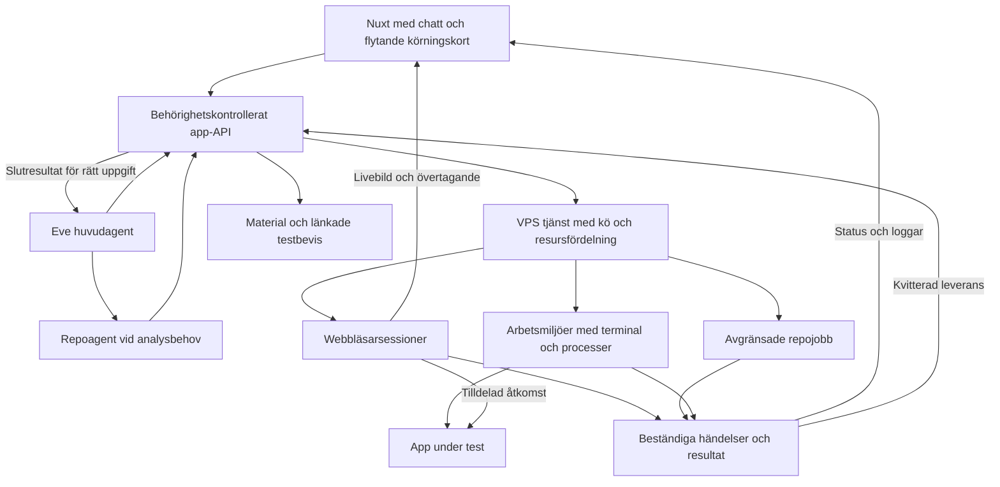

# Plan för webbläsare och sandboxmiljöer på VPS

Planen omfattar befintliga VPS-webbläsare, repository-körningar och nya arbetsmiljöer som Eve kan använda. Användaren ska kunna följa arbetet direkt, ta över en webbläsare, förstå vad som faktiskt verifierats och spara resultat i Material. VPS:en är den valda körmiljön. Eve samordnar arbetet och anropar modeller; projektkod och webbläsare körs på VPS:en.

Dokumentet innehåller ursprungsplanen och implementeringsstatus den 30 september 2026. Befintliga lokala ändringar har bevarats och byggts vidare på. Koden är ännu inte pushad till main eller driftsatt som ny Vercel-app. VPS-tjänsterna och den additiva databasmigrationen för browserägarskap är uppdaterade.

## Implementeringsstatus

Den sammanhängande kedjan är implementerad: förkontroll av publika repositories, isolerad körning, beständiga resultat, livekort och en riktig VPS-sandbox kopplad till Eve. En app som agenten startar där kan öppnas med `preview` i en egen livewebbläsare, tas över manuellt och fotograferas till Material.

| Etapp | Implementerat och verifierat | Kvarvarande begränsning |
| --- | --- | --- |
| 1 | Revisioner, faser, felklassificering, beständig resultatleverans med kvitton, CI-enhetstester | Nya callbacks väntar på protokoll 1 i produktionsappen |
| 2 | Beständig händelselagring, gemensam SSE-prenumeration, snapshot vid återanslutning, pollning med backoff, flytande repo- och sandboxkort | Historiska loggdelar återspelas inte; senaste begränsade logg visas |
| 3 | Gemensam minnesbudget; separat browser per chatt/agent; explicit sessionsval; versionsbundna kontrolltokens; CDP blockeras vid övertagande | Publika browserprocesser delar fortfarande container; preview har egen container |
| 4 | Node 22/24, npm/pnpm, projektkataloger, Java 21/Maven/Gradle-wrapper, Python/pytest; Eves verkliga fil-, kommando- och process-API på gVisor | Profilerna är verifierade med avgränsade projekt; externa tjänster och andra runtimeversioner måste hanteras uttryckligt |
| 5 | Lokal app på en tilldelad port, dedikerad preview-browser, avgränsad brandväggsregel, återkallning och städning när parent-miljön upphör | En preview samtidigt; ingen generell databas-/sidecar-orchestrering |
| 6 | Kapacitetsgränser, körotation mellan workspaces, runtime-/diskkontroller, drain, återhämtning utan omkörning, dokumenterad återställning | Fler VPS-workers, breda belastningsprov, automatisk retention och backuphantering återstår |

Eve är avsiktligt låst till **0.47.3**. Adaptern använder detta pakets faktiska API. Chatthistorik levereras i kvitterade batcher vid steggränser via Eves beständiga state; den lämnas inte i lösa bakgrundslöften. Barnagenternas riktiga Eve-strömmar visas separat i aktivitetspanelen. Interna barnagentmeddelanden ska inte blandas in i användarchattens historik.

Automatisk väckning av Eve efter ett avslutat fristående repojobb är **inte implementerad**. Resultatet sparas och visas utan modellanrop; nästa statusfråga hämtar det. Säkert stöd för deduplicerad extern task-completion och avbrytning kräver en separat verifierad Eve-integration. Det ersätts inte med osäkra automatiska följdmeddelanden.

### Verifiering i den här leveransen

- Riktig Surdeg-körning: pnpm-installation och två lyckade typecheck-uppgifter på commit `618c2e7bf4fcfb3f22b170643bc5205b26922977`. Statisk kontroll, inte funktionella tester.
- Java 21/Maven/JUnit, Gradle 8.14.3/JUnit och Python/pytest: verkliga små tester godkända i gVisor. Avsiktligt saknad miljövariabel i Node gav korrekt misslyckad kommandokörning.
- Två sandboxmiljöer: ägarskap, isolerade filer, stopp/återanslutning, processavbrytning och blockerad tailnet-åtkomst verifierade.
- Två publika browsersessioner: kapacitet, separata profiler och tokens, manuell kontroll, stale-input-avvisning, CDP-spärr och stängning verifierade.
- Lokal app-preview samtidigt med oberoende publik browser: rätt port tillåten, annan port/sandbox/tailnet avvisad, parent-stopp återkallar bara dess preview.
- SSE: origin-/sessionskontroll, återanslutning och verkliga händelser utan pollning. Senaste lätta test gav p95 cirka 257 ms, med cirka ±257 ms klockmätosäkerhet; detta är inte en garanti under belastning.
- Via riktiga Eve-agenten i UI: Node-app startad, HTTP 200, livepreview öppnad, manuell kontroll och skärmbild sparad i Material. Utgången sandbox ersattes tydligt med en tom miljö.
- Via deklarerade repoagenten i UI: huvudagenten skrev en fil, repoagenten läste den och skrev en andra fil som huvudagenten läste tillbaka. Båda använde samma miljö. Barnagentens egna verktygssteg visades separat i aktivitetspanelen.
- Slutprov verifierade att huvudagenten kan spara en barnagents skärmbild med uttryckligt sessions-ID, att manuellt övertagna sessioner inte kan fotograferas och att okända sessions-ID:n avvisas.
- 75 enhetstester, lint, hela typkontrollen, Nuxt-produktionsbygge och separat Eve-bygge godkända. Verkliga historiktester verifierade runtimebyte, dubbletthantering, användarisolering och att interna barnagentmeddelanden inte blandas in i huvudchatten.
- Enhetstester omfattar bland annat dubbletter, leveransfel, omstart, körotation, kapacitetsbudget, preview-brandvägg och städfel. Se kommandon i [driftdokumentationen](REPOSITORY_TESTING.md).

Återstående delar ovan är inte avbockade som färdiga. Beskrivningarna nedan bevarar målarkitekturen; tabellen här skiljer den från den levererade implementationen.

## Beslut och avgränsningar

- Webbläsare, repojobb och interaktiva sandboxmiljöer ingår från början i samma plan och kapacitetsmodell.
- Behåll nuvarande VPS. Använd gVisor för körning av repository-kod och nya sandboxmiljöer. Behåll fungerande webbläsarflöden under migrationen och verifiera starkare isolering per browsersession separat.
- Koppla Eves sandbox till VPS-tjänsten uttryckligen. En installerad sandbox-dependency innebär inte att Eve använder vår VPS.
- Publika repositories ska kunna undersökas utan en lista över förhandsgodkända repon. Körbarhet avgörs av tillgänglig miljö, projektets behov och resursgränser.
- Behåll Nuxt, Nuxt UI, befintligt applikationsskal och flytande körningskort. Ingen ny UI-stack behövs.
- Börja med en värd och beständig kö. Utforma workerregistrering så att fler VPS:er kan anslutas senare; Kubernetes eller en ny generell agentplattform behövs inte i första leveransen.
- Vercel Sandbox och egen microVM-drift ligger utanför första implementationen. Ingen automatisk övergång till en debiterad extern körmiljö.

## Ursprungligt nuläge före implementation

Granskningen bygger på lokal kod, installerad Eve-dokumentation och läsning av den körande VPS:en den 30 september 2026. VPS-filerna för repo-runner och browser-server matchade de granskade lokala filernas SHA256. Produktionsappens agenttraces kunde inte läsas med aktuell Vercel-anslutning, som svarade 403. Ingen ny belastningsmätning gjordes.

| Del | Nuläge | Betydelse för planen |
| --- | --- | --- |
| VPS | 4 vCPU, cirka 8 GB RAM och cirka 64 GB ledig disk vid kontrollen | Planera blandad belastning och mät innan samtidigheten höjs |
| Virtualisering | Ingen `/dev/kvm`; inga exponerade `vmx` eller `svm`-flaggor | Linux-microsandbox och Firecracker kan inte användas med nuvarande förutsättningar |
| Webbläsare | Tre sessioner som standard, separata Chromium-processer och profiler i en gemensam container | Flera användare stöds redan, men detta är inte isolering med en container per session |
| Webbläsare i appen | En aktiv webbläsare per workspace | Flera agenter i samma workspace behöver uttrycklig sessionsägare och koppling till uppgift |
| Repokörning | En körning samtidigt, högst 20 icke avslutade jobb och tio minuters total tidsgräns | Köposition, rättvis fördelning och tidsbudgetar behöver bli synliga |
| Miljöer | Node 24, npm eller exakt pnpm 10.33.4; `package.json` i roten | Förkontroll och fler miljöprofiler behövs för andra projekttyper |
| Återrapportering | `REPO_APP_URL` och `INTERNAL_API_SECRET` saknas i den körande repo-tjänstens miljö | Den befintliga callbacken är avstängd; appen hämtar resultat via statusuppdatering |
| Liveinformation | Repo-UI pollar i två separata loopar; browser-viewer skickar JPEG-bilder | Gemensamma statushändelser behövs, medan bildströmmen behåller en egen transport |
| Eve | Version 0.47.3; repo-subagent finns; ingen uttrycklig VPS-sandbox-adapter | Uppgifter, agenthändelser och körmiljö behöver kopplas samman |
| Aktivitetspanel | Verktygssteg projiceras från chatthistoriken med huvudagenten som aktör | Barnagenternas sessioner och verkliga workerhändelser behöver visas |
| CI | Lint, typkontroll och byggsteg | Kör även befintliga tester och inför kontroller för hela flödet |

Nuvarande grund innehåller redan arbetsytebehörigheter, idempotenta jobb, avbrytning, beständiga resultat och begränsade gVisor-containrar. Dessa delar ska utvecklas vidare.

## Gemensam arkitektur

VPS-tjänsten får ett gemensamt kontrakt för livscykel, ägarskap, kapacitet och händelser. Befintlig browser-server och repo-runner kan vara separata processer bakom detta kontrakt. Gemensamt ansvar betyder inte att all kod ska flyttas till en stor process eller att alla jobb ska dela container.

### Tre typer av körning

| Typ | Livslängd och beteende | Exempel |
| --- | --- | --- |
| Webbläsarsession | Interaktiv session med tidsgräns, kontrollägare och livebild | Besöka en publik sida, manuell inloggning, browser-test |
| Repojobb | Avgränsat försök med bestämd plan, slutresultat och städning | Klona, installera, köra tester och spara rapport |
| Sandboxmiljö | Arbetsmiljö som behåller filer och processer medan dess lease gäller | Undersöka kod, starta app och testa den med en kopplad webbläsare |

En lease är en tidsbegränsad reservation som förnyas medan arbetet fortfarande används. När en miljö är förstörd ska agenten få ett tydligt besked. Återanslutning till en levande miljö och återställning av en förstörd miljö är olika funktioner; fullständiga snapshots ingår inte i första leveransen.

## Ägarskap och kommunikation

Appens autentiserade identitet bestämmer användare och workspace. Modellen får inte välja ett annat ägarskap genom verktygsargument. Uppgift, körningsförsök, agent, Eve-session, worker, miljö och browsersession får separata identifierare och tydliga relationer.

Ett gemensamt händelseformat ska bära körnings-ID, aktör, sekvensnummer, tid, typ och ett begränsat innehåll. Händelser omfattar köplats, fasbyte, livstecken, loggdel, resursprov, kontrollöverlämning, artefakt och slutresultat. Browserbildströmmen ska inte lagras som en serie sådana logghändelser.

VPS:en sparar händelser och en leveranskö beständigt innan leverans kvitteras. Appen lagrar körningens sammanfattning och artefaktreferenser. Dubbletter hanteras med händelse-ID och sekvensnummer; äldre uppdateringar får inte skriva över nyare tillstånd. Återförsök ska ha väntetid, kvitto och hantering av permanent ogiltiga mottagare, så att ett borttaget workspace inte blockerar andra resultat.

Första versionen använder en beständig kö och händelselagring på en enda VPS, med atomiska uppdateringar och avgränsad retention. Välj lagringsformat vid implementation utifrån kraschåterhämtning och tillgängliga bibliotek. Globala ägarskap och användarresultat förblir i appens PostgreSQL.

En gemensam klientprenumeration per workspace försörjer kort och aktivitetspanel. Planerad transport är SSE för status och loggar från en VPS-gateway, med kortlivad behörighet som appen utfärdar för en viss arbetsyta eller körning. Browser-viewern behåller sin separata livekanal. Servicehemligheter och CDP-uppgifter ska aldrig skickas till klienten. Återanslutning använder en cursor; saknas gammal historik skickas en ny snapshot med tydlig loggbegränsning. Pollning används som reservväg med backoff.

Slutresultatet ska kunna sparas och visas utan ett nytt modellanrop. När en återrapportering till chatten behövs skickas en autentiserad, deduplicerad färdighändelse till rätt Eve-uppgift. Repetition av leveransen får inte starta om jobbet eller skapa dubbla rapporter.

## Webbläsaren ingår i varje leverans

Behåll automatisk öppning av det flytande kortet, utökad livevy, ta över, lämna tillbaka, stängning, timeout och återanslutning. Befintliga workspaces ska fortsatt kunna använda sin webbläsare under migrationen.

Flytta successivt från en implicit webbläsare per workspace till uttryckliga sessioner. Varje agentuppgift använder sin tilldelade browsersession. En workspace-vy kan visa flera sessioner utan att ett klick eller en agentåtgärd hamnar i den senast öppnade webbläsaren av misstag.

Övertagande ska vara en serverkontrollerad reservation per session. Efter pågående åtgärd pausas agentåtkomst, inklusive sidläsning, medan människan har kontroll. Andra workers får inte kringgå detta via CDP. Ett versionsnummer för kontrollägaren gör att gamla köade klick avvisas efter ett ägarbyte. När kontrollen lämnas tillbaka återupptas rätt uppgift och agenten läser sidans aktuella tillstånd innan nästa åtgärd. Viewer-behörighet ska skilja mellan att se och att styra; stängda sessioner får inte återöppnas med gamla viewer-länkar.

Inför en bildfångst per browsersession med distribution till flera tittare. Anpassa bildfrekvensen när sessionen är dold eller inaktiv. Flera öppna appflikar ska inte skapa separata fulla bildfångstloopar. Första versionen lovar inte videoinspelning.

Livebrowser och bakgrundsresearch ska båda använda den valda VPS-tjänsten och räknas in i dess kapacitet. Research ska frigöra sin tillfälliga session även vid fel. Ett kapacitetsfel ska visa kö eller vänteläge och får inte beskrivas som slut på Browserbase-minuter.

Sparade screenshots, rapporter och filer hör hemma i Material. Testing visar testplaner, testfall och körresultat med länkar till relevanta bevis. En allmän bild eller livewebbläsare ska inte läggas in som ett separat materialkort i Testing. Den flytande livepanelen kan fortsätta visas oavsett aktiv flik. Varje bild får ursprung med session, worker, körning och steg. Behåll skyddet som avvisar tvetydig koppling till flera aktiva testkörningar; aktuell UI-flik bestämmer aldrig vilket test bilden tillhör.

Nuvarande browserprocesser delar container. Innan parallella workers får bredare åtkomst till lokala appar ska vi verifiera separat browsermiljö per tilldelning och en tydlig gräns mot godtycklig repository-kod. Browserisolering med gVisor provas för kompatibilitet; Chromium-sandboxen ska fortsätta vara aktiverad.

## Repository och sandboxmiljö

Förkontrollen inventerar projektfiler utan att först köra repositoryts installationsscript. Den identifierar språk, projektrötter, pakethanterare, låsfiler, kommandon, browserbehov och deklarerade tjänster. Repoagenten används när dessa uppgifter behöver analyseras; kända körningar och statusfrågor går direkt genom verktygen.

Körningsplanen sparar exakt commit, arbetskatalog, miljöprofil, valda kommandon, installation, nätverksbehov, timeout och förväntade artefakter. Automatisk scriptidentifiering ska skilja funktionella tester från typecheck, lint och bygge. Explicit beställda kommandon får inte tyst ersättas av något annat.

Inför miljöprofiler i denna ordning:

1. Node med angiven version, npm/pnpm och upptäckt arbetskatalog, inklusive monorepos.
2. Java med Gradle/Maven, utifrån det redan observerade behovet.
3. Python med dokumenterade installations- och testvägar.
4. Projekt som behöver en lokal app, API-tjänst eller databas under test.

Varje profil beskriver verktyg, resursbehov, installationspolicy och verifierade begränsningar. En saknad profil ger ett begripligt miljöbehov. Saknade testscript, beroendefel, infrastrukturfel, timeout, misslyckade tester och misslyckad täckningsgräns blir olika utfall.

Eves sandbox-adapter ska kunna skapa en arbetsmiljö, återansluta till den medan den lever, köra kommandon, läsa och skriva filer, hantera bakgrundsprocesser och stänga miljön. Exakta adaptermetoder väljs från dokumentationen i den version av Eve vi beslutar att använda. Samma underliggande miljöhantering används av repojobben och sandbox-adaptern.

App-preview kräver en uttrycklig koppling mellan appmiljö och browser. Bara tilldelad browser får nå den appens portar och tillhörande testtjänster. Öppna inte allmän åtkomst till VPS, tailnet eller andra workspaces. Behåll skydd för privata destinationer för vanlig publik research, och verifiera även omdirigeringar, DNS och IPv6 för preview-vägen. Preview-länkar ska kräva avgränsad behörighet. När den överordnade sandboxmiljön stängs eller löper ut återkallas preview-åtkomsten, beroende browser- och serviceprocesser avslutas och hela reservationen frigörs. Separata publika browsersessioner ska fortsätta fungera.

## Kapacitet och drift

En gemensam resursbudget ska omfatta browser, research, repo och sandbox. Räkna reserverad kapacitet även medan en miljö startar eller stängs. Fördela kön mellan workspaces och undvik att ett enda workspace reserverar alla platser.

En uppgift som behöver både app och browser måste få en sammanhängande reservation eller ett återhämtbart vänteläge. Den får inte hålla en stor appmiljö obegränsat medan den väntar på en browserslot som aldrig blir ledig. Kö och tidsgränser ska kunna avbrytas utan att andra sessioner påverkas.

Behåll initialt konservativ samtidighet. Nuvarande browsercontainer kan använda 3 GiB och ett repojobb ytterligare 3 GiB. Två sådana repojobb plus browserpoolen ryms inte inom en garanterad minnesbudget på 8 GB. Bestäm slutliga samtidighetsgränser efter blandade belastningstester, inklusive CPU, arbetsfiler, bildström och systemets reserv.

Workerregistrering beskriver tillgängliga miljöprofiler, version, kapacitet och senaste livstecken. Health ska kontrollera faktisk körförmåga, disk och runtime, inte bara svara att HTTP-processen lever. Vid omstart behålls köade jobb; avbrutna försök markeras korrekt. Kommandon som kan ha haft sidoeffekter får inte automatiskt köras om som om inget hänt.

Inför logg- och artefaktretention, kontroll av övergivna containrar, säkerhetskopiering av beständig metadata och dokumenterad återställning. Cache kan införas för låsta beroenden och förbyggda miljöer, med nycklar för runtime, låsfil och tillitsgräns. Återanvänd inte en annan användares skrivbara arbetskatalog.

## Eve och svarstider

Utvärdera en uppgradering i ett separat steg. Installerad version är 0.47.3; vid granskningen var 0.68.0 publicerad. Webbens Eve-dokumentation innehöll även ännu nyare task-API:er än det publicerade paketet. Lås målversion och läs dess medföljande dokumentation innan sandbox- och bakgrundsintegrationen implementeras.

Utforma workerprotokollet oberoende av uppgraderingen. Kontrollera gamla chattar, autentisering, återanslutning, delegering, avbrytning och upprepade workflow-steg innan en ny Eve-version används i produktion.

Mät separat modellens första text, kontexthämtning, historiklagring, verktygsanrop, kö, miljöstart, checkout, installation, kommando och återrapportering. Tidigare lokala exempel gav första text efter cirka 3,2–3,6 sekunder utan verktyg; det är inte en aktuell produktionsbenchmark.

Minska alltid medskickade instruktioner och verktygsutdata där mätningar visar nytta. Hämta långa loggar vid behov. Ersätt historik-hookens många blockerande HTTP-skrivningar med en beständig, kvitterad leverans som bevarar ordning och återhämtning; använd inte okontrollerade bakgrundslöften. Behåll Flash/Low som grund och utvärdera högre reasoning för svårare analys med samma uppgiftssvit.

## Genomförande och beroenden

| Etapp | Leverans | Krav för att gå vidare |
| --- | --- | --- |
| 1 | Gemensamt körningskontrakt, korrekt status, mätpunkter, konfigurerad återrapportering och tester i CI | Browser- och repoflöden fungerar som tidigare; resultat når appen även när UI är stängt |
| 2 | Beständiga händelser, leveranskvitton, gemensam klientprenumeration och livekort för både browser och repo | Återanslutning återställer rätt tillstånd; inget tappat slutresultat eller dubbel rapport |
| 3 | Samordnad kapacitet, explicit browserägarskap och kontrollerad migration av sessioner | Flera workspaces och två uppgifter i samma workspace blandar aldrig kontroll, profiler eller resultat |
| 4 | Förkontroll, miljöprofiler och Eve-adapter för VPS-sandbox | Ett publikt repo kan undersökas och köras med synlig plan; en Eve-session kan återanvända sin levande miljö |
| 5 | App-preview med tilldelad browser och avgränsade testtjänster | Agenten startar app, öppnar browser, lämnar över och sparar bevis utan åtkomst till andra miljöer |
| 6 | Belastningsprov, driftsrutiner och utökning med fler workers | Mätta gränser, rättvis kö och verifierad återhämtning vid process- och nätverksfel |

Versionsutvärderingen för Eve sker parallellt med etapp 1–2 och måste vara klar före adapterimplementationen. Första sammanhängande produktleveransen består av etapp 1–2 och ska omfatta både befintliga browsersessioner och repojobb.

## Acceptanskriterier

Följande är mål att verifiera, inte redan uppmätta garantier:

- Under definierad testbelastning visas minst 95 procent av fas- och logghändelser inom en sekund efter att VPS:en skickat dem. Mät browserbilder separat.
- Ett tappat UI återansluter med korrekt fas, kontrollägare och loggposition. En stängd UI-flik stoppar inte ett beställt bakgrundsjobb.
- Avbrytning bekräftas av workern eller visas som ännu inte bekräftad. Ett tryck på stopp får inte felaktigt märka en fortfarande aktiv process som avslutad.
- Dubbla jobbmeddelanden och callbacks ger inte dubbel körning, slutrapport eller Material-post.
- Två workspaces kan arbeta samtidigt inom uppmätt kapacitet. Minst två browseruppgifter inom samma workspace får separata sessioner och korrekt ägare.
- Manuell inloggning och övertagande fungerar under samtidig repokörning. Agenten kan varken läsa eller styra den manuellt övertagna sessionen förrän kontrollen lämnats tillbaka.
- Stängning, timeout, workeromstart och driftsättning frigör resurser och visar ett sanningsenligt tillstånd. Återstartade köjobb får inte förväxlas med färdigkörda försök.
- Node-testrepo, Surdeg utan root-testscript, Java-projekt, saknad miljövariabel, testfel och infrastrukturfel ger skilda verifierade utfall.
- Privat nätåtkomst, andra sessioners tokens, arbetskataloger och preview-portar är avskilda. Inga servicehemligheter, inmatade lösenord eller obegränsade loggar hamnar i modellkontexten.
- Screenshots och rapporter visas i Material. Testing länkar relevanta testbevis utan att bli en allmän material- eller browserlista.
- En fungerande demo omfattar repo-URL → förkontroll → startad lokal app → browser i flytande kort → övertagande → återlämning → verifierat resultat → sparat Material → städad miljö, samtidigt som ett andra workspace arbetar oberoende.

## Migration och verifiering

Anpassa befintliga browser- och repo-API:er till det gemensamma kontraktet innan gamla vägar tas bort. Använd avgränsad aktivering per workspace och versionsmärk protokollet. Migrera datamodellen så att äldre workspaces behåller sin befintliga browsersession, medan nya uppgifter kan få uttryckliga sessioner.

Undvik omstart med aktiva användarsessioner: stoppa ny tilldelning, låt pågående arbete avslutas inom dess tidsgräns och sätt sedan in ny version. Rollback ska fungera med den utökade datamodellen och ska inte återspela genomförda kommandon. Uppdatera driftdokumentationens gamla Browserbase-beskrivningar tillsammans med implementationen.

Automatisera kontrakt, kö, avbrytning, idempotens, behörighet och felklassificering i CI. Kör integrationstester mot dedikerade testmiljöer. Liveprov med modell, VPS, webbläsare och störningar ska använda egna konton/fixtures och inte avbryta användarnas sessioner.

## Kodområden och underlag

| Område | Befintliga utgångspunkter |
| --- | --- |
| VPS-browser och viewer | `infra/browser/`, `server/utils/browser.ts`, `server/utils/vps-browser.ts`, `server/utils/research.ts` |
| Repojobb och lagring | `infra/repo-runner/`, `server/utils/repositories.ts`, `server/api/internal/repository-result.post.ts` |
| Agent och delegering | `agent/agent.ts`, `agent/subagents/repo/`, `agent/tools/repository.ts`, `agent/tools/browser.ts` |
| Historik och aktivitet | `agent/hooks/chat-history.ts`, `shared/agent-activity.ts`, `app/composables/chat/useChatSession.ts` |
| Livekort och Material | `BrowserWorkspace.vue`, `RepositoryRunCard.vue`, `RepositoryRuns.vue`, `RepositoryActivity.vue`, `WorkspacePanel.vue` i `app/components/` |
| Verifiering | `tests/browser.integration.mjs`, `tests/repo-runner.test.mjs`, `tests/repositories.integration.mjs`, `tests/repository-delegation.integration.mjs`, `.github/workflows/ci.yml` |

Lokala källor är [VPS-browser](SELF_HOSTED_BROWSER.md), [repokörningar](REPOSITORY_TESTING.md), [designsystem](DESIGN_SYSTEM.md) och den installerade [Eve-dokumentationen](../node_modules/eve/docs/README.md). Äldre driftdokumentation innehåller historiska beskrivningar; nulägestabellen ovan bygger på kod och direkt kontroll av tjänsten.

Externa referenser för fortsatt implementation är [Eve context control](https://eve.dev/docs/concepts/context-control), [Eve sandbox](https://eve.dev/docs/sandbox), [publicerad Eve 0.68.0](https://registry.npmjs.org/eve/0.68.0), [gVisor](https://gvisor.dev/docs/), [microsandbox](https://github.com/superradcompany/microsandbox#-getting-started) och [Firecrackers förutsättningar](https://github.com/firecracker-microvm/firecracker/blob/main/docs/getting-started.md#prerequisites). API-exempel måste kontrolleras mot det valda paketets medföljande dokumentation.
